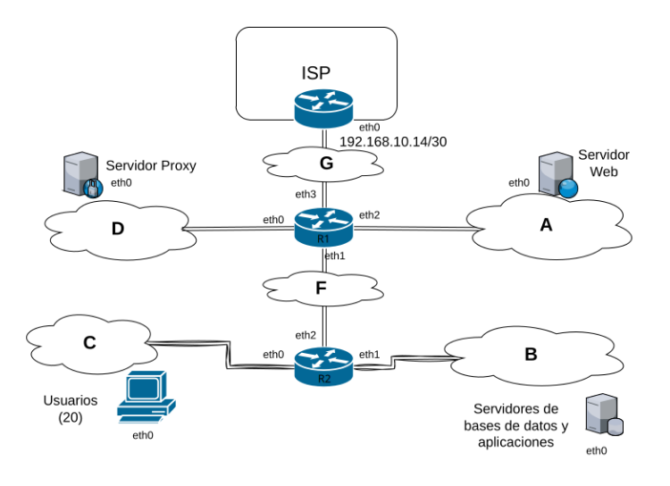

## [Volver atrás](../readme.md)

<h1>Ejercicio de ruteo en Kathara</h1>

Suponga la red cuya topología se muestra en la siguiente figura, la cual corresponde a una organización para la cual usted debe asignar direcciones y configurar los dispositivos. Usted deberá diseñar e implementar un laboratorio en kathara que refleje dicha configuración. Además se requiere que su implementación respete las siguientes consignas:
- Bloque de direcciones asignado para la organización: 170.210.96.0/28
- Dirección IP asignada al router de borde: 192.168.10.14/30
- Los servidores web y el servidor de correo prestan servicios hacia el exterior (Internet)
- Los servidores de aplicaciones y bases de datos son accedidos solamente por los usuarios corporativos (Red C).
- Los usuarios pueden navegar por Internet solamente a través del servidor proxy, y pueden acceder al correo electrónico y la web corporativa de forma directa (sin proxy)

1) Para su implementación en kathara utilice como base los archivos que se encuentran [aqui](https://drive.google.com/file/d/1ge9myUMErYMEQfnzQjyB7zyTcPj13vVJ/view?usp=drive_link).
2) Complete los archivos de extensión .startup que se encuentran en el laboratorio de manera tal que al ejecutarlo se inicie con toda la configuración necesaria para probar conectividad entre los diferentes hosts.
3) Diseñe y detalle un procedimiento que le permita verificar si la configuración propuesta por usted es funcional y, además, cumple con los requerimientos planteados como consigna.

---

<h1>Resolución</h1>

Bloque de direcciones asignado: **170.210.96.0/28**

Divido en dos subredes:

**170.210.96.0/29** - Red A

**170.210.96.8/29** - Red D

## Tabla de Red A - 170.210.96.0/29
| IP | Gateway | Interfaz |
|----|---------|----------|
| 170.210.96.0/29 | - | eth0 |
| 0.0.0.0/0 | 170.210.96.1 | eth0 |

## Tabla de Red B - 192.168.0.0/24
| IP | Gateway | Interfaz |
|----|---------|----------|
| 192.168.0.0/24 | - | eth0 |
| 0.0.0.0/0 | 192.168.0.1 | eth0 |

## Tabla de Red C - 192.168.1.0/24
| IP | Gateway | Interfaz |
|----|---------|----------|
| 192.168.1.0/24 | - | eth0 |
| 0.0.0.0/0 | 192.168.1.1 | eth0 |

## Tabla de Red D - 170.210.96.8/29
| IP | Gateway | Interfaz |
|----|---------|----------|
| 170.210.96.8/29 | - | eth0 |
| 0.0.0.0/0 | 170.210.96.9 | eth0 |

## Red F - 10.10.2.0/30

## Red G - 192.168.10.14/30

## Tabla de RISP
| IP | Gateway | Interfaz |
|----|---------|----------|
| 192.168.10.12/30 | - | eth0 |
| 170.210.96.0/28 | 192.168.10.13 | eth0 |

## Tabla de R1
| IP | Gateway | Interfaz |
|----|---------|----------|
| 170.210.96.0/29 | - | eth2 |
| 170.210.96.8/29 | - | eth0 |
| 192.168.1.0/24 | 10.10.2.1 | eth1 |
| 192.168.10.13/30 | - | eth3 |
| 10.10.2.0/30 | - | eth1 |
| 0.0.0.0/0 | 192.168.10.14 | eth3 |

## Tabla de R2
| IP | Gateway | Interfaz |
|----|---------|----------|
| 170.210.96.0/28 | 10.10.2.2 | eth2 |
| 192.168.0.0/24 | - | eth1 |
| 192.168.1.0/24 | - | eth0 |
| 10.10.2.0/30 | - | eth2 |