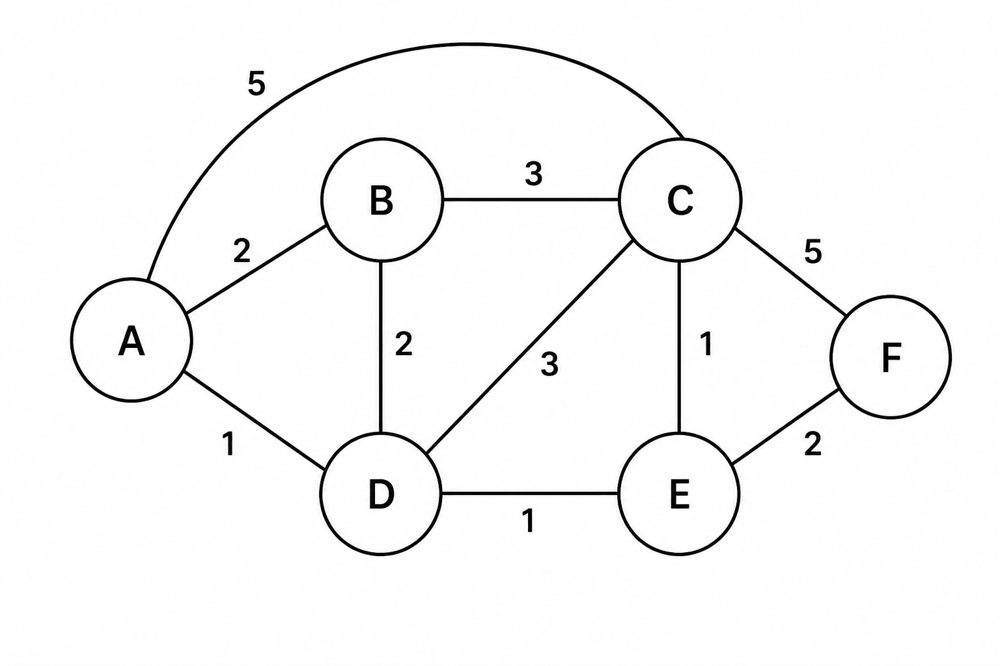
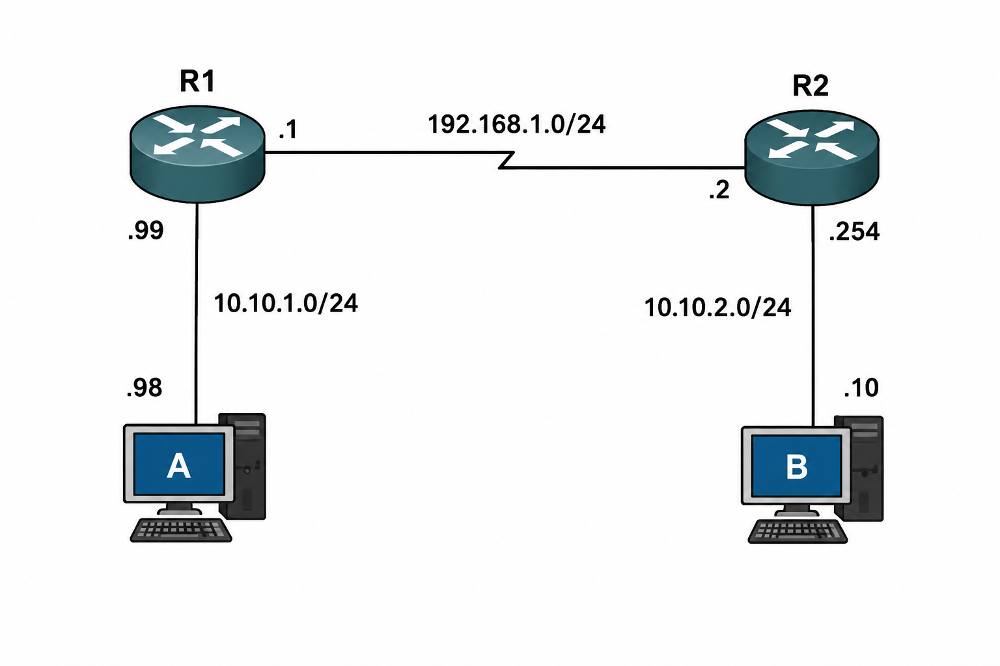
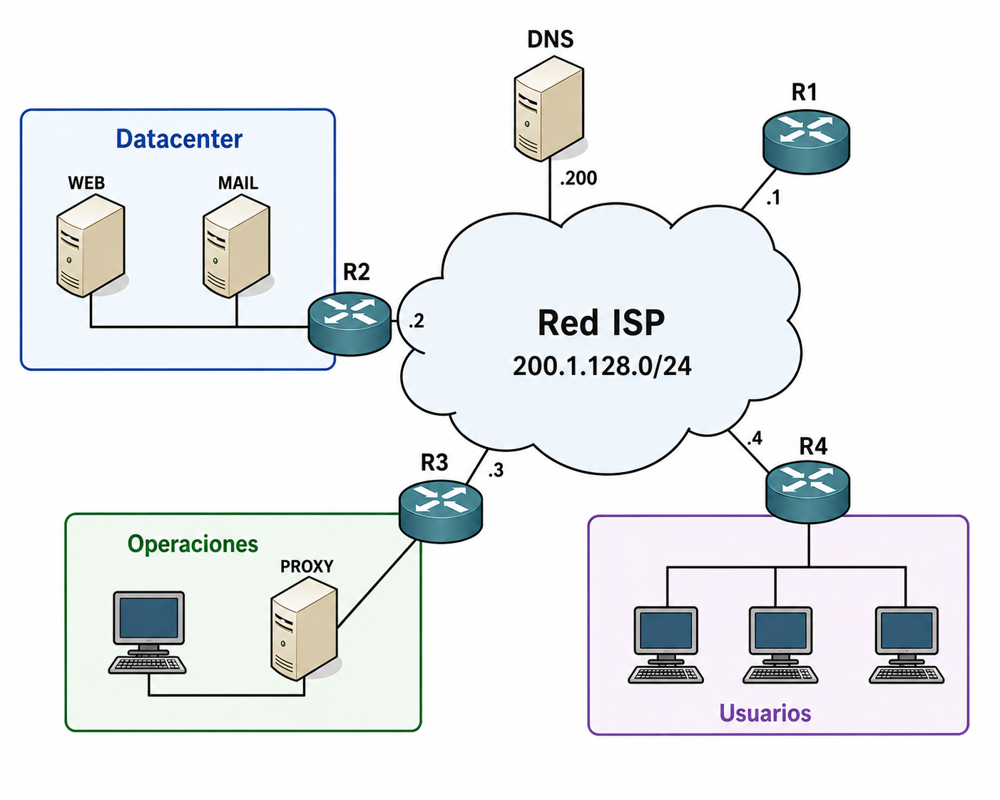

## [Volver atrás](../readme.md)

<h1>Segundo Parcial - Noviembre 2025</h1>

1. ¿Qué características tiene una red de conmutación de paquete basada en datagramas como IP?

2. Considerando las funciones de IP ¿Qué diferencia a un host de un router? Justifique.

3. Partiendo del siguiente grafo de conectividad ejecute los pasos de un algoritmo de ruteo basado en estado del enlace y construya la tabla de rutas del nodo A.

4. En IP, ¿qué diferencia a una dirección pública de una privada en cuanto a: estructura, uso de máscara, alcance y disponibilidad.

5. Mencione y explique los cambios que implementa IPv6 vs IPv4 respecto de su Encabezado, la función de ARP y la Fragmentación de datagramas.

6. De acuerdo al modelo OSI, ¿cuál es la función de la capa de transporte? En el caso de la pila de protocolos TCP/IP ¿Cómo cumple TCP con esta función?

7. Suponga un intercambio a nivel TCP entre dos procesos (A y B). El proceso A envía 10 segmentos consecutivos y el tercero se pierde y no llega a destino. ¿Qué ocurre en A? ¿Qué ocurre en B?

8. Siguiendo con el caso del punto anterior: el proceso en B tiene 8000 bytes para enviar. ¿Cuál es la cantidad mínima de segmentos que necesita para enviarlos todos? ¿Lo puede hacer inmediatamente?

9. Defina el concepto de socket en TCP y para qué se utiliza.

10. ¿Qué tipo de servicio implementa el protocolo HTTP? ¿Es fiable? ¿Cómo es la estructura de su PDU?

11. Implemente en un laboratorio de Kathará el siguiente esquema. Debe permitir alcance (ping) entre A y B. No puede usar rutas por defecto.

12. Una organización tiene su funcionamiento distribuido en tres ubicaciones geográficas diferentes, denominadas: Datacenter, Operaciones y Usuarios (ver plano). Por simplicidad, la conectividad entre las mismas se contrata a un mismo ISP el cual les provee conectividad entre sí, DNS, acceso a Internet y el bloque de direcciones públicas 200.10.10.128/27.
En el datacenter se aloja un servidor web corporativo y su servidor de correo electrónico. En el área de operaciones se encuentra un servidor proxy y una estación de control global de sus redes.
Con esta información usted debe configurar redes y ruteo (un dispositivo por red, R1, R2, R3 y R4) considerando que:
    - Los usuarios usan el servidor de mail corporativo y navegan la web solo a través del Proxy.
    - La salida a Internet del ISP es R1.

