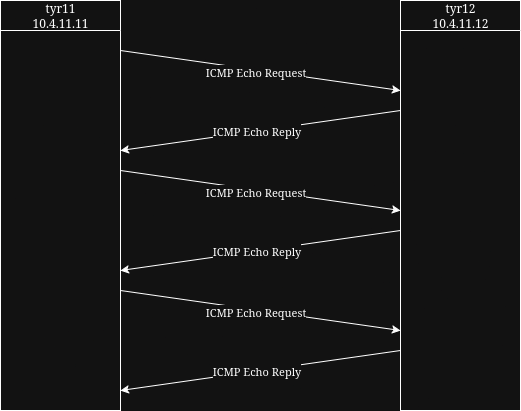

## [Volver atrás](../readme.md)

<div align="center">
<h1>TPL 1 - Configuración inicial de la red del laboratorio</h1>
</div>

### Segunda parte: Configuración de hosts en una red - prueba de conectividad - análisis de captura

Los comandos necesarios para llevar adelante la práctica se encuentran listados en el apunte respectivo de la asignatura, disponible en la web de la misma. En todos los casos, el informe a entregar debe mostrar los comandos ejecutados y las salidas obtenidas (en caso de ser una salida extensa, resaltar la parte importante). Además, se debe explicar lo que se interpreta de dicha salida y si es lo esperado en cada caso.

1. Verificar la/s interfaces de red (comúnmente llamada placa de red o NIC) que el sistema operativo haya detectado en pc1 y pc2, y listar su información en pantalla.

    ¿Que comando utilizó? ¿Cual es el nombre de las interfaces? ¿Que parte de la salida le indicó cual es la interfaz que se encuentra conectada? ¿Cual es el nombre de la interfaz que se encuentra conectada a la red?

    ```
    root@pc1:/# ip link show
    1: lo: <LOOPBACK,UP,LOWER_UP> mtu 65536 qdisc noqueue state UNKNOWN mode DEFAULT group default qlen 1000
        link/loopback 00:00:00:00:00:00 brd 00:00:00:00:00:00
    5: eth0: <BROADCAST,MULTICAST,UP,LOWER_UP> mtu 1500 qdisc fq_codel state UP mode DEFAULT group default qlen 1000
        link/ether 1e:72:ca:9b:4a:44 brd ff:ff:ff:ff:ff:ff
    ```

    Se utilizó el comando ```ip link show``` para identificar las interfaces de red. Los nombres de las interfaces son ```lo``` y ```eth0```. La parte de la salida que indica cuál es la interfaz que se encuentra conectada es el valor de ```state```, que en el caso de ```eth0``` es ```UP``` (activa), mientras que en el caso de ```lo``` es ```UNKNOWN``` (desconocida).

    ```
    root@pc2:/# ip link show
    1: lo: <LOOPBACK,UP,LOWER_UP> mtu 65536 qdisc noqueue state UNKNOWN mode DEFAULT group default qlen 1000
        link/loopback 00:00:00:00:00:00 brd 00:00:00:00:00:00
    4: eth0: <BROADCAST,MULTICAST,UP,LOWER_UP> mtu 1500 qdisc fq_codel state UP mode DEFAULT group default qlen 1000
        link/ether 3a:b4:85:44:f1:71 brd ff:ff:ff:ff:ff:ff
    ```

    Lo anterior aplica también en ```pc2```.

---

2. Configuración de interfaces de red para utilizar el protocolo TCP/IP. El paso siguiente es asignar las direcciones IP 10.4.11.11 y 10.4.11.12 a pc1 y pc2 respectivamente (la máscara de red es /24 o 255.255.255.0).

    ```
    root@pc1:/# ip addr add dev eth0 10.4.11.11/24
    root@pc1:/# ip addr show
    1: lo: <LOOPBACK,UP,LOWER_UP> mtu 65536 qdisc noqueue state UNKNOWN group default qlen 1000
        link/loopback 00:00:00:00:00:00 brd 00:00:00:00:00:00
        inet 127.0.0.1/8 scope host lo
        valid_lft forever preferred_lft forever
    5: eth0: <BROADCAST,MULTICAST,UP,LOWER_UP> mtu 1500 qdisc fq_codel state UP group default qlen 1000
        link/ether 0a:a0:22:26:d4:39 brd ff:ff:ff:ff:ff:ff
        inet 10.4.11.11/24 scope global eth0
        valid_lft forever preferred_lft forever
    ```

    ```
    root@pc2:/# ip addr add dev eth0 10.4.11.12/24
    root@pc2:/# ip addr show
    1: lo: <LOOPBACK,UP,LOWER_UP> mtu 65536 qdisc noqueue state UNKNOWN group default qlen 1000
        link/loopback 00:00:00:00:00:00 brd 00:00:00:00:00:00
        inet 127.0.0.1/8 scope host lo
        valid_lft forever preferred_lft forever
    4: eth0: <BROADCAST,MULTICAST,UP,LOWER_UP> mtu 1500 qdisc fq_codel state UP group default qlen 1000
        link/ether b2:32:87:d2:ed:94 brd ff:ff:ff:ff:ff:ff
        inet 10.4.11.12/24 scope global eth0
        valid_lft forever preferred_lft forever
    ```

    El comando ```ip addr add dev eth0 10.4.11.12/24``` significa:

    - ```ip addr add```: agregar una dirección IP
    - ```dev eth0```: interfaz a la cual se le va a asignar la dirección

---

3. Verificar que es posible contactar ambos equipos de la red.

    ```
    root@pc1:/# ping -c 3 10.4.11.12
    PING 10.4.11.12 (10.4.11.12) 56(84) bytes of data.
    64 bytes from 10.4.11.12: icmp_seq=1 ttl=64 time=0.810 ms
    64 bytes from 10.4.11.12: icmp_seq=2 ttl=64 time=0.646 ms
    64 bytes from 10.4.11.12: icmp_seq=3 ttl=64 time=0.602 ms

    --- 10.4.11.12 ping statistics ---
    3 packets transmitted, 3 received, 0% packet loss, time 2026ms
    rtt min/avg/max/mdev = 0.602/0.686/0.810/0.089 ms
    ```

    ```
    root@pc2:/# ping -c 3 10.4.11.11
    PING 10.4.11.11 (10.4.11.11) 56(84) bytes of data.
    64 bytes from 10.4.11.11: icmp_seq=1 ttl=64 time=1.18 ms
    64 bytes from 10.4.11.11: icmp_seq=2 ttl=64 time=0.671 ms
    64 bytes from 10.4.11.11: icmp_seq=3 ttl=64 time=0.679 ms

    --- 10.4.11.11 ping statistics ---
    3 packets transmitted, 3 received, 0% packet loss, time 2058ms
    rtt min/avg/max/mdev = 0.671/0.844/1.184/0.239 ms
    ```

    El comando ```ping``` se utiliza para enviar mensajes ICMP a un host. Con el argumento ```-c``` se puede determinar la cantidad de mensajes a enviar.

---

4. Cambiar la configuración de los nombres de los equipos asignandoles tyr11 y tyr12 a pc1 y pc2 respectivamente.

    ```
    root@pc1:/# hostname
    pc1
    root@pc1:/# hostname tyr11
    root@pc1:/# hostname
    tyr11
    ```

    ```
    root@pc2:/# hostname
    pc2
    root@pc2:/# hostname tyr12
    root@pc2:/# hostname
    tyr12
    ```

    El comando ```hostname``` muestra el nombre de host del sistema. Se le puede pasar como argumento una palabra para cambiar el nombre de host temporalmente.

    Si se quiere cambiar el hostname de manera permanente, se debe modificar el valor contenido en el archivo ```/etc/hostnames```.

---

5. Resolución de nombres de hosts a direcciones IP.

    a. Configurar la resolución de nombres locales en ambos host con la información contenida en el punto 4.

    b. Verificar que es posible contactar ambos equipos de la red utilizando nombres de host.

    ```
    root@pc1:/# ping tyr12
    ping: tyr12: Temporary failure in name resolution
    root@pc1:/# echo "10.4.11.12 tyr12" >> /etc/hosts
    root@pc1:/# ping -c 3 tyr12
    PING tyr12 (10.4.11.12) 56(84) bytes of data.
    64 bytes from tyr12 (10.4.11.12): icmp_seq=1 ttl=64 time=0.549 ms
    64 bytes from tyr12 (10.4.11.12): icmp_seq=2 ttl=64 time=0.668 ms
    64 bytes from tyr12 (10.4.11.12): icmp_seq=3 ttl=64 time=0.662 ms

    --- tyr12 ping statistics ---
    3 packets transmitted, 3 received, 0% packet loss, time 2083ms
    rtt min/avg/max/mdev = 0.549/0.626/0.668/0.054 ms
    ```

    ```
    root@pc2:/# ping tyr11
    ping: tyr11: Temporary failure in name resolution
    root@pc2:/# echo "10.4.11.11 tyr11" >> /etc/hosts
    root@pc2:/# ping -c 3 tyr11
    PING tyr11 (10.4.11.11) 56(84) bytes of data.
    64 bytes from tyr11 (10.4.11.11): icmp_seq=1 ttl=64 time=1.01 ms
    64 bytes from tyr11 (10.4.11.11): icmp_seq=2 ttl=64 time=0.663 ms
    64 bytes from tyr11 (10.4.11.11): icmp_seq=3 ttl=64 time=0.446 ms

    --- tyr11 ping statistics ---
    3 packets transmitted, 3 received, 0% packet loss, time 2002ms
    rtt min/avg/max/mdev = 0.446/0.707/1.013/0.233 ms
    ```

    El comando ```echo``` muestra una línea de texto. Por ejemplo, si escribo ```echo hola mundo``` en la consola muestra ```hola mundo```.

    Los caracteres ```>>``` se utilizan para concatenar texto a un archivo.

    Estos dos se pueden combinar, usando primero ```echo``` para especificar el texto que queremos concatenar al archivo que viene luego de ```>>```.

    También se puede usar el caracter ```>``` pero este sobreescribe el archivo (o lo crea, si no existe) en vez de concatenar.

---

6. Ver la tabla de ruteo definida en el equipo. ¿Cuáles son las redes accesibles?

    ```
    root@pc1:/# ip route show
    10.4.11.0/24 dev eth0 proto kernel scope link src 10.4.11.11 
    ```

    ```
    root@pc2:/# ip route show
    10.4.11.0/24 dev eth0 proto kernel scope link src 10.4.11.12 
    ```

    Tanto en ```pc1``` y en ```pc2```, la única red accesible es la ```10.4.11.0/24```, que sería la red local de ambas, es decir que pueden comunicarse con cualquier host que tenga como IP: ```10.4.11.x/24```.

---

7. Agregar la dirección 10.4.11.30 como ruta por defecto para acceder a otras redes. Verificar nuevamente la tabla de ruteo.

    ```
    root@pc1:/# ip route show
    10.4.11.0/24 dev eth0 proto kernel scope link src 10.4.11.11 
    root@pc1:/# ip route add default via 10.4.11.30 dev eth0
    root@pc1:/# ip route show
    default via 10.4.11.30 dev eth0 
    10.4.11.0/24 dev eth0 proto kernel scope link src 10.4.11.11 
    ```

    ```
    root@pc2:/# ip route show
    10.4.11.0/24 dev eth0 proto kernel scope link src 10.4.11.12 
    root@pc2:/# ip route add default via 10.4.11.30 dev eth0
    root@pc2:/# ip route show
    default via 10.4.11.30 dev eth0 
    10.4.11.0/24 dev eth0 proto kernel scope link src 10.4.11.12 
    ```

    El comando ```ip route add default via 10.4.11.30 dev eth0``` significa:

    - ```ip route add```: agregar a la tabla de ruteo
    - ```default```: por defecto
    - ```via 10.4.11.30```: el gateway (puerta de enlace)
    - ```dev eth0```: interfaz por la que salen los datos

---

8. Realizar una captura de las PDU intercambiadas mientras se utiliza el comando ping para verificar conectividad con el otro equipo. Las acciones que debe realizar son:

    a. En el dispositivo capturador inicie la captura utilizando el comando tcpdump o tshark sobre la interfaz eth0 y redirigir la salida a un archivo en el directorio /shared para su posterior análisis.

    ```
    root@capturador:/# tcpdump -i eth0 icmp -w /shared/captura_icmp.pcap
    tcpdump: listening on eth0, link-type EN10MB (Ethernet), snapshot length 262144 bytes
    ```

    El comando ```tcpdump -i eth0 icmp -w /shared/captura_icmp.pcap``` significa:
    
    - ```-i eth0```: indica la interfaz
    - ```icmp```: indica el tipo de paquetes a capturar, no necesariamente tienen que ser ``ìcmp```, pero en este caso sólo nos interesan estos
    - ```-w /shared/captura_icmp.pcap```: indica la ruta en donde se guardará la captura

    b. En pc1 ejecutar el comando ping para enviar a pc2 exactamente 3 mensajes ICMP Echo Request (consulte el manual de ping).

    ```
    root@pc1:/# ping -c 3 tyr12
    PING tyr12 (10.4.11.12) 56(84) bytes of data.
    64 bytes from tyr12 (10.4.11.12): icmp_seq=1 ttl=64 time=1.08 ms
    64 bytes from tyr12 (10.4.11.12): icmp_seq=2 ttl=64 time=0.710 ms
    64 bytes from tyr12 (10.4.11.12): icmp_seq=3 ttl=64 time=0.618 ms

    --- tyr12 ping statistics ---
    3 packets transmitted, 3 received, 0% packet loss, time 2025ms
    rtt min/avg/max/mdev = 0.618/0.803/1.081/0.200 ms
    ```

    c. Una vez obtenida la respuesta del comando ping (deberán recibirse tres respuestas), detener la captura (finalizar el proceso tcpdump o tshark presionando Ctrl+C)

    ```
    root@capturador:/# tcpdump -i eth0 icmp -w /shared/captura_icmp.pcap
    tcpdump: listening on eth0, link-type EN10MB (Ethernet), snapshot length 262144 bytes
    ^C6 packets captured
    6 packets received by filter
    0 packets dropped by kernel
    ```

    d. Analizar el volcado del programa de captura utilizando la aplicación wireshark (o cualquier otro analizador de tráfico que permita leer archivos en formato pcap), representando en un gráfico ideado por usted el intercambio de mensajes. Indicar cuál es la función de cada uno identificando los datos de encabezados mas relevantes.

    [Captura ICMP](./archivos/captura_icmp.pcap)

    

    El mensaje ```ICMP Echo Request``` es el mensaje que envía el emisor, mientras que el mensaje ```ICMP Echo Reply``` es el mensaje que envía el receptor una vez que recibe un mensaje de solicitud.

    Datos relevantes:
    - **Internet Control Message Protocol** (cabecera de transporte): 
        - **Type**: en este caso es de valor 0 (reply) u 8 (request).
        - **Response time**: el tiempo de respuesta para mensajes de tipo reply.
    - **Internet Protocol version 4** (cabecera de red):
        - **Identification**: es un valor único por cada paquete que se transfiere.
        - **Protocol**: indica el protocolo de capa superior encapsulado en la trama. En este caso es ICMP.
        - **Source / Destination Address**: contiene las direcciones IP de origen / destino.
    - **Ethernet II** (cabecera de enlace):
        - **Destination / Source**: contiene la dirección física del sistema destino / origen. Estas direcciones pueden ser tanto de sistemas finales como de sistemas intermedios.
        - **Type**: indica el protocolo de capa superior encapsulado en la trama. En este caso es IPv4.
     
---

9. Escribir los comandos de configuración que ejecutó en los puntos 2, 4, 5 y 7 en pc1 y pc2 a los archivos pc1.startup y pc2.startup respectivamente, que están dentro del directorio del laboratorio, de manera tal que los nodos se configuren automáticamente al reiniciar el laboratorio.

    ```
    [usuario@host]$ echo "ip addr add dev eth0 10.4.11.11/24" >> pc1.startup 
    [usuario@host]$ echo "hostname tyr11" >> pc1.startup 
    [usuario@host]$ echo "10.4.11.12 tyr12 >> /etc/hosts" >> pc1.startup
    [usuario@host]$ echo "ip route add default via 10.4.11.30 dev eth0" >> pc1.startup 
    [usuario@host]$ cat pc1.startup 
    ip addr add dev eth0 10.4.11.11/24
    hostname tyr11
    10.4.11.12 tyr12 >> /etc/hosts
    ip route add default via 10.4.11.30 dev eth0

    [usuario@host]$ echo "ip addr add dev eth0 10.4.11.12/24" >> pc2.startup 
    [usuario@host]$ echo "hostname tyr12" >> pc2.startup 
    [usuario@host]$ echo "10.4.11.11 tyr11 >> /etc/hosts" >> pc2.startup
    [usuario@host]$ echo "ip route add default via 10.4.11.30 dev eth0" >> pc2.startup 
    [usuario@host]$ cat pc2.startup 
    ip addr add dev eth0 10.4.11.12/24
    hostname tyr12
    10.4.11.11 tyr11 >> /etc/hosts
    ip route add default via 10.4.11.30 dev eth0
    ```