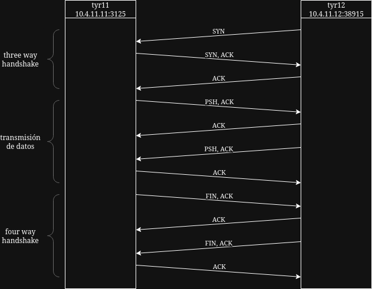

## [Volver atrás](../readme.md)

<div align="center">
<h1>TPL 2 - Aplicaciones 1: Cliente/Servidor - Telnet</h1>
</div>

### Primer parte: Creación de un modelo simple Cliente/Servidor

Utilice para esta parte de la práctica el laboratorio de práctica kathara-lab_conf_inicial y configure las interfaces de pc1 y pc2 tal como lo hizo en el primer trabajo práctico de laboratorio. Verifique conectividad entre ambos hosts.

```
--- Startup Commands Log
++ ip addr add dev eth0 10.4.11.11/24
++ hostname tyr11
++ echo '10.4.11.12 tyr12'
++ ip route add default via 10.4.11.30 dev eth0
--- End Startup Commands Log
root@tyr11:/# ping tyr12 -c 3
PING tyr12 (10.4.11.12) 56(84) bytes of data.
64 bytes from tyr12 (10.4.11.12): icmp_seq=1 ttl=64 time=2.08 ms
64 bytes from tyr12 (10.4.11.12): icmp_seq=2 ttl=64 time=0.643 ms
64 bytes from tyr12 (10.4.11.12): icmp_seq=3 ttl=64 time=0.610 ms

--- tyr12 ping statistics ---
3 packets transmitted, 3 received, 0% packet loss, time 2025ms
rtt min/avg/max/mdev = 0.610/1.111/2.082/0.686 ms
```

```
--- Startup Commands Log
++ ip addr add dev eth0 10.4.11.12/24
++ hostname tyr12
++ echo '10.4.11.11 tyr11'
++ ip route add default via 10.4.11.30 dev eth0
--- End Startup Commands Log
root@tyr12:/# ping tyr11 -c 3
PING tyr11 (10.4.11.11) 56(84) bytes of data.
64 bytes from tyr11 (10.4.11.11): icmp_seq=1 ttl=64 time=0.895 ms
64 bytes from tyr11 (10.4.11.11): icmp_seq=2 ttl=64 time=0.683 ms
64 bytes from tyr11 (10.4.11.11): icmp_seq=3 ttl=64 time=0.611 ms

--- tyr11 ping statistics ---
3 packets transmitted, 3 received, 0% packet loss, time 2057ms
rtt min/avg/max/mdev = 0.611/0.729/0.895/0.120 ms
```

Defina un número de puerto para el proceso servidor (superior a 1024).

Voy a usar el puerto 3125.

En el dispositivo capturador inicie la captura utilizando el comando tcpdump o tshark sobre la interfaz eth0 y redirigir la salida a un archivo en el directorio /shared para su posterior análisis. (Ej. “ tshark -i eth0 -w - > /shared/captura_nc.pcap ”)

```
root@capturador:/# tshark -i eth0 -w - > /shared/captura_cliente_servidor.pcap
Running as user "root" and group "root". This could be dangerous.
Capturing on 'eth0'
 ** (tshark:45) 00:59:12.871224 [Main MESSAGE] -- Capture started.
 ** (tshark:45) 00:59:12.871402 [Main MESSAGE] -- File: "-"
```

En el host pc1 deberá ejecutar la utilidad nc actuando como servidor, indicando como parámetro el número de puerto elegido. Una vez iniciado, este servicio quedará en modo de escucha o listening. En el otro host (pc2) ejecute la utilidad nc como cliente indicando como parámetros la IP del servidor y número de puerto.

```
root@tyr11:/# nc -l -p 3125
```

```
root@tyr12:/# nc 10.4.11.11 3125
```

El comando ```nc``` se utiliza para todo lo relacionado con TCP/UDP.

Con el argumento ```-l``` se especifica que ```nc``` debe escuchar una conexión proveniente, con ```-p``` se debe especificar el puerto en el cual ```nc``` debe escuchar.

Cuando ```nc``` se utiliza pasándole como argumentos un hostname y un puerto (un socket), ```nc``` intenta establecer una conexión utilizando dicho socket.

Si generó correctamente los procesos servidor y cliente, debería poder ver una especie de “chat”. Intercambie varios mensajes con el otro dispositivo y finalice la conexión (en cualquiera de los host presione CTRL+C). Luego detenga la captura en el dispositivo capturador (CTRL+C).

```
root@tyr11:/# nc -l -p 3125
hola
que tal
chau
nos vemos
^C
```

```
root@tyr12:/# nc 10.4.11.11 3125
hola
que tal
chau
nos vemos
^C
```

```
root@capturador:/# tshark -i eth0 -w - > /shared/captura_cliente_servidor.pcap
Running as user "root" and group "root". This could be dangerous.
Capturing on 'eth0'
 ** (tshark:45) 00:59:12.871224 [Main MESSAGE] -- Capture started.
 ** (tshark:45) 00:59:12.871402 [Main MESSAGE] -- File: "-"
21 ^C
tshark: 
```

Analice la captura almacenada en el archivo utilizando tshark y diversos parámetros de visualización (consulte la guía de comandos provista por la materia).

a) “Extraiga” de la captura solamente los datos intercambiados a nivel aplicación y remítalos.

[Captura Cliente/Servidor](./archivos/captura_cliente_servidor.pcap)

```
[usuario@host kathara-lab_conf_inicial]$ tshark -r shared/captura_cliente_servidor.pcap -nqz follow,tcp,hex,0

===================================================================
Follow: tcp,hex
Filter: tcp.stream eq 0
Node 0: 10.4.11.12:38918
Node 1: 10.4.11.11:3125
	00000000  68 6f 6c 61 0a                                    hola.
00000000  71 75 65 20 74 61 6c 0a                           que tal.
	00000005  63 68 61 75 0a                                    chau.
00000008  6e 6f 73 20 76 65 6d 6f  73 0a                    nos vemo s.
===================================================================
```

El comando ```tshark -r shared/captura_cliente_servidor.pcap -nqz follow,tcp,hex,0``` significa:

- **-r**: se utiliza para analizar una captura
- **-n**: deshabilita la resolución de nombres
- **-q**: abreviar el contenido en la salida (por ejemplo, cuando se usan estadísticas)
- **-z follow,tcp,hex,0**: muestra el contenido del flujo TCP de dos nodos, especificando el modo de salida en hexadecimal a partir del flujo 0.

En la salida se pueden observar los sockets del cliente y del servidor; ```Node 0``` representa el socket del cliente y ```Node 1``` representa el socket del servidor.

También se pueden observar los mensajes intercambiados entre los nodos en hexadecimal, mostrando la conversión en ASCII a la derecha de cada mensaje.

b) Realice un diagrama representando el intercambio de tramas indicando las que corresponden al establecimiento de la conexión TCP, a las de transmisión de datos a nivel aplicación, y a las del cierre de la conexión TCP.

<div align='center'>



</div>

El ```three way handshake``` es el establecimiento de la conexión entre dos hosts. El cliente es el que inicia la comunicación: envía una trama con el flag ```SYN``` en 1 y con el número de secuencia con el cual va a comenzar la comunicación. El servidor recibe esa trama y responde con una trama cuyo flag SYN también está en 1 y con el flag ```ACK``` en 1, confirmando la recepción de la trama y el número de secuencia. Por último, el cliente envía una trama con el flag ACK en 1, confirmando la recepción de la trama enviada por el servidor, y estableciendo la conexión para empezar a transmitir datos.

Luego por cada dato que se transmite, sea el cliente o el servidor el que transmite datos, en la trama enviada se encuentra el flag PSH en 1 junto con el flag ACK también en 1. El flag ```PSH``` indica que se envíen los datos inmediatamente sin esperar a que se llene el buffer.

Por último, para cerrar la conexión, el host que desea hacerlo envía una trama con flag FIN en 1 y con flag ACK en 1. El flag ```FIN``` indica que el emisor ya no tiene datos para transmitir y desea terminar la conexión. El receptor de esta trama responde con una trama con flag ACK en 1, y una vez que ya no tenga datos para enviar, envia su propia trama con flags FIN y ACK en 1. Finalmente, el host que inicialmente quiso terminar la conexión, envía una trama con flag ACK en 1 para confirmar la recepción de los datos.

c) ¿Todas las tramas en las que identifica el protocolo TCP transportan datos de aplicación?. ¿Si no es así puede explicar el porqué?

No, las tramas involucradas en el establecimiento y finalización de la conexión, y en algunos casos en la confirmación de recepción de datos, sólo contienen datos de control para la conexión. Es así porque la característica principal del protocolo TCP es asegurar la entrega correcta y ordenada de los datos.

### Segunda parte: Protocolo de acceso remoto TELNET

Instale e inicie en Kathará el laboratorio de Telnet provisto por los docentes, disponible en https://github.com/redesunlu/kathara-labs/blob/main/tarballs/kathara-lab_telnet.tar.gz

El laboratorio cuenta con dos hosts. El primer host actuará como cliente telnet (client), mientras que el segundo host actuará como servidor remoto de telnet (remote).

Asigne una dirección IP al host cliente dentro de la red 172.16.0.0/24 . (puede elegir cualquiera del rango 172.16.0.1-254 excepto 172.16.0.10 )

```
root@client:/# ip addr add 172.16.0.20/24 dev eth0
root@client:/# ip addr show
1: lo: <LOOPBACK,UP,LOWER_UP> mtu 65536 qdisc noqueue state UNKNOWN group default qlen 1000
    link/loopback 00:00:00:00:00:00 brd 00:00:00:00:00:00
    inet 127.0.0.1/8 scope host lo
       valid_lft forever preferred_lft forever
4: eth0: <BROADCAST,MULTICAST,UP,LOWER_UP> mtu 1500 qdisc fq_codel state UP group default qlen 1000
    link/ether 32:59:c4:b6:7a:d4 brd ff:ff:ff:ff:ff:ff
    inet 172.16.0.20/24 scope global eth0
       valid_lft forever preferred_lft forever
```

En el dispositivo capturador inicie la captura utilizando el comando tcpdump o tshark sobre la interfaz eth0 y redirigir la salida a un archivo en el directorio /shared para su posterior análisis. (Ej. “ tshark -i eth0 -w - > /shared/captura_telnet.pcap ”)

```
root@capturador:/# tshark -i eth0 -w - > /shared/captura_telnet.pcap
Running as user "root" and group "root". This could be dangerous.
Capturing on 'eth0'
 ** (tshark:70) 02:22:53.488723 [Main MESSAGE] -- Capture started.
 ** (tshark:70) 02:22:53.488811 [Main MESSAGE] -- File: "-"
```

En la terminal del host cliente, conéctese mediante telnet al host remoto, cuya dirección IP es 172.16.0.10. Utilice el nombre de usuario alumno y la clave ultrasecreta.

```
root@client:/# telnet 172.16.0.10
Trying 172.16.0.10...
Connected to 172.16.0.10.
Escape character is '^]'.

Linux 6.16.4-arch1-1 (remote) (pts/2)

remote login: alumno
Password: 
Linux remote 6.16.4-arch1-1 #1 SMP PREEMPT_DYNAMIC Thu, 28 Aug 2025 19:49:53 +0000 x86_64
=====================================================================
Bienvenido al servidor en la Antartida.

Continue el ejercicio ejecutando el comando:

    who && who | openssl dgst

Copie y pegue la salida de este en la resolucion de su practica.
=====================================================================

No directory, logging in with HOME=/
```

Con la sesión iniciada en remoto, ejecute el siguiente comando respetando la sintaxis.

    who && who | openssl dgst

Copie la salida de dicho comando como resolución de este ejercicio (como texto). Añada además todos los comandos que ejecutó para lograr dicho resultado.

```
$ who && who | openssl dgst
SHA256(stdin)= e3b0c44298fc1c149afbf4c8996fb92427ae41e4649b934ca495991b7852b855
```

Salga del host remoto escribiendo el comando exit.

```
$ exit
Connection closed by foreign host.
```

Luego detenga la captura en el dispositivo capturador. Remítala en formato pcap como parte de la tarea.

```
95 ^C
tshark: 
```

Analice la captura:

a) Identifique e indique las tramas que corresponden a la transmisión de datos a nivel aplicación, cuáles a protocolos auxiliares (si existen) y al establecimiento y cierre de la conexión TCP (referenciando por número de trama en la captura).

[Captura TELNET](./archivos/captura_telnet.pcap)

- Las primeras 3 tramas corresponden al establecimiento de la conexión entre el host cliente con IP 172.16.0.20 y el cliente TELNET con IP 172.16.0.10, utilizando el protocolo TCP.
- A partir de la trama 4 es cuando se empiezan a intercambiar tramas con el protocolo TELNET, es decir que en esta trama empieza la transmisión de datos a nivel aplicación. Desde la trama 4 hasta la trama 21, los hosts intercambian tramas para negociar los parámetros de sesión, confirmando la recepción de cada una enviando una trama TCP con flag ACK = 1.
- En la trama 22, el servidor envía una trama TELNET con datos, solicitando al cliente el usuario para el inicio de sesión.
- Entre la trama 24 y la trama 41, se intercambian tramas entre el cliente el servidor, en las cuales el cliente envía tramas TELNET por cada caracter que ingresa el usuario, y el servidor responde enviando tramas TELNET haciendo eco de los datos transmitidos por el cliente. El cliente responde este eco con tramas TCP de reconocimiento.
- En la trama 42, el servidor envía una trama TELNET solicitando al cliente que ingrese la contraseña. A partir de la trama 43 hasta la trama 69 sucede algo similar al punto anterior, pero esta vez el servidor no hace eco de los datos enviados por el cliente, y en cambio envía tramas TCP de reconocimiento.
- En la trama 70, el servidor envía el mensaje de bienvenida en una trama TELNET. En la trama 71, el cliente envía una trama TCP de reconocimiento y en la trama 72 envía una trama TELNET con el comando solicitado.
- Hasta la trama 78 se intercambian tramas TELNET y TCP, y en la trama 78 el servidor envía al cliente la respuesta al comando en una trama TELNET.
- A partir de la trama 80 es cuando el cliente empieza a enviar el comando "exit" para cerrar la sesión TELNET con el servidor.
- Finalmente en la trama 93 es cuando se inicia la finalización de la conexión, siendo el servidor el que inicia el proceso enviando una trama TCP con flag FIN y ACK en 1. En la trama 94 el cliente responde también con una trama TCP con flag FIN y ACK en 1. Por último, en la trama 95, el servidor envía una trama TCP reconociendo la trama enviada por el cliente.

b) Comente las características de la información en tránsito con respecto a la confidencialidad.

Los datos se envían sin cifrado en texto plano, esto es un problema porque agentes malintencionados pueden interceptar la transmisión y capturar los datos, e incluso alterarlos, ya que no se verifica la integridad de éstos. También podría redirigir el tráfico a otro equipo o incluso hacerse pasar por el cliente o por el servidor.

### Preguntas (guía de lectura)
- En la capa de aplicación ¿a qué se denomina cliente y a qué servidor?
- En el stack TCP/IP, ¿cómo es posible que un protocolo de transporte brinde servicio a n procesos ejecutándose en un mismo host?
- ¿Cuáles son las características y usos del protocolo TELNET?
- ¿Qué problemática resuelve NVT?