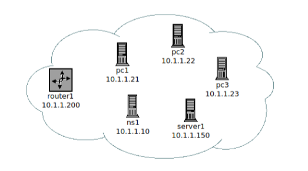
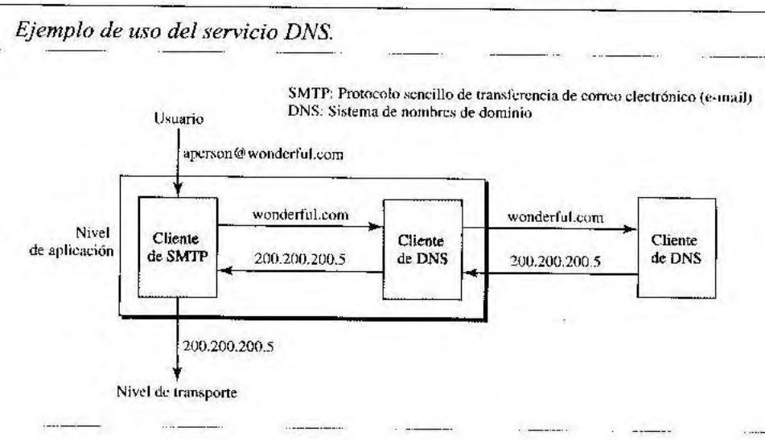
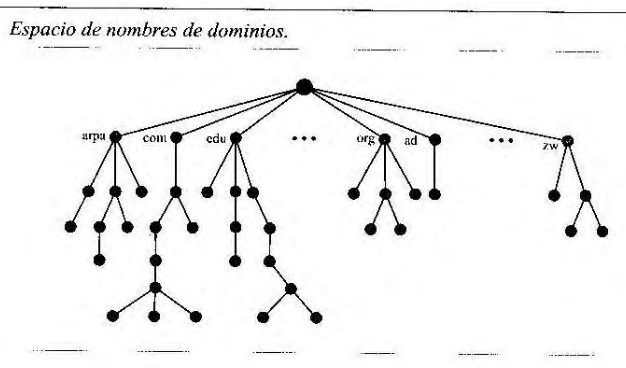
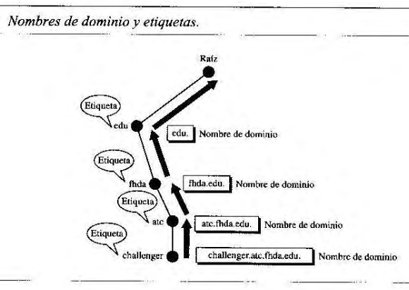
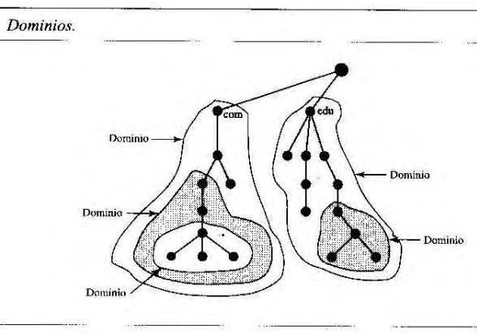
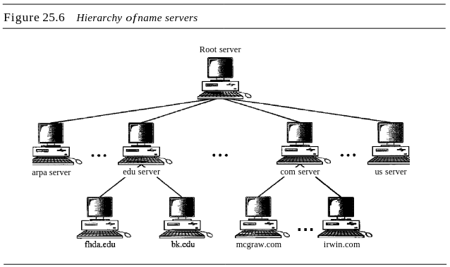
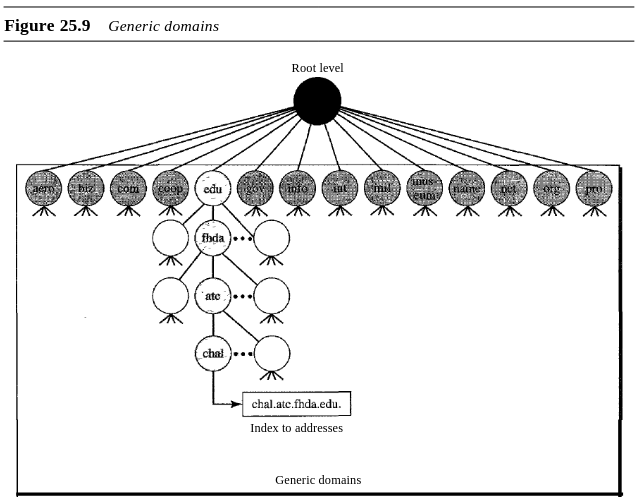
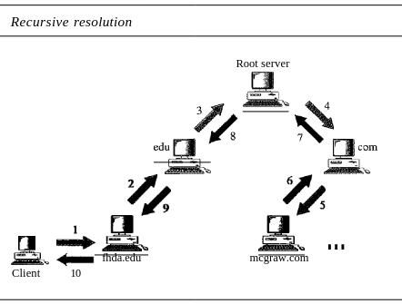
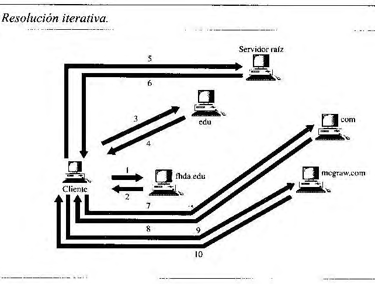

## [Volver atrás](../readme.md)

<div align="center">
<h1>TPL 3 - Domain Name System</h1>
</div>

### Indice

✍️ [Consignas](#consignas)

❓ [Guía de preguntas](#guia-de-preguntas)

📝 [Resumen](#resumen)

📖 [Bibliografía](#bibliografia)

---

### Consignas

1. Utilizando la herramienta dig (o nslookup) realice consultas al servidor DNS indicado por el docente, (o desde su hogar al provisto por su ISP, o bien alguno de acceso público tal como 8.8.8.8 o 1.1.1.1) para obtener la siguiente información:
    
    a. ¿Cuál es la dirección IP del host platdig.unlu.edu.ar ?

        [user@host ~]$ dig platdig.unlu.edu.ar

        ; <<>> DiG 9.20.13 <<>> platdig.unlu.edu.ar
        ;; global options: +cmd
        ;; Got answer:
        ;; ->>HEADER<<- opcode: QUERY, status: NOERROR, id: 27941
        ;; flags: qr rd ra; QUERY: 1, ANSWER: 1, AUTHORITY: 0, ADDITIONAL: 1

        ;; OPT PSEUDOSECTION:
        ; EDNS: version: 0, flags:; udp: 512
        ;; QUESTION SECTION:
        ;platdig.unlu.edu.ar.           IN      A

        ;; ANSWER SECTION:
        platdig.unlu.edu.ar.    3600    IN      A       190.104.80.55

        ;; Query time: 29 msec
        ;; SERVER: 192.168.100.1#53(192.168.100.1) (UDP)
        ;; WHEN: Sun Sep 14 13:22:56 -03 2025
        ;; MSG SIZE  rcvd: 64

    El comando ```dig platdig.unlu.edu.ar``` produce esta salida, en la cual se puede encuentrar la dirección IP solicitada, en la parte de ```ANSWER SECTION```. En esta sección se indica los registros DNS que devolvió el servidor DNS, en este caso devolvió un registro ```A```, indicando que la IPv4 de platdig.unlu.edu.ar es 190.104.80.55.

    b. ¿Cuál es la dirección IP del host educativa.unlu.edu.ar ? ¿Qué diferencia nota en la respuesta respecto al punto anterior?

        [user@host ~]$ dig educativa.unlu.edu.ar

        ; <<>> DiG 9.20.13 <<>> educativa.unlu.edu.ar
        ;; global options: +cmd
        ;; Got answer:
        ;; ->>HEADER<<- opcode: QUERY, status: NOERROR, id: 55646
        ;; flags: qr rd ra; QUERY: 1, ANSWER: 2, AUTHORITY: 0, ADDITIONAL: 1

        ;; OPT PSEUDOSECTION:
        ; EDNS: version: 0, flags:; udp: 1232
        ;; QUESTION SECTION:
        ;educativa.unlu.edu.ar.         IN      A

        ;; ANSWER SECTION:
        educativa.unlu.edu.ar.  3600    IN      CNAME   unlu1.unlu.edu.ar.
        unlu1.unlu.edu.ar.      2180    IN      A       190.104.80.1

        ;; Query time: 19 msec
        ;; SERVER: 192.168.100.1#53(192.168.100.1) (UDP)
        ;; WHEN: Sun Sep 14 13:28:55 -03 2025
        ;; MSG SIZE  rcvd: 86

    En este caso, el comando ```dig educativa.unlu.edu.ar``` devuelve un ```ANSWER SECTION``` con dos registros, un ```CNAME``` y un ```A```. El registro ```CNAME``` (Canonical Name) indica que "educativa.unlu.edu.ar" es un alias de "unlu1.unlu.edu.ar" (el nombre canónico), y es este último el cual contiene el registro ```A``` que contiene su dirección IPv4. Por lo tanto, la dirección IP de educativa.unlu.edu.ar es 190.104.80.1.

    c. ¿Cuáles son los intercambiadores de mail (mnemónico y dirección IP) del dominio unsa.edu.ar ?

        [user@host ~]$ nslookup -type=MX unsa.edu.ar
        Server:         192.168.100.1
        Address:        192.168.100.1#53

        Non-authoritative answer:
        unsa.edu.ar     mail exchanger = 20 mx2.unsa.edu.ar.
        unsa.edu.ar     mail exchanger = 10 mx1.unsa.edu.ar.

        Authoritative answers can be found from:

    El comando ```nslookup -type=MX unsa.edu.ar``` devuelve los registros ```MX``` de unsa.edu.ar, los cuales proporcionan los hosts a los cuales debemos consultar para saber cuál es la dirección IP de los intercambiadores de mail. En este caso son dos: mx1.unsa.edu.ar y mx2.unsa.edu.ar.

        [user@host ~]$ nslookup -type=A mx1.unsa.edu.ar
        Server:         192.168.100.1
        Address:        192.168.100.1#53

        Non-authoritative answer:
        Name:   mx1.unsa.edu.ar
        Address: 170.210.206.18

    Con el comando ```nslookup -type=A mx1.unsa.edu.ar``` obtenemos los registros ```A``` de mx1.unsa.edu.ar, junto con su IPv4, la cual es 170.210.206.18.

        [user@host ~]$ nslookup -type=A mx2.unsa.edu.ar
        Server:         192.168.100.1
        Address:        192.168.100.1#53

        Non-authoritative answer:
        Name:   mx2.unsa.edu.ar
        Address: 190.221.183.218

    Con el comando ```nslookup -type=A mx2.unsa.edu.ar``` obtenemos los registros ```A``` de mx2.unsa.edu.ar, junto con su IPv4, la cual es 190.221.183.218.

    d. ¿Cuál es el nombre del host cuya dirección IP es 190.104.80.12 ?

        [user@host ~]$ nslookup 190.104.80.12
        12.80.104.190.in-addr.arpa      name = redhidro.unlu.edu.ar.

    El comando ```nslookup 190.104.80.12``` devuelve dos elementos:

    - ```12.80.104.190.in-addr.arpa```: este es un nombre que lo arma el cliente DNS para poder realizar una consulta inversa al servidor DNS, el cual a partir de ese nombre obtiene un registro ```PTR``` que apunta al nombre canónico que corresponde con la dirección IP.
    - ```redhidro.unlu.edu.ar.```: es el nombre canónico de la dirección IPv4 ```190.104.80.12```.

    Entonces el nombre de host cuya dirección IP es 190.104.80.12 es redhidro.unlu.edu.ar.

    e. ¿Cuáles son los servidores de nombres (mnemónicos y dirección IP) para el dominio ripe.net ?

        [user@host ~]$ dig +short -t NS ripe.net
        ns4.apnic.net.
        rirns.arin.net.
        manus.authdns.ripe.net.
        ns3.lacnic.net.
        ns3.afrinic.net.
    
    Con el comando ```dig +short -t NS ripe.net``` obtengo sólo los mnemónicos de los nameservers de ripe.net. Cada uno de estos servidores de nombres contiene la información sobre ripe.net, por lo cual el cliente DNS puede utilizar cualquiera de estos para resolver la dirección IP de ripe.net.

        [user@host ~]$ dig +short ns4.apnic.net.
        202.12.31.53
        [user@host ~]$ dig +short rirns.arin.net.
        199.253.249.53
        [user@host ~]$ dig +short manus.authdns.ripe.net.
        193.0.9.7
        [user@host ~]$ dig +short ns3.lacnic.net.
        200.3.13.14
        [user@host ~]$ dig +short ns3.afrinic.net.
        204.61.216.100

    f. ¿Cuál es la dirección IPv6 del host debian.org ?

        [user@host ~]$ dig -t AAAA debian.org

        ; <<>> DiG 9.20.13 <<>> -t AAAA debian.org
        ;; global options: +cmd
        ;; Got answer:
        ;; ->>HEADER<<- opcode: QUERY, status: NOERROR, id: 56907
        ;; flags: qr rd ra; QUERY: 1, ANSWER: 4, AUTHORITY: 0, ADDITIONAL: 1

        ;; OPT PSEUDOSECTION:
        ; EDNS: version: 0, flags:; udp: 4096
        ;; QUESTION SECTION:
        ;debian.org.                    IN      AAAA

        ;; ANSWER SECTION:
        debian.org.             207     IN      AAAA    2a04:4e42:200::644
        debian.org.             207     IN      AAAA    2a04:4e42:600::644
        debian.org.             207     IN      AAAA    2a04:4e42:400::644
        debian.org.             207     IN      AAAA    2a04:4e42::644

        ;; Query time: 2 msec
        ;; SERVER: 192.168.100.1#53(192.168.100.1) (UDP)
        ;; WHEN: Sun Sep 14 16:44:57 -03 2025
        ;; MSG SIZE  rcvd: 151

    Con el comando ```dig -t AAAA debian.org``` hago una consulta DNS para obtener los registros ```AAAA```, los cuales apuntan a direcciones IPv6. Las direcciones IPv6 de debian.org son:
    - 2a04:4e42::644
    - 2a04:4e42:200::644
    - 2a04:4e42:600::644
    - 2a04:4e42:400::644

2. Utilice la herramienta DNS BAJAJ disponible en http://www.zonecut.net/dns/ para obtener información en forma de grafo acerca del dominio cruzroja.org.ar . ¿Cuáles son los servidores (nombre y dirección IP) para dicho dominio?

La herramienta DNS BAJAJ muestra como se realiza la consulta para resolver la dirección IP de cruzroja.org.ar desde la raíz (1.root-servers.net) hacia los nodos descendientes, hasta encontrar los servidores de nombre ```ns1.cruzroja.org.ar.``` y ```ns2.cruzroja.org.ar.``` de cruzroja.org.ar, que apuntan a la misma dirección IP 107.190.132.130.

3. ¿En dónde se encuentra la copia mas cercana de un servidor dns raíz? ¿Cuál es el nombre del servidor replicado (o servidores)?


4. Defina cómo estará compuesta la base de datos de un servidor DNS administrado por Ud., de manera tal que sea el servidor primario del dominio SU-NRO-LEGAJO.tyr.example ( .example es un TLD reservado para uso en documentación y ejemplos). De acuerdo al diagrama de la Figura 1, defina:

    a. El nombre de todos los hosts en el nuevo dominio, y su respectivo puntero reverso.

    b. Los hosts pc1 y ns1 como name servers del dominio.

    c. www.SU-NRO-LEGAJO.tyr.example y ftp.SU-NRO-LEGAJO.tyr.example como alias de server1.
    
    Complete la planilla adjunta a partir de las definiciones previas.

<div align='center'>



Figura 1: Host en la red a definir en DNS

</div>

5. Instale e inicie en el entorno kathara el laboratorio de dns provisto por los docentes disponible en https://github.com/redesunlu/kathara-labs/blob/main/tarballs/kathara-lab_dns.tar.gz y realice las siguientes actividades:

    a. En el dispositivo capturador inicie la captura utilizando el comando tcpdump o tshark sobre la interfaz eth0 y redirigir la salida a un archivo en el directorio /shared para su posterior análisis. (Ej. “tshark -i eth0 -w - > /shared/captura_dns.pcap”)

    b. Desde pc1.lugroma3.org, ejecute el comando ping -c 4 pc2.nanoinside.net

    c. Una vez recibidas las 4 respuestas ICMP, detenga la captura.

    d. Analice la captura y describa cómo es el proceso de resolución de nombres para determinar la dirección ip de pc2.nanoinside.net, representando gráficamente el intercambio de mensajes dns, e indicando el propósito de cada uno.

    e. Identifique el host que realiza una consulta recursiva y cuál consultas iterarivas.

6. Analice la captura captura_ejemplo_dns.pcap y represente el intercambio de mensajes. ¿Puede indicar alguna particularidad que observe en la misma?

7. ¿Cómo un desarrollador de aplicaciones puede acceder al servicio DNS? (Por ej. si es necesario resolver, en una aplicación de software, mnemónicos a direcciones IP o viceversa)

---

### Guia de preguntas

¿Cuál es el objetivo del sistema DNS?

¿Porqué es un sistema y no solamente un protocolo? Descríbalo indicando estructura, elementos que intervienen y tipos de datos (Resource Records) típicos que se pueden consultar.

El protocolo DNS puede utilizar como protocolo de transporte tanto UDP como TCP. ¿En qué casos se utiliza cada uno y cuál es la razón?

¿Quién tiene a su cargo la administración de los nombres de dominio bajo el dominio .ar ? ¿Qué y cuáles son las zonas especiales? ¿Qué requisito especial se requiere para solicitar un dominio .org.ar ?

---

### Resumen

#### 25.0 Domain Name System

Hay varias aplicaciones en la capa de aplicación que siguen el paradigma cliente/servidor. Los programas cliente/servidor se pueden dividir en dos categorías: los que pueder ser usados directamente por el usuario, y los que dan soporte a otros programas de aplicación. El Domain Name System (DNS) es un programa de soporte que es usado por otros programas, como el e-mail.

<div align='center'>



</div>

La imagen anterior muestra como un programa cliente/servidor DNS puede dar soporte a un programa de correo para encontrar la dirección IP de un receptor. Un usuario de un programa de correo puede saber la dirección de correo del receptor, pero el protocolo IP necesita la dirección IP. El cliente DNS envía una solicitud a un servidor DNS para encontrar la dirección IP correspondiente a esa dirección de correo.

Para identificar una identidad, los protocolos TCP/IP usan la dirección IP. Pero las personas prefieren usar nombres en lugar de direcciones numéricas, entonces se necesita un sistema que pueda traducir un nombre a una dirección o viceversa.

Con el tiempo fueron surgiendo varias soluciones, pero la que se utiliza hoy en día es dividir la enorme cantidad de información en partes más pequeñas y almacenar cada parte en una computadora diferente. El host que necesita encontrar una dirección se puede contactar con la computadora más cercana que contiene la información necesaria. Este método es el que utiliza el **Domain Name Service (DNS)**.

#### 25.1 Espacio de nombres

Para no ser ambiguos, los nombres asignados a las máquinas deben ser seleccionados con cuidado a partir de un espacio de nombres con control total sobre la asociación de nombres y direcciones IP. En otras palabras, los nombres deben ser únicos porque las direcciones son únicas. Un espacio de nombres que traduce cada dirección a un nombre único puede ser organizado de dos maneras: plana o jerárquica.

**Espacio de nombres plano**

En un espacio de nombres plano, un nombre se asigna a una dirección. Un nombre en este espacio es una secuencia de caracteres sin estructura. Los nombres pueden o no tener una sección en común, y si la tienen, no tiene significado. La principal desventaja de un espacio de nombres plano es que no puede ser usado en un sistema grande como el Internet porque debe ser controlado de manera centralizada para evitar la ambiguedad y duplicación.

**Espacio de nombres jerárquico**

En un espacio de nombres jerárquico, cada nombre se compone de varias partes. La primera parte puede definir la naturaleza de una organización, la segunda parte puede definir el nombre de una organización, la tercera puede definir departamentos dentro de la organización, etc. 

La autoridad que asigna y controla el espacio de nombres puede ser descentralizada. Una autoridad central puede asignar la parte del nombre que define la naturaleza de la organización y el nombre de la organización, mientras que se puede dar la responsabilidad sobre el resto del nombre a la organización misma. La organización puede agregar sufijos o prefijos al nombre que define su host o sus recursos. 

#### 25.2 Espacio de nombres de dominio

El espacio de nombres es un espacio de nombres jerárquico. Para lograr esto, se diseñó un **espacio de nombres de dominio**. Los nombres se definen con una estructura de árbol invertida con una raíz en la parte superior. El árbol solo puede tener 128 niveles, del nivel 0 (raíz) al nivel 127.

<div align='center'>



</div>

**Etiqueta**

Cada nodo en el árbol tiene una etiqueta, una cadena de caracteres con un tamaño de 63 caracteres como máximo. El nodo raíz es una cadena vacía. 

**Nombres de dominio**

Cada nodo en el árbol tiene un nombre de dominio. Un **nombre de dominio** completo es una secuencia de etiquetas separadas por puntos. La última etiqueta es la etiqueta raíz (nulo). 

<div align='center'>



</div>

Si la etiqueta finaliza con una cadena nula, entonces el nombre de dominio se denomina **nombre de dominio completamente cualificado (FQDN)**. Un FQDN es un nombre de dominio que contiene el nombre completo de una estación. Contiene todas las etiquetas que definen únicamente el nombre del host. Por ejemplo, el nombre de dominio ```challenger.atc.fhda.edu.``` es el FQDN de una computadora llamada ```challenger``` instalada en el Centro de Tecnología Avanzada (Advanced Technology Center) en De Anza College. Un servidor DNS solo puede unir un FQDN a una dirección.


Si la etiqueta no finaliza con una cadena nula, entonces se tiene un **nombre de dominio parcialmente cualificado (PQDN)**. Un PQDN empieza desde un nodo, pero no llega a la raíz. Se usa cuando el nombre a resolver pertenece al mismo sitio que el cliente. En este caso el resolver puede brindar la parte faltante, llamada sufijo, para crear un FQDN. Por ejemplo, si un usuario en el sitio de ```fhda.edu.``` necesita la dirección IP de la computadora challenger, el usuario puede definir el nombre parcial ```challenger```. El cliente DNS agrega el sufijo ```atc.fhda.edu.``` antes de pasarle la dirección al servidor DNS.

**Dominio**

Un **dominio** es un subárbol del espacio de nombres de dominio. El nombre del dominio es el nombre del dominio del nodo que se encuentra en la parte superior del subárbol. Acá se pueden ver un par de ejemplos:

<div align='center'>



</div>

#### 25.3 Distribución del espacio de nombres

La información contenida en un espacio de nombres de dominio debe ser almacenada, pero es muy ineficiente almacenar tanta información en una sola computadora, debido al tráfico que ocasiona la multitud de solicitudes que puede recibir dicha computadora. Tampoco es fiable porque cualquier fallo puede hacer que la información quede inaccesible.

**Jerarquía de servidores de nombre**

La solución a esos problemas es distribuir la información en varias computadoras llamadas servidores DNS. Una manera de hacerlo es dividir el espacio entero en varios dominios con respecto al primer nivel, en otras palabras, dejamos solo a la raíz y creamos tantos subárboles como nodos de primer nivel haya. DNS permite subdividir los dominios en dominios más pequeños (subdominios). Cada servidor puede ser responsable de un dominio grande o pequeño, es decir que hay una jerarquía de servidores del mismo modo en el que hay una jerarquía de nombres.

<div align='center'>



</div>

**Zona**

Como la jerarquía completa de nombres de dominio no puede ser almacenada en un solo servidor, se divide en varios servidores. El servidor responsable o con autoridad se lo conoce como **zona**. La zona es una parte contigua del árbol entero. Si un servidor acepta responsabilidad de un dominio y no divide el dominio en subdominios, el dominio y la zona hacen referencia a lo mismo. El servidor crea una base de datos llamada **archivo de zona** y almacea toda la información de cada nodo bajo ese dominio. Sin embargo, si un servidor divide su dominio en subdominios y delega parte de su autoridad a otros servidores, dominio y zona se refieren a cosas diferentes. La información sobre los nodos en los subdominios se almacena en los servidores de los niveles bajos, con el servidor original almacenando una especie de referencia a esos servidores de nivel bajo. El servidor original todavía tiene una zona, pero la información detallada está almacenada en los servidores de niveles bajos.

Un servidor también puede dividir parte de su dominio y delegar su responsabilidad, y al mismo tiempo mantener parte del dominio para si mismo. En este caso, la zona está hecha de información detallada para la parte del dominio que no fue delegada y hace referencia a esas partes que fueron delegadas.

**Root server**

Un **root server** o **servidor raíz** es un servidor cuya zona consiste de todo el árbol. Un root server generalmente no almacena información sobre los dominios pero delega su autoridad a otros servidores, manteniendo referencias a dichos servidores. Existen varios root servers, cada uno cubriendo el espacio de nombres de dominio entero. Estos servidores están distribuidos por todo el mundo.

**Servidores primarios y secundarios**

Un **servidor primario** es un servidor que almacena un archivo sobre la zona en la cual es autoridad. Es el responsable de crear, mantener, y actualizar el archivo de zona.

Un **servidor secundario** es un servidor que transfiere toda la información sobre una zona desde otro servidor y almacena el archivo en su disco. No crea ni actualiza archivos de zona. Si se necesita actualizar, debe ser hecho por el servidor primario, el cual envía la versión actualizada al servidor secundario.

La idea es crear redundancia sobre los datos para el caso en el que si uno de los servidores falla, el otro puede continuar sirviendo clientes. Hay que tener en cuenta que un servidor puede ser un servidor primario para una zona en específico y ser un servidor secundario para otra zona.

#### 25.4 DNS en Internet

En Internet, el espacio de nombres de dominios se divide en tres secciones diferentes: dominios genéricos, dominios de país, y dominio inverso.

Los **dominios genéricos** definen hosts registrados de acuerdo con su comportamiento genérico. Cada nodo del árbol define un dominio, el cuál es un índice en la base de datos del espacio de nombres de dominio.

<div align='center'>



</div>

Los **dominios de país** usan abreviaciones de dos caracteres. Las etiquetas secundarias pueden ser organizacionales, o pueden ser designaciones nacionales más específicas.

El **dominio inverso** se usa para traducir una dirección a un nombre. Esto puede suceder, por ejemplo, cuando un servidor recibe una solicitud de un cliente para realizar una tarea. Si bien el servidor tiene un archivo que contiene la lista de clientes autorizados, sólo se lista la dirección IP del cliente. El servidor le consulta a su resolver para enviar una consulta al servidor DNS para traducir una dirección a un nombre para determinar si el cliente está en la lista de autorizados.

Este tipo de consulta se denomina consulta inversa o de puntero. Para manejar una consulta puntero, el dominio inverso es agregado al espacio de nombres de dominio con el nodo de primer nivel llamado ```arpa```. El segundo nivel también es un solo nodo llamado ```in-addr```. El resto del dominio define direcciones IP. Por ejemplo, la IP ```190.104.80.1``` se representa como:

```
1.80.104.190.in-addr.arpa.
```

en ese nodo se almacena el registro PTR que apunta al nombre de dominio:

```
1.80.104.190.in-addr.arpa.   IN PTR   www.unlu.edu.ar.
```

Los servidores que manejan el dominio inverso también son jerárquicos, esto significa que la parte de la dirección IP que define la red debe estar en el nivel alto mientras que la parte de la dirección IP que define los hosts debe estar en un nivel debajo.

#### 25.5 Resolución

Traducir un nombre a una dirección o una dirección a un nombre se denomina resolución de direcciones.

**Resolver**

DNS es designado como una aplicación cliente/servidor. Un host que necesita encontrar una dirección a partir de un nombre o viceversa llama a un cliente DNS, el **resolver**. El resolver accede al servidor DNS más cercano con una solicitud de traducción. Si el servidor tiene la información, se la devuelve al resolver, si no, remite al resolver a otros servidores, o pregunta a otros servidores para que provean la información.

Luego de que el resolver recibe la traducción, verifica si es una resolución correcta o un error, y finalmente responde al proceso que hizo la solicitud.

**Traducción de nombres a direcciones**

La mayoría de las veces, el resolver da el nombre de dominio a un servidor y le pregunta por la dirección correspondiente. El servidor mira los dominios genéricos o de país para encontrar la dirección.

Si el nombre de dominio está en la sección de dominios genéricos, el resolver envía la consulta al servidor DNS local. Si el servidor local no lo puede resolver, remite al resolver a otros servidores o consulta a otros servidores directamente.

Si el nombre de dominio está en la sección de dominios de país, el procedimiento es el mismo.

**Traducción de direcciones a nombres**

Para resolver consultas inversas, DNS usa el dominio inverso. En la solicitud, la dirección IP es invertida y las dos etiquetas ```in-addr``` y ```arpa``` son concatenados para crear un dominio aceptado por la sección de dominio inverso. Este dominio es recibido por el DNS local y se resuelve.

**Resolución recursiva**

El cliente (resolver) puede consultar por una respuesta recursiva al servidor de nombres, lo cual significa que el resolver espera que el servidor le de la respuesta final. Si el servidor es la autoridad para el nombre de dominio, consulta su base de datos y responde. Si no es la autoridad, le envía la solicitud a otro servidor (normalmente al padre) y espera por la respuesta. Si el padre es la autoridad, responde; si no, envía la consulta a otro servidor. Cuando la consulta es resuelta, la respuesta viaja hasta que llega al cliente que hizo la solicitud. Esto se llama **resolución recursiva**.

<div align='center'>



</div>

**Resolución iterativa**

Si el cliente no hace una consulta recursiva, la traducción se puede hacer de manera iterativa. Si el servidor es autoridad del nombre, envía la respuesta, si no, retorna la dirección IP del servidor que puede resolver la consulta. El cliente repite la consulta a los distintos servidores hasta que consigue una respuesta con la resolución.

<div align='center'>



</div>

**Caching**

Cada vez que el servidor recibe una consulta para un nombre que no está en su dominio, necesita buscar en su base de datos una dirección IP de un servidor. Cuando un servidor quiere resolver una traducción de otro servidor y recibe la respuesta, almacena esta información en su caché antes de enviarla al cliente. Si el mismo u otro cliente consultan por la misma traducción, puede resolver el problema a partir de la información contenida en la caché. Sin embargo, el servidor aclara al cliente que la información proviene de su caché, marcando la respuesta como ```no autoritativa```.

El **caching** acelera la resolución, pero puede ser problemática si la información permanece por largos períodos de tiempo, ya que esa información podría estar desactualizada. Para evitar esto, se utilizan dos técnicas. Primero, el servidor autoritativo agrega información a la traducción llamada **time to live (TTL)**. Define el tiempo en segundos en el que dicha información puede ser almacenada en caché. Una vez terminado ese tiempo, la traducción es invalida y cualquier consulta sobre esa traducción debe ser enviada de nuevo al servidor autoridad. Segundo, DNS requiere que cada servidor mantenga un contador TTL para cada traducción que cachea, para que cuando alguna expire, la traducción sea eliminada.

---

### Bibliografia

➤ [**FOR07**] - [Data Communications and Networking](https://github.com/mnomico/tyr/raw/main/libros/FOR07.pdf)

&nbsp;&nbsp;&nbsp;&nbsp;&nbsp;&nbsp;⤷ Capítulo 25: “Domain Name System”

</div>