## [Volver atrás](../readme.md)

<div align="center">
<h1>TPL 4 - Correo Electrónico SMTP - POP3 - IMAP4 - MIME</h1>
</div>

### Indice

✍️ [Consignas](#consignas)

❓ [Guía de preguntas](#guia-de-preguntas)

📝 [Resumen](#resumen)

📖 [Bibliografía](#bibliografia)

---

### Consignas

1. Un usuario redacta un mensaje destinado a consultas@empresax.example.com en su cliente de correo y lo envía mediante su propio MTA. Detalle paso a paso el procedimiento que debe seguir el MTA del usuario para entregar el mensaje al destinatario.

    Cuando el usuario desea enviar un mensaje, ejecuta un programa ```user agent``` para preparar el mensaje. El mensaje contiene las direcciones de correo del emisor y del receptor. Para poder enviar el mensaje, se debe enviar por Internet: el ```MTA``` del cliente debe establecer una conexión con el ```MTA``` del servidor para transmitir el mail. 

    Para que el MTA cliente pueda establecer una conexión con el MTA servidor, primero necesita saber su dirección IP. A partir de la dirección de mail destino, extrae el dominio, en este caso ```empresax.example.com``` y le solicita al resolver DNS que obtenga los registros ```MX``` de ese dominio. Luego de obtener la dirección IP, establece una conexión TCP con el MTA servidor, y utilizan el protocolo ```Simple Mail Transfer Protocol (SMTP)``` para la transferencia del mensaje. 
    
    Para establecer la conexión SMTP, el servidor envía el código 220 (service ready) para decirle al cliente que está listo para recibir mails. Luego el MTA cliente envía el mensaje ```HELO``` para identificarse usando su nombre de dominio. El servidor responde con el código 250 (request command completed) o con otro código dependiendo de la situación.

    Luego de que la conexión se estableció entre el cliente y servidor SMTP, se pueden intercambiar mensajes. El cliente envía el mensaje ```MAIL FROM``` para enviar la dirección de mail del emisor. El servidor responde con el código 250. El cliente envía el mensaje ```RCPT TO``` para enviar la dirección de mail del destinatario. El servidor responde con el código 250. El cliente envía el mensaje ```DATA``` para iniciar la transferencia del mensaje. El servidor responde con el código 354 (start mail input). El cliente envía el contenido del mensaje, el cual se termina con una línea que contiene sólamente un punto. El servidor responde con el código 250.

    Una vez transferido el mensaje, el cliente termina la conexión mediante el envío del mensaje ```QUIT``` al cual el servidor responderá con el código 221 (service closed). Por último, se debe cerrar la conexión TCP.

2. Comente los problemas que plantea el uso de SMTP en cuanto a que el protocolo no requiere obligatoriamente la autenticación por parte del usuario que envía correo y el abuso que esto puede acarrear.

    Los problemas que pueden ocurrir por la ausencia de autenticación en SMTP pueden ser los siguientes:
    - Cualquier persona puede enviar un mensaje haciéndose pasar por otra persona, permitiendo ataques de phishing.
    - Mediante el uso de servidores SMTP abiertos se pueden enviar mensajes spam de manera masiva.

3. Instale e inicie en el entorno kathará el laboratorio de email provisto por los docentes, disponible en https://github.com/redesunlu/kathara-labs/blob/main/tarballs/kathara-lab_email.tar.gz y realice las siguientes actividades:

    1. En el dispositivo capturador inicie la captura utilizando el comando tcpdump o tshark sobre la interfaz eth0 y redirija la salida a un archivo en el directorio /shared para su posterior análisis. (Ej. “tshark -i eth0 -w - > /shared/captura_email.pcap”)

    2. Desde la pc1, utilizando nc , conéctese al servidor SMTP mail.lugroma3.org (TCP puerto 25) y envíe un mensaje cuyo remitente sea <su-nombre@lugroma3.org> destinado a la cuenta de correo <guest@nanoinside.net> .

            root@pc1:/# nc mail.lugroma3.org 25
            220 dnslug ESMTP Exim 4.96 Thu, 18 Sep 2025 15:06:49 +0000
            HELO pc1.lugroma3.org
            250 dnslug Hello pc1.lugroma3.org [192.168.0.111]
            MAIL FROM:<mateonomico@lugroma3.org>
            250 OK
            RCPT TO:<guest@nanoinside.net>
            250 Accepted
            DATA
            354 Enter message, ending with "." on a line by itself
            Subject: Resolucion del ejercicio 3

            Nombre: Mateo Nomico

            Legajo: 168102

            Este es un mensaje de prueba.

            .
            250 OK id=1uzGEK-00003j-1Y

        • Indique en el encabezado Subject: “Resolucion del ejercicio 3”. Escriba un cuerpo de mensaje de al menos 3 líneas, incluyendo su nombre y su legajo.

            DATA
            354 Enter message, ending with "." on a line by itself
            Subject: Resolucion del ejercicio 3

            Nombre: Mateo Nomico

            Legajo: 168102

            Este es un mensaje de prueba.

        • Finalice el mensaje escribiendo un punto en una línea en blanco. Deberá ver la respuesta 250 OK id=... indicando que el mensaje fue procesado correctamente.

            .
            250 OK id=1uzGEK-00003j-1Y

    3. Desde la pc2, utilizando nc , conéctese al servidor POP3 pop.nanoinside.net (TCP puerto 110). Acceda a la cuenta de usuario guest (contraseña guest ), recupere el mensaje almacenado en la casilla, bórrelo y finalice adecuadamente la sesión POP.

        ```
        root@pc2:/# nc pop.nanoinside.net 110
        +OK Dovecot (Debian) ready.
        USER guest
        +OK
        PASS guest
        +OK Logged in.
        LIST
        +OK 1 messages:
        1 800
        .
        RETR 1
        +OK 800 octets
        Return-path: <mateonomico@lugroma3.org>
        Envelope-to: guest@nanoinside.net
        Delivery-date: Thu, 18 Sep 2025 15:08:08 +0000
        Received: from [192.168.0.11] (port=52526 helo=dnslug)
                by dnsnano with esmtp (Exim 4.96)
                (envelope-from <mateonomico@lugroma3.org>)
                id 1uzGEy-000032-1y
                for guest@nanoinside.net;
                Thu, 18 Sep 2025 15:08:08 +0000
        Received: from [192.168.0.111] (port=39886 helo=pc1.lugroma3.org)
                by dnslug with smtp (Exim 4.96)
                (envelope-from <mateonomico@lugroma3.org>)
                id 1uzGEK-00003j-1Y
                for guest@nanoinside.net;
                Thu, 18 Sep 2025 15:08:08 +0000
        Subject: Resolucion del ejercicio 3
        Message-Id: <E1uzGEK-00003j-1Y@dnslug>
        From: mateonomico@lugroma3.org
        Date: Thu, 18 Sep 2025 15:07:45 +0000

        Nombre: Mateo Nomico

        Legajo: 168102

        Este es un mensaje de prueba.

        .
        DELE 1
        +OK Marked to be deleted.
        QUIT
        +OK Logging out, messages deleted.
        ```

    4. Detenga el proceso de captura en el dispositivo capturador.

    5. Analice la captura y discuta acerca de la confidencialidad de los datos transmitidos.

        Los mensajes SMTP no están cifrados, es decir que la información sobre direcciones de emisor y destinatario quedan expuestos, y el mensaje se puede ver en texto plano. Se intenta establecer una conexión segura con STARTTLS pero falla, ya que parece que el servidor no soporta TLS, y esto hace que la información se vea en texto plano, y por lo tanto, que los mensajes puedan ser interceptados por alguien y ser leídos o modificados.

    6. Identifique la conexión TCP que se establece entre los MTA’s. Utilice tshark para mostrar el contenido de dicho stream y adjúntelo.

        ```
        [user@host shared]$ tshark -r captura_email.pcap -qz follow,tcp,ascii,1

        ===================================================================
        Follow: tcp,ascii
        Filter: tcp.stream eq 1
        Node 0: 192.168.0.11:52526
        Node 1: 192.168.0.22:25
            61
        220 dnsnano ESMTP Exim 4.96 Thu, 18 Sep 2025 15:08:08 +0000

        13
        EHLO dnslug

            159
        250-dnsnano Hello dnslug [192.168.0.11]
        250-SIZE 52428800
        250-8BITMIME
        250-PIPELINING
        250-PIPECONNECT
        250-CHUNKING
        250-STARTTLS
        250-SMTPUTF8
        250 HELP

        10
        STARTTLS

            31
        454 TLS currently unavailable

        556
        MAIL FROM:<mateonomico@lugroma3.org> SIZE=1478
        RCPT TO:<guest@nanoinside.net>
        BDAT 455 LAST
        Received: from [192.168.0.111] (port=39886 helo=pc1.lugroma3.org)
        .by dnslug with smtp (Exim 4.96)
        .(envelope-from <mateonomico@lugroma3.org>)
        .id 1uzGEK-00003j-1Y
        .for guest@nanoinside.net;
        .Thu, 18 Sep 2025 15:08:08 +0000
        Subject: Resolucion del ejercicio 3
        Message-Id: <E1uzGEK-00003j-1Y@dnslug>
        From: mateonomico@lugroma3.org
        Date: Thu, 18 Sep 2025 15:07:45 +0000

        Nombre: Mateo Nomico

        Legajo: 168102

        Este es un mensaje de prueba.

        QUIT

            114
        250 OK
        250 Accepted
        250- 455 byte chunk, total 455
        250 OK id=1uzGEy-000032-1y
        221 dnsnano closing connection

        ===================================================================
        ```

        La conexión TCP se establece entre el MTA emisor con el socket 192.168.0.11:52526 y el MTA receptor con el socket 192.168.0.22:25.

    7. ¿Qué cosas adicionó al mensaje original el servidor mail.lugroma3.org ?

        ```
        Received: from [192.168.0.111] (port=39886 helo=pc1.lugroma3.org)
        .by dnslug with smtp (Exim 4.96)
        .(envelope-from <mateonomico@lugroma3.org>)
        .id 1uzGEK-00003j-1Y
        .for guest@nanoinside.net;
        .Thu, 18 Sep 2025 15:08:08 +0000
        Message-Id: <E1uzGEK-00003j-1Y@dnslug>
        ```
        
        El servidor mail.lugroma3.org agregó algunos encabezados al mensaje original:
        - Received, que indica el host origen, el host destino, la versión de SMTP, y la fecha y hora.

        Estos campos los agrega el servidor para controlar y saber el camino por el cual fue transmitido el mensaje.

4. Seleccione un mensaje dentro de la carpeta SPAM de su casilla de correo y, utilizando el menú “. . .”, descargue el código RFC 822 del mismo (en Gmail corresponde a la opción Mostrar original, en Outlook a Ver origen del mensaje, en Yahoo a Ver mensaje original, etc). Analice
los encabezados del mensaje e indique:

    • La semántica y el valor de los campos de encabezado vistos en clase (From, To, CC, Date, Subject, Reply-To, MIME-Version, Content-Type),

    • El valor del campo Return-Path y si coincide con el valor del campo From,

    • La lista de servidores SMTP por los que fue pasando el mensaje (encabezados que comienzan con Received: from ), la hora en la que pasó por cada uno de ellos y qué protocolo se utilizó en la transferencia (indicado por with ... ),

    • Si es MIME de tipo _multipart/*_, determinar para qué se utiliza el valor del dato boundary , cuantos bloques componen el mensaje, qué tipo de contenido (Content-Type) y qué codificación se utiliza (Content-Transfer-Encoding) en cada bloque.

---

### Guia de Preguntas

1. Describa el objetivo y como opera la aplicación correo electrónico, indicando los elementos involucrados: que son y cuál es la función de los agentes de usuario (user agents - UAs) y agentes de transferencia de mensajes (mail transfer agent - MTAs).

2. ¿Cuáles son los comandos SMTP de una implementación mínima? Describa someramente cada uno.

3. Describa el formato de mensajes de Internet (Internet Message Format - IMF). Utilidad y alcance. ¿Qué resultado se obtendrá si se envía un correo electrónico que no respete el IMF?

4. ¿Cuál es el objetivo de las extensiones MIME? Describa cómo se implementa y brinde ejemplos de diferentes tipos de contenidos y codificación.

5. ¿Cuál es el propósito de los protocolos POP e IMAP? Describa brevemente los comandos disponibles para el protocolo POP3. ¿Qué ventajas ofrece el protocolo IMAP4 sobre POP3?

---

### Resumen

### 23 Electronic Mail

#### 23.1 Architecture

Para explicar la arquitectura del e-mail, se presentan cuatro escenarios.

**Primer escenario**

El emisor y el receptor del e-mail son usuarios del mismo servidor de mail. El administrador creó un mailbox para cada usuario, que está almacenado en el disco duro local. Cuando un usuario quiere enviar un mensaje, ejecuta un programa llamado **user agent (UA)** que prepara el mensaje y lo almacena en el mailbox del destinatario. El mensaje tiene la dirección de mailbox del emisor y del receptor. El destinatario puede ver los contenidos de su mailbox mediante un user agent.

<div align='center'>

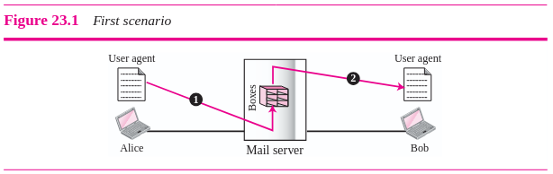

</div>

**Segundo escenario**

El emisor y el receptor del e-mail son usuarios de diferentes servidores de mail. El mensaje debe ser enviado por Internet. Para esto se necesita user agents y **message transfer agents (MTAs)**

<div align='center'>

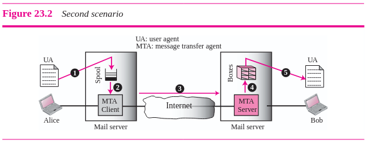

</div>

El usuario usa un user agent para enviar su mensaje a su servidor de mail. El servidor de mail usa una cola llamada **spool** que almacena los mensajes a enviar pendientes. El destinatario necesita un user agent para ver el contenido de su mailbox, contenido en su servidor de mail. El mensaje necesita ser enviado por Internet, y para esto se necesita dos MTA: un cliente y un servidor.

**Tercer escenario**

<div align='center'>

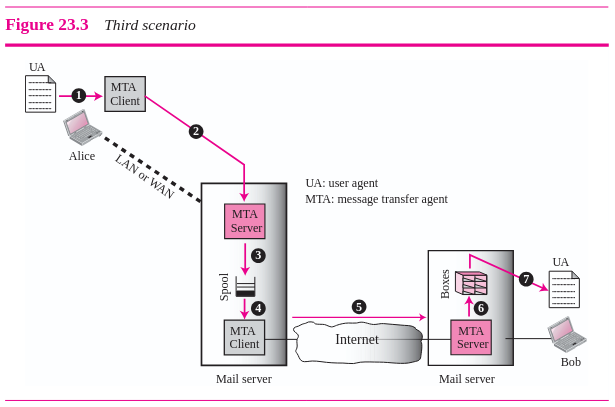

</div>

El usuario destino está conectado a su servidor de mail, sin embargo el usuario origen está separado físicamente del servidor de mail. El emisor utiliza un user agent para redactar su mensaje, el cual es enviado por su MTA cliente, que establece una conexión con el MTA servidor del servidor de mail. El MTA cliente en el servidor de mail envía el mensaje por Internet con destino al MTA servidor que se encuentra en el servidor de mail del destinatario. El destinatario utiliza un user agent para ver el contenido de su mailbox.

**Cuatro escenario**

Este escenario es el más común. El destinatario ahora también está separado físicamente del servidor de mail. Para que el destinatario pueda ver el contenido de su mailbox, se necesitan los **message access agents (MAAs)**. El destinatario utiliza un MAA cliente para ver sus mensajes, el MAA cliente envía una petición al MAA servidor, que se encuentra en el servidor de mail, y le pide que le transfiera los mensajes.

<div align='center'>

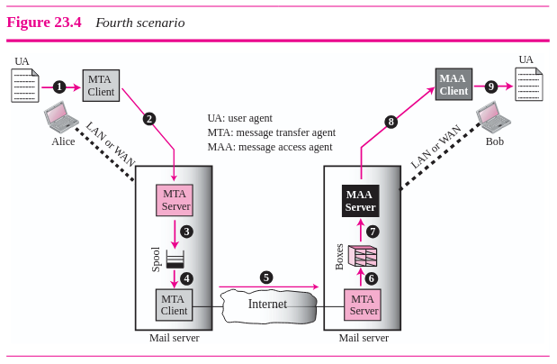

</div>

El destinatario necesita los MAAs para ver sus mensajes porque los MTA son programas **push**, el cliente pushea el mensaje al servidor. El destinatario necesita un programa **pull**, el cliente necesita pullear el mensaje del servidor.

<div align='center'>

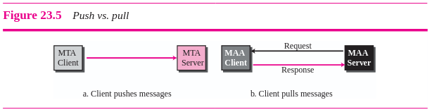

</div>

#### 23.2 User Agent

El **user agent (UA)** brinda servicios relacionados con el envío y recepción de mensajes al usuario.

**Enviar mails**

Para enviar un mail, el usuario, mediante el user agent, crea un mail con la dirección origen y destino de e-mail y otra información, junto con un mensaje.

El mensaje contiene un **encabezado** y un **cuerpo**. El encabezado del mensaje define el emisor, el receptor, el asunto, entre otra información. El cuerpo del mensaje contiene el mensaje que redacta el usuario.

**Direcciones**

Para enviar un mail, se utilizan direcciones que consisten de dos partes, una **parte local** y un **nombre de dominio** separados por un @.

<div align='center'>

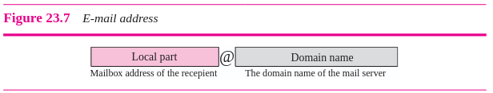

</div>

La parte local define el nombre del mailbox del usuario.

#### 23.3 SMTP (Simple Mail Transfer Protocol)

La transferencia de mails se hace mediante **MTAs (Message Transfer Agents)**. Para enviar mails, se debe contar con un MTA cliente, y para recibir mails, se debe contar con un MTA servidor. El protocolo que define la comunicación entre MTAs se llama **SMTP (Simple Mail Transfer Protocol)**.

<div align='center'>

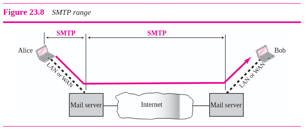

</div>

SMTP se utiliza dos veces, entre el emisor y el servidor de mail del emisor, y entre los dos servidores de mail. SMTP define se deben enviar y recibir los comandos y las respuestas.

**Comandos**

<div align='center'>

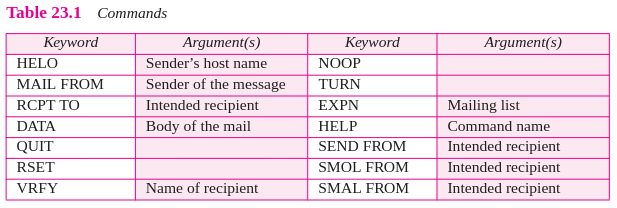

</div>

- HELO: lo utiliza el cliente para identificarse frente al servidor. El argumento es el nombre de dominio del cliente. Su formato es el siguiente:
    
    ```HELO: challenger.atc.fhda.edu```

- MAIL FROM: lo utiliza el cliente para identificar el emisor del mensaje. El argumento es la dirección e-mail del emisor. Su formato es el siguiente:

    ```MAIL FROM: forouzan@challenger.atc.fhda.edu```

- RCPT TO: lo utiliza el cliente para identificar el receptor del mensaje. El argumento es la dirección e-mail del receptor. Si hay varios destinatarios, el comando se repite. Su formato es el siguiente:

    ```RCPT TO: betsy@mcgraw-hill.com```

- DATA: este comando se usa para enviar el mail. Las líneas que le siguen son tratados como el mensaje del mail. El mensaje se termina por una línea que contiene solamente un punto. Su formato es el siguiente:

    ```
    DATA
    This is the message
    to be sent to McGraw-Hill
    Company
    .
    ```

- QUIT: este comando termina la comunicación con el servidor.

- RSET: este comando aborta la transacción de mail actual. Se elimina la información almacenada sobre el emisor y el receptor, y se reinicia la conexión.

- VRFY: este comando le pide al receptor que confirme si el nombre identifica a un receptor válido. Su formato es el siguiente:

    ```VRFY: betsy@mcgraw-hill.com```

- NOOP: este comando lo utiliza el cliente para verificar el estado del receptor.

**Respuestas**

Las respuestas las envía el servidor al cliente. Una respuesta es un código de tres dígitos que puede ser seguida por información adicional.

<div align='center'>

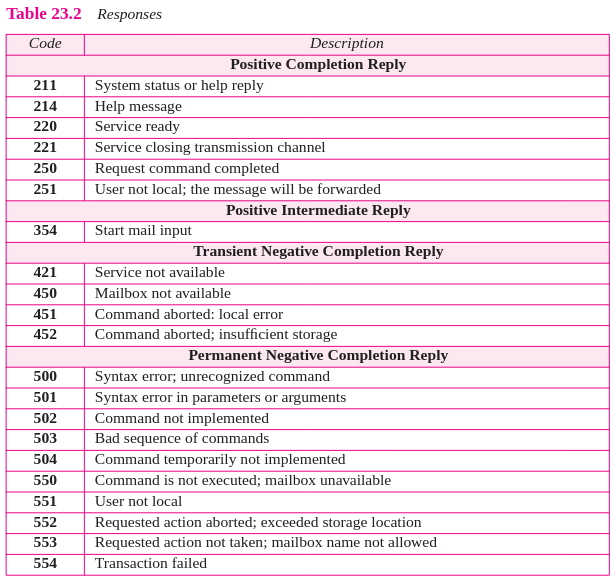

</div>

**Fases de transferencia**

Luego de que el cliente haga una conexión TCP al puerto bien conocido 25, el servidor SMTP comienza la fase de conexión. Esta fase consiste de tres pasos:

1. El servidor envía el código 220 (service ready) para decirle al cliente que está listo para recibir mail. Si el servidor no está listo, envía el código 421 (service not available).
2. El cliente envía el mensaje HELO para identificarse usando la dirección de nombre de dominio. 
3. El servidor responde con el código 250 (request command completed) u otro código dependiendo de la situación.

<div align='center'>

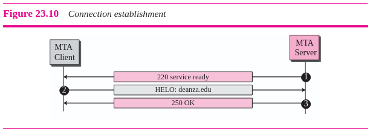

</div>

Luego de establecer la conexión entre el SMTP cliente y servidor, se puede envíar un mensaje entre un emisor y uno o varios receptores. Esta fase contiene ocho pasos, y los pasos 3 y 4 se pueden repetir si hay más de un emisor:

1. El cliente envía el mensaje MAIL FROM para enviar la dirección mail del emisor.
2. El servidor responde con el código 250.
3. El cliente envía el mensaje RCPT TO para enviar la dirección mail del receptor.
4. El servidor responde con el código 250.
5. El cliente envía el mensaje DATA para iniciar la transferencia del mensaje.
6. El servidor responde con el código 354 (start mail input).
7. El cliente envía el contenido del mensaje en líneas consecutivas. El mensaje se termina con una línea con solamente un punto.
8. El servidor responde con el código 250 (OK).

<div align='center'>

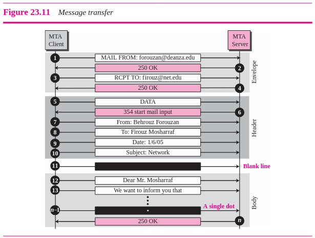

</div>

Luego de que el mensaje se transfiera con éxito, el cliente termina la conexión:
1. El cliente envía el comando QUIT.
2. El servidor responde con el código 221.

Luego de terminar la fase de cierre de conexión, se debe cerrar la conexión TCP.

<div align='center'>

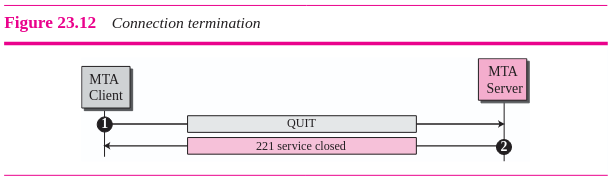

</div>

#### 23.4 MTAs y POP3

SMTP es un protocolo push, pushea el mensaje del cliente al servidor. Para la siguiente fase, en la cual el cliente necesita obtener los mensajes del servidor, se necesita usar un protocolo pull. Por lo tanto, se necesita un MTA (Message Access Agent).

Se pueden utilizar dos protocolos: **Post Office Protocol version 3 (POP3)** e Internet Mail Access Protocol version 4 (IMAP).

<div align='center'>

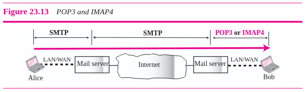

</div>

**Post Office Protocol version 3 (POP3)** es simple y limitado en funcionalidad. El cliente POP3 se instala en la computadora del receptor, y el servidor POP3 se instala en el servidor de mail.

El acceso al mail arranca cuando un usuario utiliza el cliente para descargar su e-mail del mailbox del servidor de mail. El cliente abre una conexión al servidor en el puerto TCP 110. Luego envía su nombre de usuario y contraseña para acceder al mailbox, el cual le permite listar y ver los mensajes.

<div align='center'>

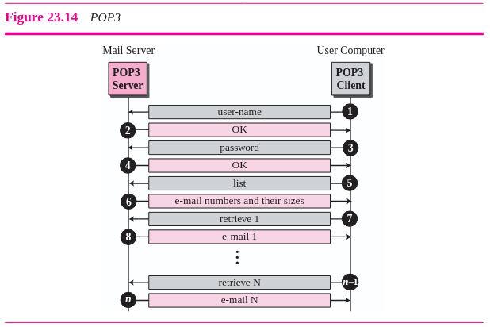

</div>

#### 23.5 MIME

El e-mail solo puede mandar formato en ASCII NVT de 7 bits, lo cual presenta algunas limitaciones, y dificulta el uso de algunos lenguajes y el envío de archivos binarios y archivos multimedia.

**Multipurpose Internet Mail Extensions (MIME)** es un protocolo suplementario que permite el envío de datos sin formato ASCII por e-mail. MIME transforma los datos sin formato ASCII del emisor a datos ASCII NVT y se los envía al cliente MTA, para que sean enviados por Internet. El mensaje es transformado a los datos originales cuando se reciben.

<div align='center'>

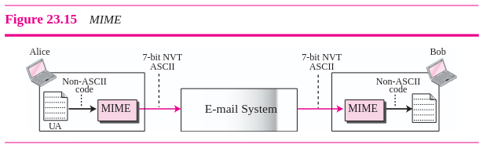

</div>

MIME define tres encabezados que pueden ser agregados al encabezado del e-mail para definir los parámetros de transformación:
1. MIME-Version: define la versión de MIME.
2. Content-Type: define el tipo de datos utilizado en el cuerpo del mensaje. El tipo y el subtipo del contenido se separan con una barra. Dependiendo del subtipo, puede contener otros parámetros.

<div align='center'>

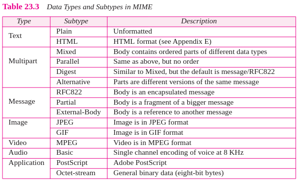

</div>

3. Content-Transfer-Encoding: define el método usado para codificar los mensajes.

<div align='center'>

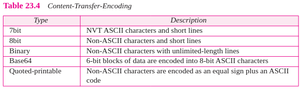

</div>

4. Content-Id: identifica unívoacmente el mensaje entero en entornos de mensajes múltiples.
5. Content-Description: define si el cuerpo es imagen, audio o video.

### 23.7 E-Mail Security

Los intercambios de e-mail pueden ser asegurados mediante dos seguridades de capa de aplicación: Pretty Good Privacy (PGP) y Secure MIME (SMIME).

<div align='center'>

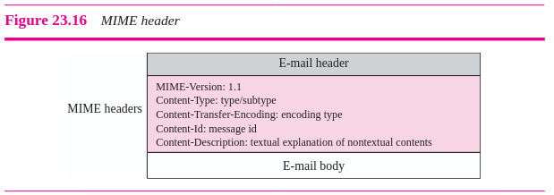

</div>

---

### Bibliografia

➤ [**FOR09**] - [TCP IP Protocol Suite](https://github.com/mnomico/tyr/raw/main/libros/FOR09.pdf)

&nbsp;&nbsp;&nbsp;&nbsp;&nbsp;&nbsp;⤷ Capítulo 23: “Electronic Mail: SMTP, POP, IMAP and MIME”