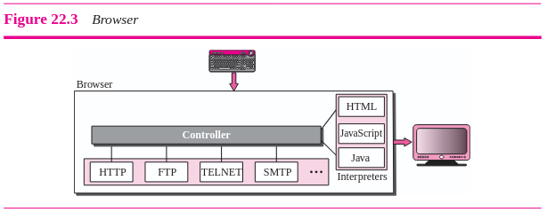
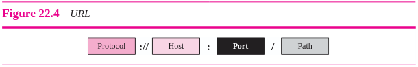
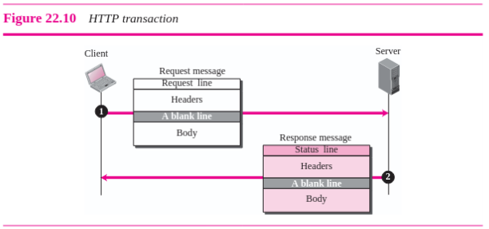
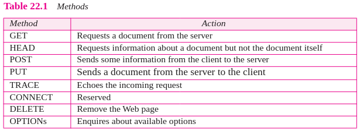
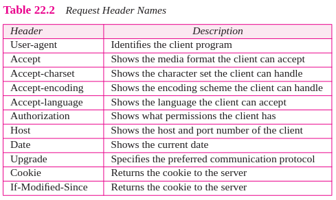
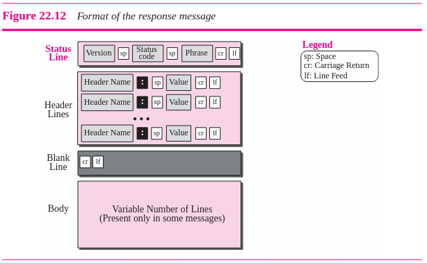
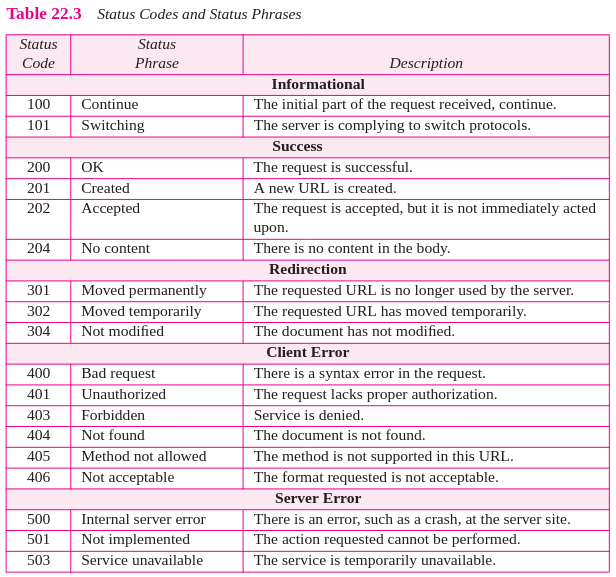
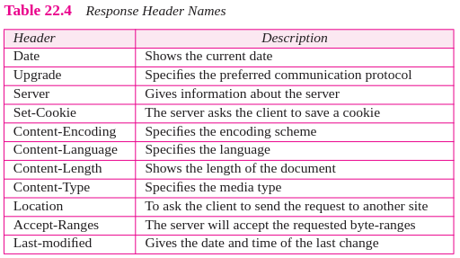
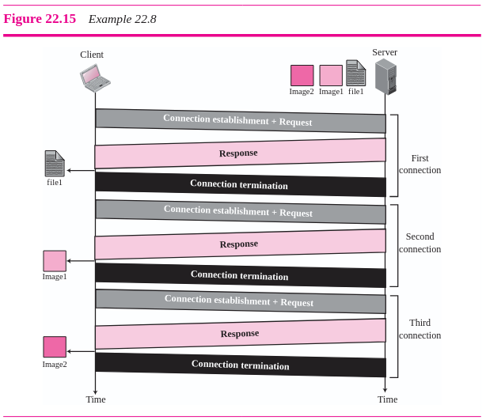
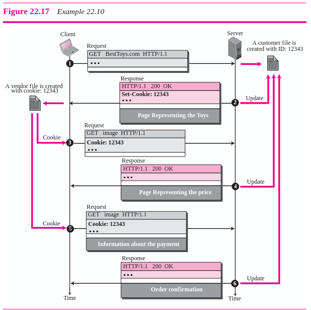

## [Volver atrás](../readme.md)

<div align="center">
<h1>TPL 5 - World Wide Web - HTTP</h1>
</div>

### Indice

✍️ [Consignas](#consignas)

❓ [Guía de preguntas](#guia-de-preguntas)

📝 [Resumen](#resumen)

📖 [Bibliografía](#bibliografia)

---

### Consignas

1. Utilizando la herramienta nc, conéctese a la dirección y al puerto del servidor web www.unlu.edu.ar y lleve a cabo las siguientes pruebas utilizando primitivas del protocolo HTTP. Guarde las respuestas obtenidas.

    a. Petición por protocolo HTTP versión 1.0

        $ nc -v -C www.debian.org 80 (enter)
        GET / HTTP/1.0 (enter) (enter)

    b. Petición por protocolo HTTP versión 1.1

        $ nc -v -C www.unlu.edu.ar 80 (enter)
        GET / HTTP/1.1 (enter)
        Host: www.unlu.edu.ar (enter) (enter)

    c. Petición HTTP. Copie el texto de la petición (indicada bajo la línea) y péguelo una vez establecida la conexión con nc . Finalice la petición pulsando tres veces la tecla Enter.

        $ nc -v -C www.unlu.edu.ar 80
        GET / HTTP/1.1
        Host: www.labredes.unlu.edu.ar
        Connection: keep-alive

    d. Petición HTTP. Copie el texto de la petición (indicada bajo la línea) y péguelo una vez establecida la conexión con nc. Finalice la petición pulsando tres veces la tecla Enter.

        $ nc -v -C www.unlu.edu.ar 80
        GET / HTTP/1.1
        Host: www.labredes.unlu.edu.ar
        Connection: close

    Responda:

    1. ¿Qué códigos numéricos de respuesta HTTP devuelve el servidor web para cada petición? ¿Qué significan según la RFC?

    2. ¿Cuales son los otros encabezados devueltos y qué contenido es transferido en cada caso?

    3. ¿Qué diferencia nota respecto a la duración de la conexión contra el servidor en los dos últimos casos?

    4. ¿Qué información acerca del sortware servidor web y configuración se obtiene?

2. Realice 3 capturas de peticiones HTTP al servidor web www.unlu.edu.ar. Para la primer y segunda captura utilice 2 navegadores gráficos distintos (ej: Firefox, Iceweasel, Chrome, Chromium, Konqueror, Epiphany, Explorer, Sarafi, etc.), y para la tercer captura use la herramienta de transferencias curl (https://curl.haxx.se/) o wget (http://www.gnu.org/software/wget/).

    a. ¿Qué encabezados envía cada cliente en la petición?
    b. Comente las características de la información en tránsito con respecto a la confidencialidad.

3. Describa cómo opera un cliente HTTP (por ejemplo un navegador web) para recuperar una página HTML que contiene varios objetos. Analice la captura del archivo captura_ejemplo_http.pcap provisto por los docentes y represente el intercambio de mensajes mediante un gráfico ideado por Ud. ¿Qué primitivas se utilizan en cada caso?.

4. Instale e inicie en el entorno kathará el laboratorio de proxy HTTP provisto por los docentes, disponible en https://github.com/redesunlu/kathara-labs/blob/main/tarballs/kathara-lab_proxy.tar.gz. Este laboratorio comprende tres hosts: uno actúa como servidor web (con el servicio Apache2 en ejecución), uno actúa como cliente web (con el navegador Lynx instalado) y uno actúa como proxy HTTP (con el servicio Squid en ejecución).

    a. Servidor HTTP Apache: Comente cuáles son los parámetros de configuración básicos necesarios de un servidor HTTP. Sugerencia: Investigue el archivo de configuración del software Apache y detalle alguna de las posibilidades de configuración. ¿Qué estructura de directorios se utiliza, y cuál es su contenido? ¿Qué información se almacena en los archivos de logs estándares?

    b. En el cliente, configure que las peticiones HTTP se realicen a través de proxy. Para ello, establezca la variable de entorno HTTP_PROXY como se muestra a continuación. Esto es equivalente a configurar las variables “Servidor proxy” y “Puerto” en los navegadores gráficos y en los celulares.

        export http_proxy=http://10.0.0.30:3128

    c. En el dispositivo capturador inicie la captura utilizando el comando tcpdump o tshark sobre la interfaz eth0 y redirija la salida a un archivo en el directorio /shared para su posterior análisis. (Ej. “tshark -i eth0 -w - > /shared/captura_http1.pcap”)

    d. En el cliente, navegue hacia la dirección http://169.254.0.1/ utilizando un browser de consola:

        lynx http://169.254.0.1/

    Dicha dirección IP es la correspondiente al host servidor web.

    e. Detenga la captura y analice el mensaje que aparece en pantalla. ¿Qué código de respuesta HTTP se retornó? Cierre el navegador web pulsando la tecla q
    
    f. La configuración de fábrica del software proxy Squid impide que los clientes naveguen a través de él. Para resolverlo, busque el archivo /etc/squid/squid.conf dentro del host proxy, edítelo y reemplace la línea
    
        # http_access allow localnet

    por

        http_access allow localnet

    g. Guarde los cambios y reinicie el proceso que actúa como proxy mediante el comando service squid restart

    De esta manera, el software Squid admitirá peticiones que realicen clientes que estén accediendo desde redes privadas (10.0.0.0/8, 192.168.0.0/16 y otras).

    h. Inicie una nueva captura y vuelva a realizar la petición del punto d.

    i. Indique qué mensaje aparece en pantalla. Cierre el navegador web pulsando la tecla q

    j. Detenga la captura, analícela y responda:

    1. ¿Qué encabezados envía el cliente al proxy-http en la petición?

    2. ¿Qué encabezados envía el proxy-http al servidor web en la petición?
    
    3. Mencione las diferencias que observa en los encabezados respecto a no utilizar un proxy-http (punto 4)

    4. ¿Es posible cambiar el número de puerto TCP en el que escucha el servidor proxy? ¿Qué línea del archivo de configuración hay que cambiar para que Squid escuche por conexiones en el puerto 8080?

    5. ¿Cómo un sistema que realiza caché local puede determinar si algún objeto en el servidor original fue modificado con respecto a la copia actual, sin realizar la transferencia completa del objeto?

---

### Guia de Preguntas

1. Describa someramente el protocolo HTTP, indicando modo de operación y primitivas básicas.

2. ¿Cuál es el formato de mensajes del protocolo HTTP?

3. ¿Qué es un servidor Proxy? ¿En qué situaciones se implementa? Brinde ejemplos.

4. ¿Qué es HTML? ¿Qué especifica?

5. ¿Qué es la interfaz CGI? ¿Para qué se utiliza?

6. ¿De qué formas un programa puede recibir parámetros por medio de la interfaz CGI? Comente las diferencias en el modo de operación en cada caso.

---

### Resumen

### 22 World Wide Web and HTTP

La World Wide Web (WWW) es un repositorio de información enlazada por varios puntos alrededor del mundo. Fue un proyecto iniciado por CERN para crear un sistema que pueda manejar los recursos distribuídos necesarios para investigaciones científicas.

#### 22.1 Architecture

La WWW es un servicio distribuído cliente-servidor, el cual puede ser accedido por un cliente mediante un navegador. Este servicio está distribuído por varios **sitios**. Cada sitio tiene uno o más documentos, llamados páginas web. Una página web simple no tiene links a otras páginas web. Una página web compuesta tiene uno o más links a otras páginas web. Cada página web es un archivo con un nombre y una dirección.

El **hypertext** significa crear documentos que refieren a otros documentos. En un documento hypertext, una parte del texto se puede definir como un link a otro documento. Cuando un hypertext se ve mediante un navegador, el link se puede clickear para obtener el otro documento. La **hypermedia** es un término que se aplica a documentos que contienen links a otros documentos textuales o documentos que contienen gráficos, video o audio.

Los **navegadores** interpretan y muestran un documento web, y todos utilizan casi la misma arquitectura. Cada navegador consiste de tres partes: un controlador, un protocolo de cliente, e interpretadores.

<div align='center'>



</div>

El controlador recibe una entrada y utiliza el software del cliente para acceder al documento, luego usa uno de los interpretadores para mostrar el documento en la pantalla. El protoclo de cliente puede ser FTP, TELNET o HTTP. El interpretador puede ser HTML, Java o JavaScript, dependiendo del tipo de documento.

La página web se almacena en el servidor. Cada vez que llega una solicitud de un cliente, el documento correspondiente es enviado al cliente. Para mejorar la eficiencia, los servidores almacenan archivos solicitados en caché, y también utilizan multithreading para poder aceptar más de una solicitud al mismo tiempo.

Un cliente que quiere acceder a una página web necesita el nombre del archivo y la dirección. Para facilitar el acceso, HTTP utiliza localizadores. El **uniform resource locator (URL)** es un localizador para especificar cualquier tipo de información en Internet. La URL define cuatro cosas: protocolo, computadora host, puerto, y la ruta (o path).

<div align='center'>



</div>

El **protocolo** es la aplicación cliente-servidor que se usa para obtener el documento. Varios protocolos se pueden utilizar para esto, pero el más común hoy en día es HTTP.

El **host** es el nombre de dominio de la computadora en la cual se encuentra la información.

La URL puede contener de manera opcional el número de puerto del servidor. Si el puerto se incluye, es insertado entre el host y el path, y es separado del host por dos puntos.

El **path** es el nombre de ruta del archivo en el cual se encuentra la información.

#### 22.2 Web Documents

Los documentos en la WWW se pueden agrupar en tres categorías: estáticos, dinámicos, y activos. La categorización se basa en el tiempo que se determina el contenido de los documentos.

Los **documentos estáticos** son documentos con contenido fijo que se crean y almacenan en un servidor. Cuando un cliente quiere acceder al documento, se envía una copia del documento almacenado.

Los **documentos dinámicos** son creados por servidores web cuando un navegador solicita el documento. Cuando llega la solicitud, el servidor web corre un programa que crea el documento dinámico. El servidor retorna la salida del programa como respuesta al navegador.

El **Common Gateway Interface (CGI)** es una tecnología que crea y maneja documentos dinámicos. CGI es un conjunto de estándares que definen cómo se escribe un documento dinámico, cómo se ingresan los datos al programa, y cómo se utiliza la salida resultante.

CGI permite el uso de cualquier lenguaje de programación para la generación del documento, lo único que define es un conjunto de reglas y condiciones que el programador debe seguir.

La entrada desde un navegador hacia un servidor se envía utilizando un **form**. Si la información en un form es pequeña, como una palabra, se puede concatenar a la URL luego de un signo de pregunta. Por ejemplo, la siguiente URL contiene información de un form:

    http://www.deanza/cgi-bin/prog.pl?23

Cuando el servidor recibe la URL, usa la parte de la URL antes del signo de pregunta para acceder al programa a ejecutar, e interpreta lo que viene después del signo de pregunta como el input enviado por el cliente.

Si el input es demasiado grande, el navegador puede pedir al servidor que envie un form. El navegador puede llenar el form con los datos de entrada y los envía al servidor, y el servidor utiliza este form como el input para el programa CGI.

La salida del programa CGI generalmente es texto plano o texto con estructuras HTML. Sin embargo, la salida puede ser de varios tipos. Para que el cliente pueda saber que tipo de salida está recibiendo, el programa CGI crea headers, que se separan con una línea vacía.

Para algunas aplicaciones, necesitamos un programa que pueda ejecutarse del lado del cliente. Estos documentos se llaman **documentos activos**. Cuando un navegador solicita un documento activo, el servidor envía una copia. El documento luego se corre en el cliente.

#### 22.3 HTTP

El **Hypertext Transfer Protocol (HTTP)** es un protocolo que se utiliza principalmente para acceder a datos en la WWW. HTTP funciona como una combinación de FTP y SMTP, ya que transfiere archivos, utiliza los servicios de TCP (en el puerto bien conocido 80), los mensajes entre el cliente y servidor son similares a los mensajes SMTP y el formato de los mensajes es controlado por headers similares a los de MIME.

Si bien HTTP utiliza los servicios de TCP, es un protocolo sin estado, es decir que el servidor no guarda información del cliente. El cliente inicia la transacción enviando una solicitud, y el servidor contesta enviando una respuesta.

<div align='center'>



</div>

Un mensaje de solicitud consiste de una línea de solicitud (request line), un encabezado (header) , y a veces un cuerpo (body).

La **request line** tiene tres campos llamados Method, URL y Version. Estos tres se separan por un espacio. El campo Method define el **tipo de solicitud**. En la versión 1.1 de HTTP se definen varios métodos:

<div align='center'>



</div>

El campo URL define la dirección y el nombre de la página web. El campo Version indica la versión del protocolo.

Luego de la request line se puede tener líneas **request header**. Cada línea del header envía información adicional del cliente al servidor. Cada línea tiene un nombre de header, dos puntos, un espacio, y un valor.

<div align='center'>



</div>

El body puede estar presente en un mensaje de solicitud. Normalmente contiene un comentario a enviar.

Un **mensaje de respuesta** consiste de un status line, header lines, blank lines y a veces un body.

<div align='center'>



</div>

La primer línea en un mensaje de respuesta se llama **status line**. Hay tres campos en esta línea separados por espacios. El primer campo define la versión del protocolo HTTP. El campo de código de estado define el estado de la solicitud, y su valor es de tres dígitos.

<div align='center'>



</div>

Luego de la status line, se puede tener cero o más líneas de **response header**. Cada línea envía información adicional del servidor al cliente.

Cada header line tiene un nombre de header, dos puntos, un espacio, y un valor.

<div align='center'>



</div>

El body del mensaje de respuesta contiene el documento que envía el servidor al cliente. El body no está presente si la respuesta es un mensaje de error.

Un cliente puede agregar una **condición** en su solicitud. El servidor va a enviar el recurso pedido si se cumple la condición, caso contrario se le informa al cliente. Una de las condiciones más comunes que imponen los clientes es la fecha y hora en la que fue modificada una página web. El cliente puede enviar la línea de header ```If-Modified-Since``` para pedirle al servidor que necesita la página si fue modificada después de un momento dado.

Antes de HTTP 1.1, el protocolo sólo realizaba conexiones no persistentes. Cuando apareció la versión 1.1, por default se empezó a realizar conexiones persistentes.

En una **conexión no persistente**, una conexión TCP se realiza para cada solicitud/respuesta. Los pasos que se realizan son los siguientes:
1. El cliente abre una conexión TCP y envía una solicitud.
2. El servidor envía la respuesta y cierra la conexión.
3. El cliente lee los datos y cierra la conexión.

La conexión no persistente implica una alta sobrecarga sobre el servidor, porque se necesita abrir y cerrar tantas conexiones como recursos necesite el cliente.

<div align='center'>



</div>

En una **conexión persistente**, el servidor deja abierta la conexión para que el cliente pueda realizar solicitudes después de enviar una respuesta. El servidor puede cerrar la conexión si el cliente lo desea o luego de un tiempo sin recibir solicitud alguna.

La WWW originalmente se diseño como una entidad sin estado, es decir que no se guarda información cuando un cliente y un servidor se comunican. Con el tiempo, se fue necesitando que se guarden algunos datos sobre estas comunicaciones, por ejemplo, para las páginas de compras que permiten a los usuarios guardar productos en un carrito.

Para este tipo de situaciones, se creó un mecanismo llamado **cookies**. La creación y almacenamientos de cookies se realiza de la siguiente manera:
1. Cuando un servidor recibe una solicitud de un cliente, almacena la información sobre el cliente en un archivo o en un string. La información puede contener el nombre de dominio de cliente, los contenidos de la cookie (información sobre el cliente como nombre, número de registro, entre otros), un timestamp, y otros tipos de información.
2. El servidor incluye la cookie en la respuesta que le envía al cliente.
3. Cuando el cliente recibe la respuesta, el navegador almacena la cookie en el directorio de cookies.

Cuando un cliente envía una solicitud a un servidor, el navegador se fija en el directorio de cookies para ver si puede encontrar una cookie enviada por ese servidor. Si la encuentra, la cookie se incluye en la solicitud. Cuando un servidor recibe la solicitud, sabe que es un cliente anterior. Los contenidos de la cookie nunca son leídos por el navegador o notificados al usuario. La cookie es creada y consumida solamente por el servidor.

<div align='center'>



</div>

Un **servidor proxy** es una computadora que mantiene copias de respuestas de solicitudes recientes. HTTP soporta este tipo de servidores. El cliente HTTP envía una solicitud al servidor proxy, y el servidor proxy verifica su caché. Si la respuesta no está almacenada en caché, el servidor proxy envía la solicitud al servidor correspondiente. Las respuestas son enviadas por el servidor proxy y almacenadas para solicitudes futuras.

El servidor proxy reduce la carga de un servidor original, reduce el tráfico y mejora la latencia. Sin embargo, para usar un servidor proxy, el cliente debe estar configurado para acceder al proxy en vez del servidor original.

Los servidores proxy normalmente se encuentran del lado del cliente. Esto significa que podemos tener una jerarquía de servidores proxy:
1. Una computadora cliente puede ser usada como un servidor proxy, almacenando respuestas de solicitudes que son realizadas con frecuencia.
2. En una compañía, un servidor proxy puede ser instalada en la LAN de una computadora para reducir la carga que viene y sale de la LAN.
3. Un ISP con varios clientes puede instalar un servidor proxy para reducir la carga que viene y sale de la red del ISP.

Para saber cuando la información en un servidor proxy debe ser actualizada, se agregan headers para mostrar la última fecha y hora de modificación de la información, para luego determinar por cuánto tiempo es válida esa información.

HTTP por si sólo no provee seguridad. Sin embargo, HTTP puede utilizarse junto a protocolos como **SSL (Secure Socket Layer)** o **TLS (Transport Layer Security)**. En estos casos, HTTP se lo conoce como **HTTPS**, brindando condifencialidad, autenticación para cliente y servidor, e integridad de los datos.

---

### Bibliografia

➤ [**FOR09**] - [TCP IP Protocol Suite](../libros/FOR09.pdf)

&nbsp;&nbsp;&nbsp;&nbsp;&nbsp;&nbsp;⤷ Capítulo 22: “World Wide Web and HTTP”
