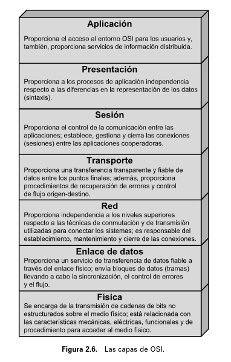
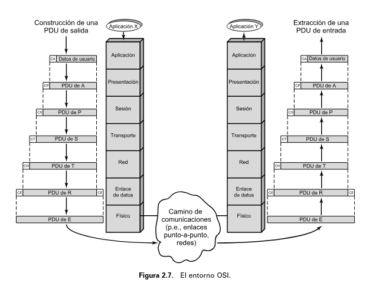
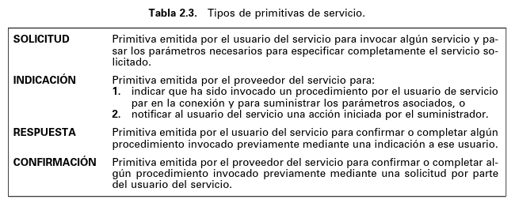
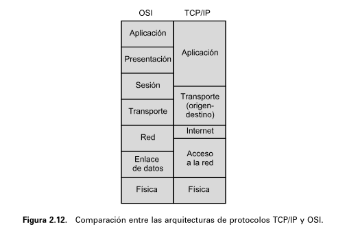
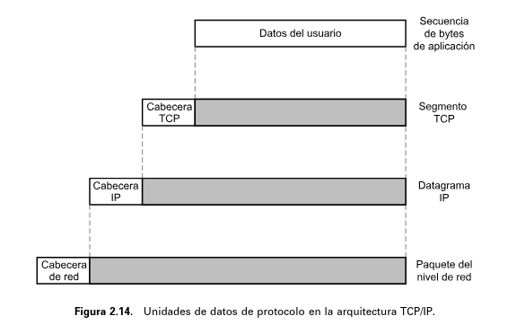

## [Volver atrás](../readme.md)

<h1>Introducción, Redes y Modelo OSI</h1>

### Indice

💡 [Conceptos a tener en cuenta](#conceptos-a-tener-en-cuenta)

❓ [Guía de preguntas](#guia-de-preguntas)

📝 [Resumen](#resumen)

📖 [Bibliografía](#bibliografia)

---

### Conceptos a tener en cuenta

➤ Redes

➤ Enlaces

➤ Protocolos

➤ Modelo OSI

➤ Capas del Modelo OSI

➤ PDU

➤ Encapsulamiento

➤ Pila de Protocolos (OSI y TCP/IP)

➤ Tipos de Servicio

---

### Guia de preguntas

1. **¿Qué es una red de datos y cuáles son sus objetivos y características principales?**

    Una red es un conjunto de dispositivos autónomos interconectados, permanentemente o no, que tienen por objetivo compartir recursos y permitir la comunicación.

    Otra definición, que se encuentra en STA04 Capítulo 16.4:

    Una red es un conjunto de puntos de acceso interconectados con una estructura software de
    protocolos que posibilita la comunicación.

    Sus características principales son:
    - **Fiabilidad**: los datos transmitidos deben llegar al destino, y además deben llegar en el orden en el que fueron enviados.

2. **¿Qué es un enlace? Brinde ejemplos.**

    Un enlace es el medio de comunicación físico por el cual dos dispositivos conectados entre sí se comunican simultáneamente y transfieren datos.

3. **¿Qué es un protocolo de comunicaciones y qué define?**

    Una arquitectura de protocolos es una estructura en capas de elementos hardware y software que facilita el intercambio de datos entre sistemas y posibilita aplicaciones distribuidas, como el comercio electrónico y la transferencia de archivos.

    En los sistemas de comunicación, en cada una de las capas de la arquitectura de protocolos se implementa uno o más protocolos comunes. Cada protocolo proporciona un conjunto de reglas para el intercambio de datos entre sistemas.

    La comunicación se consigue haciendo que las capas correspondientes, o pares, intercambien información. Las capas pares se comunican intercambiando bloques de datos que verifican una serie de reglas o convenciones denominadas **protocolo**. Los aspectos clave que definen o caracterizan a un protocolo son:

    - La **sintaxis**: establece cuestiones relacionadas con el formato de los bloques de datos.
    - La **semántica**: incluye información de control para la coordinación y la gestión de errores.
    - La **temporización**: considera aspectos relativos a la sintonización de velocidades y secuenciación.

4. **¿Cuáles son los “Tipos de Servicio” ofrecidos por los protocolos? ¿En qué se diferencian?**

    Si el que inicia la transferencia recibe una confirmación de que el servicio solicitado ha tenido el efecto deseado en el otro extremo, esta secuencia de eventos se conoce como **servicio confirmado**. Si solamente se invocan las primitivas de solicitud e indicación, entonces se denomina **servicio no confirmado**: la entidad que inicia la transferencia no recibe confirmación de que la acción solicitada haya tenido lugar.

    En la capa de transporte se especifican dos protocolos, el **orientado a conexión**, TCP (Protocolo de Control de la Transmisión, Transmission Control Protocol) y el **no orientado a conexión** UDP (Protocolo de Datagrama de Usuario, User Datagram Protocol).

    TCP proporciona una conexión fiable para transferir los datos entre las aplicaciones, mientras que UDP no garantiza la entrega, la conservación del orden secuencial, ni la protección frente duplicado, pero posibilita el envío de mensajes entre aplicaciones con la complejidad mínima.

    La capa de sesión proporciona los siguientes servicios:
    - **Control del diálogo**: éste puede ser simultáneo en los dos sentidos (full-duplex) o alternado en ambos sentidos (half-duplex).
    - **Agrupamiento**: el flujo de datos se puede marcar para definir grupos de datos. 
    - **Recuperación**: la capa de sesión puede proporcionar un procedimiento de puntos de comprobación, de forma que si ocurre algún tipo de fallo entre puntos de comprobación, la entidad de sesión puede retransmitir todos los datos desde el último punto de comprobación.

5. **¿Qué es el modelo de referencia OSI y qué define?**

    El modelo **OSI** (Open System Interconnection) es un modelo de referencia que fue desarrollado para la normalización, es decir permitir la comunicación entre sistemas distintos sin que sea necesario cambiar el hardware o el software.

    Dentro del modelo, en cada capa se pueden desarrollar uno o más protocolos. El modelo define en términos generales las funciones que se deben realizar en cada capa.

6. **Enuncie ventajas y desventajas del modelo OSI.**

    Simplifica el procedimiento de la normalización ya que:
    - Como las funciones de cada capa están bien definidas, para cada una de ellas, el establecimiento de normas o estándares se puede desarrollar independiente y simultáneamente. Esto acelera el proceso de normalización.
    - Como los límites entre capas están bien definidos, los cambios que se realicen en los estándares para una capa dada no afectan al software de las otras. Esto hace que sea más fácil introducir nuevas normalizaciones.

7. **Indique la función de cada capa del modelo OSI.**

    - **Capa de aplicación**: proporciona el acceso al entorno OSI para los usuarios y, también, proporciona servicios de información distribuida.
    - **Capa de presentación**: proporciona a los procesos de aplicación independencia respecto a las diferencias en la representación de los datos (sintaxis).
    - **Capa de sesión**: proporciona el control de la comunicación entre las aplicaciones; establece, gestiona y cierra las conexiones (sesiones) entre las aplicaciones cooperadoras.
    - **Capa de transporte**: proporciona una transferencia transparente y fiable de datos entre los puntos finales; además, proporciona procedimientos de recuperación de errores y control de flujo origen-destino.
    - **Capa de red**: proporciona independencia a los niveles superiores respecto a las técnicas de comunicación y de transmisión utilizadas para conectar los sistemas; es responsable del establecimiento, mantenimiento y cierre de las conexiones.
    - **Capa de enlace**: proporciona un servicio de transferencia de datos fiable a través del enlace físico; envía bloques de datos (tramas) llevando a cabo la sincronización, el control de errores y el flujo.
    - **Capa física**: se encarga de la transmisión de cadenas de bits no estructurados sobre el medio físico; está relacionada con las características mecánicas, eléctricas, funcionales y de procedimiento para acceder al medio físico.

8. ¿Qué capa define la “red”?

9. ¿Cuántos protocolos hay en la capa de aplicación de una pila? ¿Y en la de transporte? ¿Y en la de red? Justifique en cada caso.

10. **¿Qué es una PDU? Brinde un ejemplo.**

    La unión de los datos generados por la capa superior, junto con la información de control de la capa actual, se denomina unidad de datos del protocolo (**PDU**, Protocol Data Unit). 

    **PDU de transporte**

    La cabecera en cada PDU de transporte contiene información de control que será usada por el protocolo de transporte en la computadora destino. La información que se debe incluir en la cabecera puede ser, por ejemplo:
    - **SAP destino**: cuando la capa de transporte destino recibe la PDU de transporte, deberá saber a quién van destinados los datos.
    - **Número de secuencia**: ya que el protocolo de transporte está enviando una secuencia de PDUs, éstas se numerarán secuencialmente para que, si llegan desordenadas, la capa de transporte destino sea capaz de ordenarlas.
    - **Código de detección de error**: la capa de transporte emisora debe incluir un código obtenido en función del resto de la PDU. El protocolo de transporte receptor realiza el mismo cálculo y compara los resultados con el código recibido. Si hay discrepancia se concluye que hubo un error en la transmisión, el receptor puede descartar la PDU y tomar las acciones necesarias para su corrección.

    **PDU de red**

    El protocolo de acceso a la red añade la cabecera de acceso a la red a los datos provenientes de la capa de transporte, creando así la PDU de acceso a la red. La cabecera debe contener la siguiente información:
    - **La dirección del destino**: la red debe conocer a quién debe entregar los datos.
    - **Solicitud de recursos**: el protocolo de acceso a la red puede pedir a la red que realice algunas funciones, como por ejemplo, gestionar prioridades.

11. **Explique qué se define con el término “Encapsulamiento”.**

    Prácticamente en todos los protocolos, los datos son transferidos en PDUs. Cada PDU contiene no solo datos, sino también información de control.

    La adición de información de control a los datos es lo que se conoce como **encapsulamiento**. Los datos son aceptados o generados por una entidad y encapsulados dentro de una PDU que contiene los datos más información de control.

12. **Defina SAP, SDU e ICI en el contexto del Modelo OSI (y la función de encapsulamiento)**

    

    

    

    **SAP** (Service Access Point) es una dirección única dentro de una computadora, que permite a la capa de transporte proporcionar los datos a la aplicación apropiada. También se los conoce como **puertos**.

13. Indique similitudes y diferencias entre el Modelo OSI y la pila de protocolos TCP/IP.

14. En el contexto del modelo OSI ¿Qué es un “Sistema Intermedio” y “Sistema Final”? ¿Cuáles son los equivalentes en el contexto de TCP/IP?

    Un **sistema final** es un sistema el cual transmite o recibe paquetes de datos. Un encaminador, procesador que conecta dos redes y cuya función principal es retransmitir datos desde una red a otra siguiendo la ruta adecuada para alcanzar al destino, es un **sistema intermedio**.

15. A partir de la lectura de la “Breve Historia de Internet”

    a. ¿Qué es justamente “Internet”?

    b. ¿En qué desarrollo se basa?

    c. ¿Qué reglas plantearon para las redes?

    d. ¿Qué problemas debían resolver? Relacione cada uno con la capa del Modelo OSI adecuada para resolverlo.

---

### Resumen

#### 1.1 Modelo para las comunicaciones

El objetivo principal de cualquier sistema de comunicaciones es intercambiar información entre dos entidades. Los elementos clave del modelo para las comunicaciones son:
- **La fuente**: el dispositivo que genera los datos a transmitir.
- **El transmisor**: el transmisor transforma y codifica la información, generando señales electromagnéticas que son transmitidas a través de un sistema de transmisión.
- **El sistema de transmisión**: puede ser una línea de transmisión o una red compleja que conecte a la fuente con el destino.
- **El receptor**: el receptor acepta la señal del sistema de transmisión y la transforma para que pueda ser manejada por el destino.
- **El destino**: toma los datos del receptor.

Las tareas que debe realizar un sistema de comunicación son las siguientes:
- **Utilización del sistema de transmisión**: uso eficaz de los recursos que se utilizan en la transmisión mediante la multiplexación y el control de congestión.
- **Implementación de la interfaz**: transmisión de la información a través de la interfaz con el medio de transmisión.
- **Generación de la señal**: las características de la señal deben permitir la propagación por el medio de transmisión y que pueda ser interpretada por el receptor.
- **Sincronización**: el receptor debe ser capaz de determinar cuándo comienza y termina la señal recibida.
- **Gestión del intercambio**: para intercambiar datos durante un período de tiempo, las dos entidades deben cooperar.
- **Detección y corrección de errores**: necesaria ya que la señal transmitida se distorsiona siempre antes de llegar a destino.
- **Control de flujo**: para evitar que la fuente no sature el destino transmitiendo datos más rápido de lo que el receptor puede procesar.
- **Direccionamiento**: el sistema fuente debe indicar la identidad del destino, y el sistema de transmisión debe garantizar que sólo ese destino recibe los datos.
- **Recuperación**: para situaciones en la que la pérdida de datos no es aceptable, como en transacciónes de bases de datos.
- **Formato de mensajes**: acuerdo entre las dos partes sobre el formato de los datos que intercambian.
- **Seguridad**: los datos deben llegar solamente al destino, no deben ser alterados y debe asegurarse que los datos realmente provienen del origen.
- **Gestión de red**: el sistema de comunicación es muy complejo, por lo que se necesita gestionar la red para configurar el sistema, monitorear su estado, y poder reaccionar ante fallos y sobrecargas.

#### 1.3 Redes de Transmisión de Datos

A veces no es práctico que dos dispositivos de comunicaciones se conecten directamente por un enlace punto a punto. Esto se debe a las siguientes circunstancias:
- Los dispositivos están demasiado alejados.
- Hay dispositivos que necesitan conectarse entre ellos en instantes de tiempos diferentes.

La solución a este problema es conectar cada dispositivo a una red de comunicación. Las redes se pueden clasificar en dos, las **redes de área amplia (WAN, Wide Area Networks)** y las **redes de área local (LAN, LOcal Area Networks)**.

**Redes de Área Amplia**

Se considera como redes de área amplia a aquellas que cubren un gran área geográfica, y usan circuitos de un proveedor de servicios. Las WAN se implementan usando las siguientes tecnologías:
- **Conmutación de circuitos**: se establece un camino dedicado a través de dos nodos de la red. El camino es un conjunto de enlaces físicos conectados entre nodos.
- **Conmutación de paquetes**: no se asignan recursos en el camino, sino que los datos se envían en paquetes, y cada paquete se pasa de nodo en nodo siguiendo algún camino.
- **Retransmisión de tramas (frame relay)**: surgió debido a que la tasa de errores se redujo drásticamente y a que las velocidades de transmisión son mayores.
- **ATM (Asynchronous Transfer Mode) (cell relay)**: se la considera como la evolución de la retransmisión de tramas. El frame relay utiliza paquetes de longitud variable mientras que el cell relay utiliza paquetes de longitud fija, llamados celdas. Reduce el esfuerzo de procesamiento, y trabaja a velocidades de entre 10 a 100 Mbps.

**Redes de Área Local**

Una LAN es una red de comunicaciones que interconecta varios dispositivos y brinda un medio para el intercambio de información. Su área de cobertura es reducida en comparación con WAN, generalmente ocupa el área de uno o varios edificios. Es mucho más costosa de implementar, mantener y gestionar. Por lo general, las velocidades de transmisión internas son mayores que en una WAN.

#### 2.1 Necesidad de una Arquitectura de Protocolos

Para transferir datos entre dispositivos, debe haber cooperación entre ellos. En una arquitectura de protocolos, cada capa de la pila de protocolos realiza tareas relacionadas entre sí que son necesarias para comunicar con otro sistema. Cada capa proporciona un conjunto de servicios a la capa inmediatamente superior. 

La comunicación se consigue haciendo que las capas **pares** intercambien información. Las capas pares se comunican intercambiando datos que verifican una serie de reglas o convenciones llamadas **protocolo**. Las características que definen a un protocolo son:
- **Sintaxis**: establece cuestiones sobre el formato de los datos.
- **Semántica**: incluye información de control para la gestión de errores.
- **Temporización**: tiene en cuenta aspectos sobre la sintonización de velocidades y secuenciación.

#### 2.2 Una Arquitectura de Protocolos Simple

En vez de tener un solo módulo que haga todas las tareas necesarias para la comunicación, se utiliza un conjunto de módulos que realizan todas las funciones, es decir, una **arquitectura de protocolos**.

**Un modelo de tres capas**

La **capa de acceso a la red** está relacionada con el intercambio de datos entre la computadora y la red a la que está conectada. La computadora emisora debe darle a la red la dirección del destino, para que la red pueda encaminar los datos.

Se necesita que los datos se intercambien de manera fiable, es decir, asegurarse que los datos llegan al destino, y que lleguen en el mismo orden. La **capa de transporte** es la que contiene las funciones que se encargan de esto.

La **capa de aplicación** contiene la lógica necesaria para aceptar varias aplicaciones de usuario.

Cada computadora en la red debe tener una dirección única, y cada aplicación dentro de la computadora tiene que tener una dirección única dentro de esa computadora. Esta dirección se llama **SAP (Service Access Point)** o **puertos**.

La unión de los datos generados por la capa superior junto con la información de control de la capa actual se denomina **PDU (Protocol Data Unit)**. 

La cabecera de la **PDU de transporte** contiene la siguiente información de control:
- **Puerto destino**: lo necesita la capa de transporte del destino para saber a que aplicación van los datos.
- **Número de secuencia**: se deben enumerar las PDU para que el destino pueda reordenarlas.
- **Código de detección de error**: se debe incluir para que el destino pueda comprobar si hubo un error en la transmisión.

La cabecera de la **PDU de red** contiene la siguiente información de control:
- **Dirección destino**: debe saber a quién entregar los datos.
- **Solicitud de recursos**: el protocolo de red puede pedir a la red que realice alguna función.

#### 2.3 OSI

Debido a la complejidad que implican las comunicaciones, un solo estándar no es suficiente, las distintas funcionalidades se deben dividir en partes más manejables, estructurándose en una arquitectura de comunicaciones. En 1977 el ISO (International Organization for Standarization) desarrolló el **modelo de referencia OSI**.

La técnica para estructurar los problemas es la división en capas. Las funciones de comunicación se distribuyen en una jerarquía de capas, en donde cada capa realiza un conjunto de tareas relacionadas entre sí, necesarias para lograr la comunicación con otros sistemas. Cada capa proporciona servicios a la capa inmediatamente superior. Los cambios en las capas no implican cambios en las otras capas.

El modelo de referencia OSI tiene siete capas. La comunicación se realiza entre dos aplicaciones de dos computadoras. Si una aplicación quiere transmitir un mensaje a otra aplicación, invoca a la capa de aplicación. La capa origen establece una relación paritaria con las capa destino usando el protocolo de la capa en cuestión. Este protocolo necesita los servicios de la capa inferior, el cual debe ser el mismo en las dos entidades, y así sucesivamente hasta llegar a la capa física, donde se transmiten los bits por el medio.

Las unidades de datos de protocolo (PDU) en la arquitectura OSI se utilizan de la siguiente manera: por cada capa, a la PDU que se recibe de la capa superior, se le agrega una cabecera (header) con datos de control sobre la capa en cuestión, y luego se entrega tanto la cabecera como el payload (el PDU recibido) como si fuera una sola PDU. A esto se lo conoce como **encapsulación**. Esto se realiza en todas las capas, excepto en la capa física. Cuando el destino recibe la trama, va desencapsulando los datos, leyendo los datos de la cabecera, descartándola y pasándole el resto de los datos a la capa superior.

El motivo principal para el desarrollo del modelo OSI fue dar un modelo de referencia para la normalización. En cada capa se pueden desarrollar más de un protocolo.

En la arquitectura OSI, los servicios entre capas adyacentes se describen en primitivas y parámetros. Una primitiva especifica la función que se va a realizar, y los parámetros se usan para pasar datos e información de control.

El **servicio confirmado** consiste en que el que inicia la transferencia recibe una confirmación de que el servicio solicitado tuvo efecto en el otro extremo. Si solamente se invocan primitivas de solicitud e indicación, se denomina **servicio no confirmado**, la entidad que inicia la transferencia no recibe confirmaciones.

#### 2.4 La Arquitectura de Protocolos TCP/IP

El modelo TCP/IP estructura el problema de la comunicación en cinco capas:
- **Capa física**.
- **Capa de enlace**.
- **Capa de red**.
- **Capa de transporte**.
- **Capa de aplicación**.

La **capa física** define la interfaz física entre la estación que transmite datos y el medio de transmisión. Se encarga de especificar las características del medio de transmisión, las señales, la velocidad de los datos, etc.

La **capa de enlace** es responsable del intercambio de datos entre el sistema final y la red. El emisor debe brindar la dirección del destino para poder encaminar los datos.

La **capa de red** brinda las funciones que permiten que los datos puedan ser transmitidos por distintas redes. El protocolo **IP (Internet Protocol)** se utiliza para encaminar los datos por varias redes. Este protocolo se implementa tanto en los sistemas finales como en los encaminadores intermedios. 

La **capa de transporte** debe asegurar que los datos se transmitan de forma fiable, es decir que los datos lleguen al destino y en el mismo orden en el que fueron enviados. El protocolo **TCP (Transmission Control Protocol)** es el más utilizado para esta capa.

La **capa de aplicación** contiene toda la lógica necesaria para el funcionamiento de las aplicaciones de usuario.

TCP brinda una conexión fiable para transferir datos entre las aplicaciones. Una conexión es una asociación lógica temporal entre dos entidades. Cada PDU de TCP, llamada **segmento TCP**, tiene en la cabecera las direcciones de los puertos origen y destino, los cuales corresponden con los SAP de OSI. Los valores de los puertos identifican a los usuarios de las entidades TCP.

Aparte del protocolo TCP, TCP/IP usa otro protocolo de transporte, el protocolo **UDP (User Datagram Protocol)**, que no garantiza la entrega, la llegada en orden de los datos ni tiene en cuenta los duplicados. Su función principal es identificar los puertos, y algunas aplicaciones orientadas a transacciones lo utilizan.

Para poder transferir datos, cada entidad debe tener una dirección única, y dentro de cada entidad, los procesos también se deben identificar de manera única mediante los puertos.

A cada fragmento de datos que tenga que enviar, TCP añade información de control en su cabecera TCP, formando un **segmento TCP**. La información de control la va a usar la entidad par TCP en la estación destino. En la cabecera TCP se incluyen los siguientes campos:
- **Puerto destino**: la estación destino lo necesita para saber a que proceso entregarle los datos.
- **Número de secuencia**: se numeran los segmentos para que el destino pueda ordenarlos si llegan desordenados.
- **Checksum**: el emisor incluye un código que se calcula en función al resto del segmento TCP, para que el receptor haga el mismo cálculo y pueda saber si hubo errores en la transmisión.

Luego TCP pasa cada segmento a IP para transmitir a la estación destino. Los segmentos se transmiten por la red y pasan por dispositivos de encaminamiento. Para esto se necesita información de control, entonces IP agrega una cabecera de información de control a cada segmento para formar un **datagrama IP**. En la cabecera IP, se incluye la dirección de la computadora destino.

Por último, cada datagrama IP se pasa a la capa de enlace, que agrega su cabecera, creando una **trama**. La cabecera de la trama contiene información que la subred necesita para transferir los datos, entre ellos:
- **Dirección de la subred destino**: la subred debe saber a que dispositivo debe entregar la trama.
- **Funciones solicitadas**: el protocolo de enlace puede pedir el uso de funciones que ofrece la subred, por ejemplo el uso de prioridades.

En el dispositivo de encaminamiento, la cabecera del paquete se elimina, y se examina la cabecera IP. El módulo IP del dispositivo de encaminamiento direcciona el paquete hacia el destino usando la dirección destino de la cabecera IP. Para hacer esto, se agrega al datagrama una cabecera de enlace.

Luego el destino recibe los datos, y en cada capa se elimina la cabecera correspondiente y el resto se pasa a la capa superior, hasta que los datos de usuario lleguen al proceso destino.

---

### Bibliografia

➤ [**STA04**] - [Comunicaciones y redes de computadores](../libros/STA04.pdf)

&nbsp;&nbsp;&nbsp;&nbsp;&nbsp;&nbsp;⤷ Capítulo 1: “Introducción” 
&nbsp;&nbsp;&nbsp;&nbsp;&nbsp;&nbsp;⤷ Capítulo 2: “Protocolos y Arquitectura”

➤ [**Online**] - [Breve historia de Internet](https://www.internetsociety.org/es/internet/history-internet/brief-history-internet/)

