## [Volver atrás](../readme.md)

<div align="center">
<h1>Modelo para las Comunicaciones y Transmisión de Datos</h1>
</div>

### Indice

💡 [Conceptos a tener en cuenta](#conceptos-a-tener-en-cuenta)

❓ [Guía de preguntas](#guia-de-preguntas)

✍️ [Ejercicios](#ejercicios)

📝 [Resumen](#resumen)

📖 [Bibliografía](#bibliografia)

---

### Conceptos a tener en cuenta

➤ Modelo para las comunicaciones

➤ Enlace/Circuito de Datos

➤ Señales analógicas

➤ Señales digitales

➤ Modulación

➤ Ancho de Banda

➤ Modos de Transmisión

➤ Capacidad del canal

➤ Multiplexación

---

### Guia de preguntas

1. ¿En el modelo para las comunicaciones, qué diferencia un ETD de un ETCD? Con qué capas del modelo OSI se asocia cada uno? 

2. Busque ejemplos de ETD y ETCD en los sistemas de transmisión que usa/conoce.

3. ¿Cuáles son las diferencias entre datos analógicos y digitales.

4. ¿Qué son las “señales” usadas para transmitir datos?

5. ¿Cuáles son las diferencias entre señales analógicas y digitales.

6. ¿Qué parámetros de las señales se pueden modificar y cómo?

7. ¿Cuáles son las unidades de los parámetros de las señales? 

8. ¿Qué es una señal periódica?

9. ¿Cómo se pueden representar datos digitales en señales analógicas?

10. ¿Qué son las señales compuestas? (vea ejemplos en la planilla ‘ondas.ods’)

11. ¿Qué diferencia a la señal portadora de sus armónicos?

12. ¿Cómo se pueden representar datos digitales en señales digitales?

13. ¿Cuáles son las ventajas de usar señales digitales por sobre las analógicas para la transmisión de datos?

14. ¿Cuáles son los problemas asociados a las señales?

15. ¿Cuál es la diferencia de “amplificar” vs “repetir” una señal?

16. ¿Qué es el ancho de banda? 

17. ¿Qué aporta el diagrama del “Espectro de Frecuencias”?

18. ¿Qué es un “canal de comunicaciones”?

19. ¿Cómo se calcula la capacidad teórica de un canal y qué parámetros intervienen?

20. ¿Cómo se transforma una SNRdb en SNR?

21. ¿Cuál modelo de capacidad teórica de un canal es mejor: Nyquist o Shannon?

22. ¿Para qué sirven las técnicas de multiplexación?

23. Describa FDM y TDM.

24. Describa las variantes de TDM, sus requerimientos y ventajas en cada caso.

25. ¿Qué es la transmisión en ‘Banda Ancha’? ¿Cómo se usa para ofrecer acceso a Internet y qué características tiene?

---

### Ejercicios

1. Para un sistema de transmisión de 8 Mhz de ancho de banda y 48 Mbps de capacidad ¿Hasta cuántos niveles de tensión se puede transmitir?

2. Se tiene un canal de 10.200 Hz y una SNR = 20dB, con un sistema que puede codificar utilizando 16 niveles de tensión. ¿Cuál es la capacidad máxima del canal?

3. Se requiere implementar un enlace de 16 Mbps utilizando un ancho de banda de 1 Mhz. Con el medio utilizado, la SNR es de 24 dB. ¿Se puede implementar el proyecto? De no ser posible ¿Cómo se puede resolver el problema?

4. Se cuenta con un canal de TV de 40 MHz de ancho de banda. ¿Qué tasa se puede alcanzar si se utiliza una señal de 4 niveles y el canal no tiene ruido. Si el canal tiene ruido: ¿Qué SNR es aceptable para obtener las mismas prestaciones?

5. ¿Qué nivel de ruido máximo es aceptable para transmitir sobre un canal de 3 Khz a una tasa de 56 Kbps?

6. Suponiendo que la red de telefonía pública provee un ancho de banda de 3000 Hz y una SNR = 20dB ¿Qué capacidad máxima (teórica) se puede alcanzar?

7. Suponga que se requiere que un sistema de comunicaciones opere a 100 Mbps utilizando un ancho de banda de 70 Mhz. ¿Cuál es la cota inferior de la relación señal/ruido para que el sistema funcione?

---

### Resumen

#### 3.0 Señales y Datos

Una de las principales funciones de la capa física es mover datos en forma de señales electromagnéticas a través de un medio de transmisión.

#### 3.1 Digital y analógica

Los datos pueden ser analógicos o digitales. Los datos analógicos se refieren a información que es continua, mientras que los datos digitales se refieren a información que tiene datos discretos.

Las señales también pueden ser analógicas o digitales. Una señal analógica tiene un número infinito de valores sobre un período de tiempo. Una señal digital solo puede tener un número limitado de valores definidos. En general, estos valores son 1s y 0s.

La manera más simple de mostrar señales es graficándolas en un par de ejes perpendiculares. El eje vertical representa el valor o la fuerza de una señal. El eje horizontal representa el tiempo.

Las señales pueden tomar dos formas, *periódicas* o *aperiódicas* .

Una señal periódica completa un patrón dentro de una franja de tiempo medible, llamada **período**, y repite ese patrón por períodos idénticos. Un **ciclo** es un patrón completo. Una señal aperiódica cambia sin mostrar un partón o ciclo que se repite a través del paso del tiempo.

En la comunicación de datos, generalmente se utiliza las señales analógicas periódicas (porque necesitan menor ancho de banda) y las señales digitales aperiódicas (porque repesentan la variación de datos).

#### 3.2 Señales analógicas periódicas

Las señales anaógicas periódicas se pueden clasificar en *simples* o *compuestas*. Una señal analógica periódica simple, una onda sinusoidal, no puede ser descompuesta en señales más simples. Una señal analógica periódica compuesta está compuesta por múltiples ondas sinusoidales.

Una onda sinusoidal se puede describir mediante tres parámetros: el pico de **amplitud**, la **frecuencia**, y la **fase**.

El pico de amplitud de una señal es el valor absoluto de su intensidad más alta.

<div align='center'>

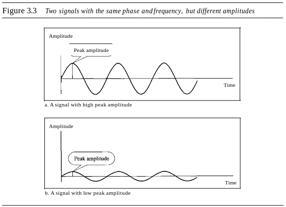

</div>

El período se refiere a la cantidad de tiempo, en segundos, que una señal necesita para completar 1 ciclo. La frecuencia se refiere al número de períodos en 1 segundo. El período es la inversa de la frecuencia (T = 1/f), y la frecuencia es la inversa del período (f = 1/T).

<div align='center'>


</div>

El período se expresa en segundos. La frecuencia se expresa en Hertz (Hz), lo cual significa ciclo por segundo.

Otra manera de ver la frecuencia es la siguiente: la frecuencia es la tasa de cambios con respecto al tiempo. Si suceden cambios en un corto período de tiempo, significa alta frecuencia, en cambio si suceden cambios en un largo período de tiempo, significa baja frecuencia.

La fase describe la posición de la onda con respecto al tiempo 0. La fase se mide en grados o radianes.

<div align='center'>

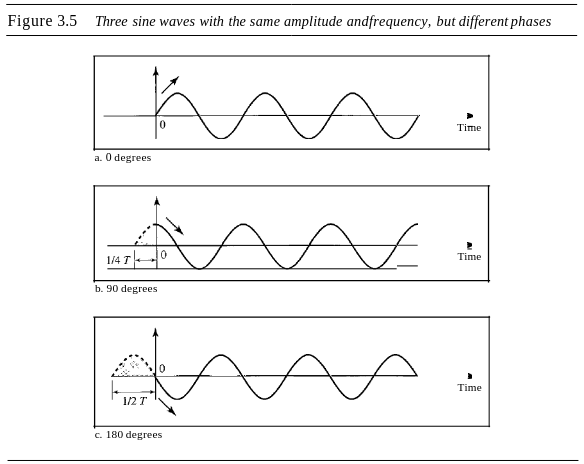

</div>

A partir de la imagen anterior podemos decir que:

1. Una onda con una fase de 0º empieza en el tiempo 0 con amplitud 0. La amplitud incrementa.
2. Una onda con una fase de 90º empieza en el tiempo 0 con amplitud pico. La amplitud decrementa.
3. Una onda con una fase de 180º empieza en el tiempo 0 con amplitud 0. La amplitud decrementa.

Otra manera de observar la fase es en términos de posición u offset. Podemos decir que:

1. Una onda con fase de 0º no se desplaza.
2. Una onda con fase de 90º se desplaza hacia la izquierda por 1/4 de ciclo. Pero la señal no existe antes del tiempo 0.
3. Una onda con fase de 180º se desplaza hacia la izquierda por 1/2 de ciclo. Pero la señal no existe antes del tiempo 0.

La *longitud de onda* es otra característica de una señal que viaja a través de un medio de transmisión. La longitud de donda fija el período o la frecuencia de una onda sinusoidal simple a la velocidad de propagación del medio.

La longitud de onda es la distancia que una señal simple puede viajar en un período.

La longitud de onda se puede calcular si se tiene la velocidad de propagación y el período de la señal. Sin embargo, como el período y la frecuencia están relacionados entre sí, si representamos la longitud de onda con λ, la propagación de la luz con c, y la frecuencia con f, tenemos:

```
longitud de onda = propagación de la velocidad x período 

λ = c * T = c / f
```

La velocidad de propagación de señales electromagnéticas depende del medio y de la frecuencia de la señal. La longitud de onda generalmente se mide en micrometros (micrones).

Una señal compuesta está formada por varias ondas sinusoidales simples de diferentes frecuencias, amplitudes y fases. 

Una señal compuesta puede ser periódica o aperiódica. Una señal compuesta periódica puede ser descompuesta en una serie de ondas sinusoidales simples con frecuencias discretas. Una señal compuesta aperiódica puede ser descompuesta en una infinidad de ondas sinusoidales simples con frecuencias continuas.

<div align='center'>

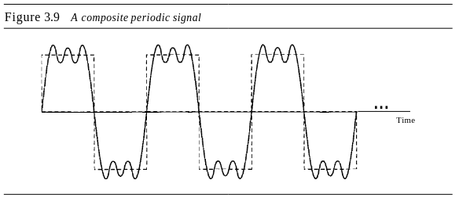

</div>

La siguiente imagen muestra el resultado de descomponer la señal anterior en dominios de tiempo y frecuencia:

<div align='center'>

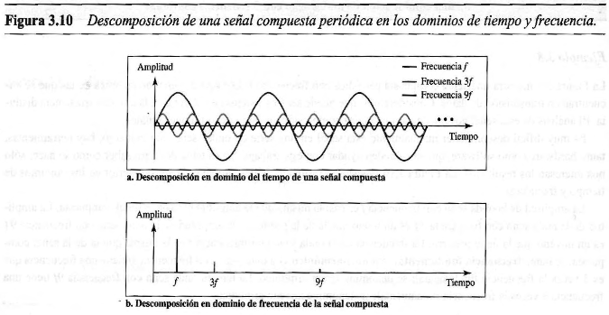

</div>

La amplitud de la onda seno con frecuencia *f* es casi la misma que la amplitud pico de la señal compuesta. La frecuencia de la onda seno con frecuencia *f* es la misma que la de la señal compuesta; se llama **frecuencia fundamental** o primer **armónico**.

El rango de frecuencias contenida en una señal compuesta es su **ancho de banda**. El ancho de banda es la diferencia entre la frecuencia más alta y la frecuencia más baja de una señal compuesta.

#### 3.3 Señales digitales

Además de ser representada por señales analógicas, la información también puede ser representada por una señal digital. Por ejemplo, un 1 se puede codificar como un voltaje positivo y un 0 como voltaje cero. Una señal digital puede tener más de dos niveles.

<div align='center'>

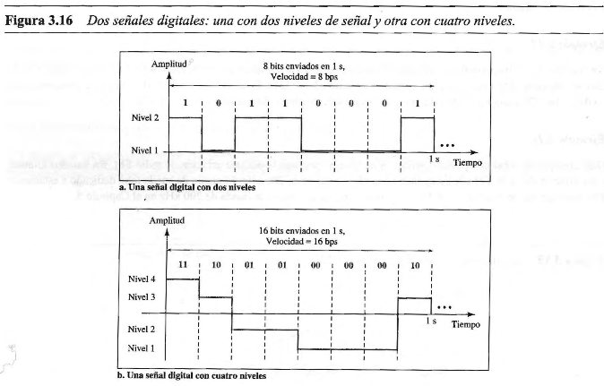

</div>

Se envía 1 bit por nivel en la parte a de la imagen, y 2 bits por nivel en la parte b de la imagen. Si una señal tiene L niveles, entonces cada nivel necesita log2(L) bits.

La mayoría de las señales digitales son aperiódicas, y por lo tanto, la frecuencia y el período no son características apropiadas para describirlas. El término **bit rate** o **tasa de bits** se utiliza para describir las señales digitales. El bit rate es el número de bits enviados en 1 segundo, expresado en bits por segundo (bps).

Según el análisis de Fourier, una señal digital es una señal analógica compuesta con ancho de banda infinito.

Para las señales digitales, podemos definir algo similar al concepto de longitud de onda para las señales analógicas: el **bit length** o **invervalo de bit**. El bit length es la distancia que ocupa un bit en el medio de transmisión.

Una señal digital, periódica o aperiódica, es una señal analógica compuesta con frecuencias entre 0 e infinito. A nosotros solamente nos interesan las señales digitales aperiódicas. Para enviar una señal digital de un punto a otro, se pueden usar una de dos aproximaciones: transmisión banda base o transmisión banda ancha (usando modulación).

La *transmisión banda base* significa enviar una señal digital sobre un canal sin cambiar la señal digital a una señal analógica.

<div align='center'>

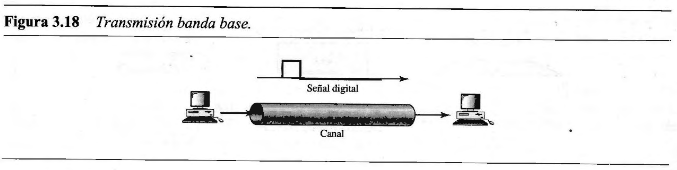

</div>

La transmisión banda base necesita un canal paso bajo, un canal con un ancho de banda que comienza en cero. Hay dos casos de comunicación banda base: un canal paso bajo con gran ancho de banda y uno con un ancho de banda limitado.

La *transmisión banda ancha* o con modulación implica cambiar la señal digital a una señal analógica para su transmisión. La modulación permite usar un canal paso banda, un canal con un ancho de banda que no empieza en cero. Este tipo de canal tiene mayor disponibilidad que un canal paso bajo.

<div align='center'>

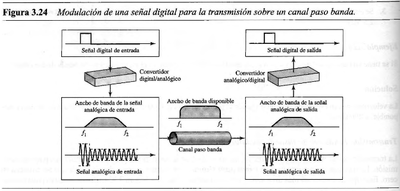

</div>

En la imagen, se muestra la modulación de una señal digital. La señal digital se convierte a una señal analógica compuesta. Se usa una señal analógica de frecuencia única (llamada portadora). La amplitud de la portadora se cambia para que parezca como la señal digital. Sin embargo, el resultado no es una señal de frecuencia única, es una señal compuesta. En el receptor, la señal analógica recibida se convierte a digital.

#### 3.4 Deterioro de la transmisión

Las señales viajan a través de medios de transmisión, los cuales no son perfectos. Esta imperfección causa el deterioro de la transmisión. Esto significa que la señal al principio del medio no es la misma que la señal al final del medio, lo que se envía no es lo que se recive. Las tres causas del deterioro son la *atenuación*, *distorsión* y *ruido*.

La **atenuación** es la pérdida de energía. Cuando una señal viaja a través del medio, pierde un poco de su energía para vencer la resistencia del medio. Para compensar esta pérdida, se usan amplificadores para amplificar la señal.

<div align='center'>

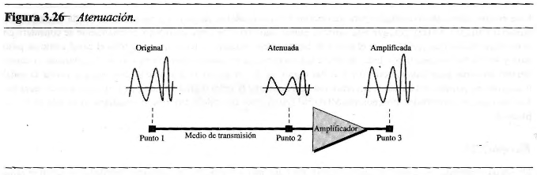

</div>

Para mostrar que una señal perdió o ganó fuerza, los ingenieros usan la unidad del decibel. El decibel (dB) mide la fuerza relativa de dos señales o de una señal en dos puntos diferentes. El decibel es negativo si la señal es atenuada y positivo si una señal es amplificada.

```
dB = 10 log 10 (P2 / P1)
```

Las variables P1 y P2 son las potencias de una señal en los puntos 1 y 2.

La **distorsión** es el cambio de forma de una señal. La distorsión puede ocurrir en una señal compuesta formada por varias frecuencias. Cada componente de señal tiene su propia velocidad de propagación a través del medio y, por lo tanto, su propio retraso en llegar al destino. Las diferencias en el retraso pueden crear diferencias en la fase si el retraso no es exactamente igual a la duración del período. Es decir, los componentes de señal en el receptor tienen fases diferentes de las que tenían en el emisor, por lo tanto la forma de la señal compuesta no es la misma.

<div align='center'>

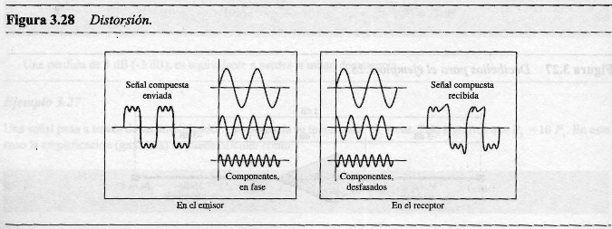

</div>

El **ruido** y sus diferentes tipos, pueden corromper la señal. El ruido térmico es el movimiento aleatorio de electrones en un cable que crea una señal extra. El ruido inducido viene de fuentes como motores y electrodomésticos. Ruido de impulso es un pico que viene de líneas de potencia, energía, etc.

Para hallar el límite de tasa de bits teórico, necesitamos saber la relación entre la potencia de la señal u la potencia del ruido. La **relación señal-ruido (SNR, Signal-to-Noise Ratio)** se define como:

```
SNR = potencia promedio de la señal / potencia promedio del ruido
```

Tenemos que considerar la potencia promedio de la señal y del ruido porque pueden cambiar con el tiempo. SNR es la relación de lo que se quiere (señal) a lo que no se quiere (ruido). Un SNR alto significa que la señal está corrompida en menor medida por el ruido; un SNR bajo significa que la señal está mayormente corrompida por el ruido.

<div align='center'>

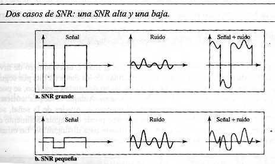

</div>

Como SNR es la relación de dos potencias, generalmente se describe en decibeles, SNRdB, definido como:

```
SNRdB = 10 log 10 SNR
```

#### 3.5 Límites de velocidad de datos

La velocidad de los datos depende de tres factores:
- El ancho de banda disponible
- El nivel de las señales que se utilizan
- La calidad del canal (el nivel del ruido)

Dos fórmulas teóricas fueron desarrolladas para calcular la velocidad de los datos: una por Nyquist para un canal sin ruido, y otro por Shannon para un canal con ruido.

Para un **canal sin ruido**, la formula de bit rate de Nyquist define el bit rate máximo teórico como:

```
BitRate = 2 x ancho de banda x log 2 L
```

Según esta formula, dado un ancho de banda, podemos tener el bit rate que queramos incrementando el nivel de las señales, pero en la práctica esto tiene un límite. Cuando incrementamos el nivel de señales, estamos imponiendo una carga sobre el receptor. Si el nivel de una señal es 2, el receptor puede distinguir fácilmente entre un 0 y un 1. Si el nivel de una señal es 64, el receptor debe ser lo suficientemente sofisticado para distinguir entre los diferentes 64 niveles. En otras palabras, incrementar los niveles de una señal reduce la fiabilidad del sistema.

En la vida real, no podemos tener un canal sin ruido, los canales siempre son ruidosos. Shannon introdujo la formula que determina la velocidad teórica máxima de datos para un **canal con ruido**:

```
Capacidad = ancho de banda x log 2 (1 + SNR)
```

En esta fórmula, la capacidad es la capacidad del canal en bits por segundo. En esta fórmula no se ve el nivel de señal, lo que significa que no importa cuantos niveles tengamos, no podemos conseguir una velocidad de datos más alta que la capacidad del canal.

#### 3.6 Rendimiento

Un problema importante es el rendimiento de la red.

Una característica que mide el rendimiento de la red es el **ancho de banda**. Sin embargo, el término se puede usar en dos contextos diferentes con dos valores de medida diferentes: ancho de banda en hertz y ancho de banda en bits por segundo.

El ancho de banda en hertz es el rango de frecuencias contenidas en una señal compuesta o el rango de frecuencias que un canal puede transmitir.

El ancho de banda también se puede referir al número de bits por segundo que un canal, enlace o red puede transmitir.

Hay una relación explícita entre el ancho de banda en hertz y en bps. Un incremento en ancho de banda en hertz significa un ancho de banda en bps. La relación depende de si usamos transmisión banda base o transmisión con modulación.

El **throughtput** o **rendimiento** es una medida de que tan rápido podemos enviar datos por una red. Si bien puede pensarse que ancho de banda en bps y throughtput pueden ser lo mismo, en realidad son diferentes. El ancho de banda es una medida potencial de un enlace y el throughtput es la medida real de cuán rápido podemos enviar datos.

La **latencia** define que tanto se tarda un mensaje en llegar completamente al destino desde el momento en el que se envía el primer bit. Podemos decir que la latencia está compuesta por cuatro componentes: tiempo de propagación, tiempo de transmisión, tiempo de encolamiento y retraso de procesamiento.

```
Latencia = tiempo de propagación + tiempo de transmisión + tiempo de encolamiento + retraso de procesamiento.
```

El tiempo de propagación mide el tiempo que requiere un bit para viajar desde el origen hacia el destino. Se calcula dividiendo la distancia por la velocidad de propagación:

```
Tiempo de propagación = distancia / velocidad de propagación
```

El tiempo requerido para transmitir un mensaje depende del tamaño del mensaje y el ancho de banda del canal:

```
Tiempo de transmisión = tamaño del mensaje / ancho de banda
```

El tiempo de encolamiento es el tiempo que necesita cada sistema intermedio o final para almacenar el mensaje antes de que pueda ser procesado. El tiempo de encolamiento cambia con la carga impuesta en la red. Cuando hay mucho tráfico, el tiempo de encolamiento incrementa. Un sistema intermedio, como un router, encola los mensajes que llegan y los procesa uno por uno.

El producto del ancho de banda y del retraso es el número de bits que puede llenar el enlace. Esta medición es importante si necesitamos enviar datos en ráfagas y esperar para recibir el ACK de cada ráfaga antes de enviar la próxima. Para usar la capacidad máxima del enlace, debemos hacer que el tamaño de nuestras ráfagas de datos sean 2 veces el producto del ancho de banda y del retraso, ya que necesitamos llenar el canal full duplex.

Otro problema de rendimiento que está relacionado con el retraso es el **jitter**. El jitter es un problema si diferentes paquetes de datos encuentran diferentes retrasos y la aplicación que usa los datos en el receptor es sensible al tiempo (por ejemplo, datos de audio y video).

#### 6.0 Utilización del Ancho de Banda: Multiplexación y Ensanchado

La utilización del ancho de banda es el uso inteligente del ancho de banda disponible para alcanzar ciertos objetivos.

En la *multiplexación*, nuestro objetivo es la eficiencia: combinamos varios canales en uno. En el *ensanchado*, nuestro objetivo es la privacidad y el antijamming: expandemos el ancho de banda de un canal para insertar redundancia.

#### 6.1 Multiplexación

Cuando el ancho de banda de un medio que enlaza dos dispositivos es mayor que el ancho de banda que necesitan los dispositivos, el enlace puede ser compartido. La **multiplexación** es un conjunto de técnicas que permite la transmisión simultánea de múltiples señales a través de un enlace de datos.

Si el ancho de banda de un enlace es mayor que el ancho de banda que necesitan los dispositivos, el ancho de banda es desperdiciado. Un sistema eficiente maximiza el uso de todos sus recursos.

En un sistema multiplexado, n líneas comparten el ancho de banda de un enlace.

<div align='center'>

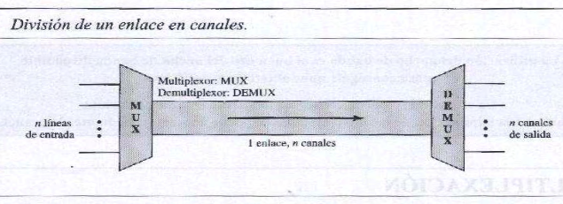

</div>

Las líneas a la izquierda envían sus flujos de transmisión a un **multiplexor (MUX)** que los combina en un solo flujo (muchos a uno). En el receptor, ese flujo es alimentado a un **demultiplexor (DEMUX)** que separa el flujo (uno a muchos) y los envía a sus líneas correspondientes.

En la imagen, la palabra enlace se refiere al camino físico, mientras que la palabra canal se refiere a la porción del enlace que realiza la transmisión entre un par de líneas dado. Un enlace puede tener varios (n) canales.

Existen tres técnicas básicas de multiplexación: multiplexación por división de frecuencias, multiplexación por división de longitud de ondas, y multiplexación por división de tiempo. Las primeras dos son técnicas diseñadas para señales analógicas, y la tercera para señales digitales.

La **multiplexación por división de frecuencias (FDM)** es una técnica analógica que puede ser aplicada cuando el ancho de banda de un enlace (en hertz) es mayor que el ancho de banda combinado de las señales a ser transmitidas. En FDM, las señales generadas por cada dispositivo emisor modulan diferentes frecuencias portadoras. Estas señales moduladas son combinadas en una señal compuesta que puede ser transportada por el enlace. Las frecuencias portadoras son separadas por el ancho de banda suficiente para acomodar la señal modulada. Este rango de ancho de banda son los canales por los cuales las señales van a viajar. Los canales pueden ser separados por tiras de anchos de banda sin usar, llamadas **bandas de guarda** para prevenir que las señales se solapen. Además, las frecuencias portadoras no deben interferir con las frecuencias de datos originales.

<div align='center'>

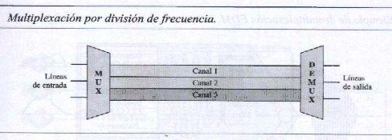

</div>

La siguiente imagen muestra el proceso de multiplexación FDM:

<div align='center'>

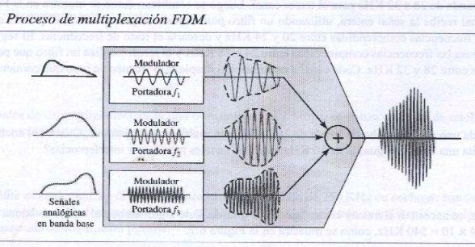

</div>

Cada fuente genera una señal de un rango de frecuencia similar. Dentro del multiplexor, estas señales similares modulan frequencias portadoras diferentes (f1, f2 y f3). La señal modulada resultante se combina en una señal compuesta que es enviada a través de un medio de enlace que tiene el ancho de banda suficiente para acomodarla.

El demultiplexor utiliza una serie de filtros para descomponer la señal multiplexada en sus señales componentes. Las señales individuales son pasadas a un demodulador que las separa de sus portadores y las pasa a las líneas de salida.

<div align='center'>

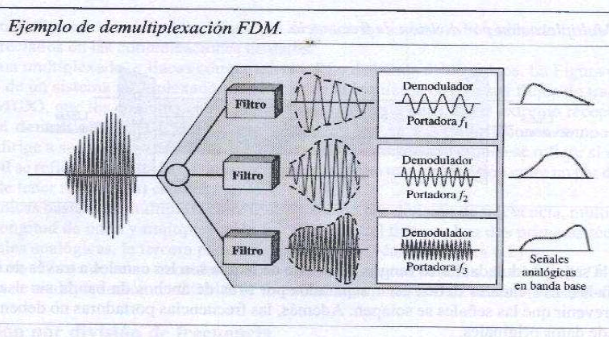

</div>

La **multiplexación por división de longitud de ondas (WDM)** está diseñada para usar la capacidad de alta tasa de datos de la fibra óptica. 

Conceptualmente WDM es igual que FDM, con la excepción de que la multiplexación y demultiplexación implica señales ópticas transmitidas por canales de fibra óptica. La diferencia es que las frecuencias son muy altas.

<div align='center'>

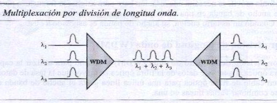

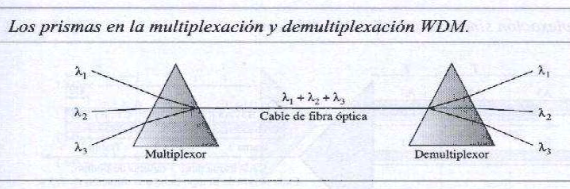

</div>

La **multiplexación por división de tiempo (TDM)** es un proceso digital que le permite a varias conexiones compartir el ancho de banda de un enlace. En vez de compartir una porción del ancho de banda como en FDM, el tiempo es compartido. Cada conexión ocupa una porción del tiempo en el enlace. 

<div align='center'>

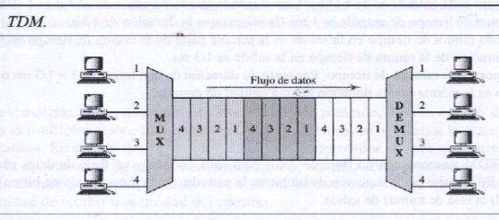

</div>

Se utiliza el mismo enlace que en FDM, pero el enlace se divide por tiempo en vez de por frecuencia. Las porciones de señales 1, 2, 3 y 4 ocupan el enlace secuencialmente.

TDM se puede dividir en dos esquemas diferentes: *síncrona* y *estadística*.

En la **TDM síncrona**, el flujo de datos de cada conexión de entrada está dividida en unidades, donde cada entrada ocupa una ranura de tiempo de entrada. Una unidad puede ser 1 bit, un caracter, o un bloque de datos. Cada unidad de entrada pasa a ser una unidad de salida y ocupa una ranura de tiempo de salida. Sin embargo, la duración de una ranura de tiempo de salida es n veces más corta que la duración de de una ranura de tiempo de entrada. Si una ranura de tiempo de entrada ocupa T segundos, la ranura de tiempo de salida dura T/n segundos, donde n es el número de conexiones. En otras palabras, una unidad en una conexión de salida tiene una duración más corta, ya que viaja más rápido.

En TDM síncrona, una ronda de unidad de datos de cada conexión de entrada se introduce en una trama. Si tenemos n conexiones, una trama se divide en n ranuras de tiempo y se asigna una ranura a cada unidad, una por cada línea de entrada. Si la duración de la unidad de entrada es T, la duración de cada ranura es T/in y la duración de cada trama es T.

<div align='center'>

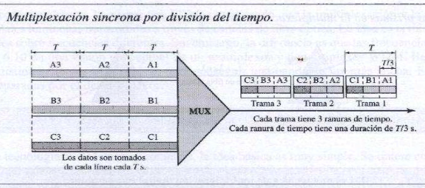

</div>

La tasa de datos de un enlace de salida debe ser n veces la tasa de datos de una conexión para garantizar el flujo de datos. En la imagen anterior, la tasa de datos de un enlace es 3 veces la tasa de datos de una conexión, y la duración de una unidad en una conexión es 3 veces la de una ranura de tiempo.

Las ranuras de tiempo son agrupadas en **tramas**. Una trama consiste en un ciclo completo de ranuras de tiempo, con una ranura dedicada a cada emisor. En un sistema con n líneas de entrada, cada trama tiene n ranuras, con cada ranura asignada a transportar datos de una línea de entrada específica.

Los conmutadores del multiplexor y demultiplexor se sincronizan y rotan a la misma velocidad, pero en diferentes sentidos. Cuando el conmutador del multiplexor se abre frente a una conexión, dicha conexión puede enviar una unidad por la línea. Este proceso se denomina **interleaving** o **entrelazado**. Cuando el conmutador del demultiplexor se abre frente a una conexión, dicha conexión puede recibir una unidad de la línea.

<div align='center'>

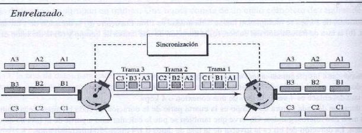

</div>

Un problema de TDM es como manejar la disparidad en la tasa de datos de entrada. Si las tasas de datos no son las mismas, se pueden utilizar tres estrategias: *multiplexación multinivel*, *asignación múltiple de ranuras*, e *inserción de bits*.

La **multiplexación multinivel** es una técnica que se usa cuando una tasa de datos de una línea de entrada es un múltiplo de otras. Las líneas de datos se pueden multiplexar para igualar la tasa de datos de otras líneas.

<div align='center'>

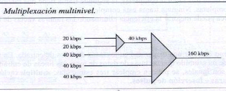

</div>

A veces es más eficiente asignar más de una ranura en una trama para una sola línea de entrada. Una línea de entrada se puede dividir para asignarle dos ranuras en la salida. Esto se llama **asignación múltiple de ranuras**.

<div align='center'>

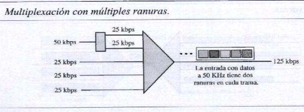

</div>

A veces la tasa de bits de las fuentes no son múltiplos enteros de cada uno. Una solución es hacer que la línea de entrada que tenga la tasa de datos más alta sea la dominante, y agregar bits extra a las líneas de entrada con tasas menores. Esta técnica se denomina **inserción de bits**.

<div align='center'>

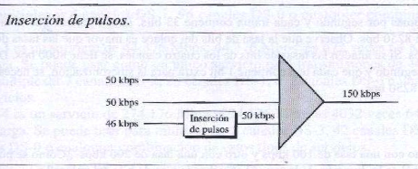

</div>

La sincronización entre el multiplexor y el demultiplexor es un problema principal de la TDM. Si no están sincronizados, un bit que pertenece a un canal puede ser recibido por el canal incorrecto. Para esto se agregan bits de sincronización al principio de cada trama. Estos bits se llaman **bits de tramado**, y siguen un patrón trama a trama que permite al demultiplexor sincronizarse con el flujo entrante para que pueda separar las ranuras de tiempo de manera precisa. En general, el patrón va alternando entre 0 y 1 por trama.

<div align='center'>

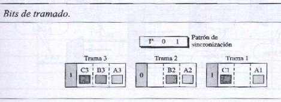

</div>

En la **TDM estadística**, las ranuras son asignadas dinámicamente para mejorar la eficiencia de ancho de banda. Sólo cuando una línea de entrada tiene una ranura entera de datos para enviar se le da una ranura en la trama de salida. El número de ranuras en cada trama es menor al número de líneas de entrada. El multiplexor chequea cada línea de entrada usando round-robin: le asigna una ranura a una línea de entrada si la línea tiene datos a enviar, sino, se saltea la línea y se chequea la siguiente línea.

<div align='center'>

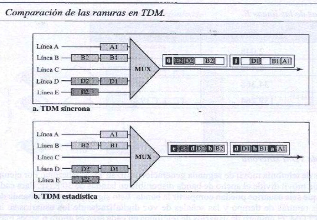

</div>

Las diferencias con respecto a TDM síncrona son:

- Las ranuras en TDM estadística lleva datos y una dirección, y la proporción del tamaño de datos con respecto al tamaño de la dirección debe ser razonable para que la transmisión sea eficiente.
- Las tramas en TDM estadística no necesitan ser sincronizadas, no necesitan los bits de sincronización.
- En TDM estadística, la capacidad del enlace es menor que la suma de las capacidades de cada canal. La capacidad del enlace está basada en las estadísticas de la carga de cada canal.

#### 6.2 Espectro ensanchado

En el **espectro ensanchado**, se combinan señales de diferentes fuentes para que puedan entrar en un ancho de banda más grande, pero sólo en aplicaciones inalámbricas (LANs y WANs). En este tipo de aplicaciones, las estaciones usan el aire como el medio de comunicación, y deben compartir este medio sin ser interceptadas por un escuchador y sin ser subjetos de interferencias por parte de intrusos malintencionados.

Para lograr esto, las técnicas de ensanchado agregan redundancia: ensanchan el espectro original que necesita cada estación. Si el ancho de banda requerido por cada estación es B, el espectro ensanchado lo expande a Bss, de manera que Bss >> B. El ancho de banda expandido permite a la fuente envolver su mensaje en una envoltura protectora para una transmisión más segura.

<div align='center'>

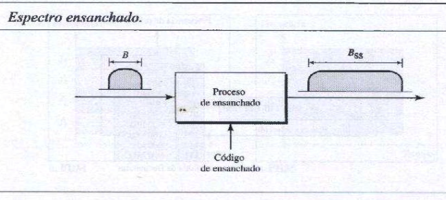

</div>

El espectro ensanchado alcanza sus objetivos mediante dos principios:
1. El ancho de banda asignado a cada estación necesita ser más grande que lo que se necesita. Esto permite la redundancia.
2. La expansión del ancho de banda original B al ancho de banda Bss debe ser hecho por un proceso que es independiente de la señal original, es decir que el ensanchado ocurre después de que la señal es creada por la fuente.

Luego de que la señal es creada por la fuente, el proceso de ensanchado usa un código de ensanchado y ensancha el ancho de banda. El código de ensanchado es una serie de números que parecen aleatorios, pero en realidad son un patrón.

Existen dos técnicas para ensanchar el ancho de banda: *espectro de ensanchado por salto de frecuencia (FHSS)* y *espectro de ensanchado por secuencia directa (DSSS)*

La técnica de **espectro de ensanchado por salto de frecuencia (FHSS)** usa M diferentes frecuencias portadoras que son moduladas por la señal fuente. En un mommento, la señal modula una frecuencia portadora, en el momento siguiente, la señal modula otra frecuencia portadora. Si bien la modulación es hecha usando una frecuencia portadora a la vez, M frecuencias son usadas en el largo plazo. El ancho de banda ocupado por una fuente después de ensanchar es BpHSS >> B.

<div align='center'>

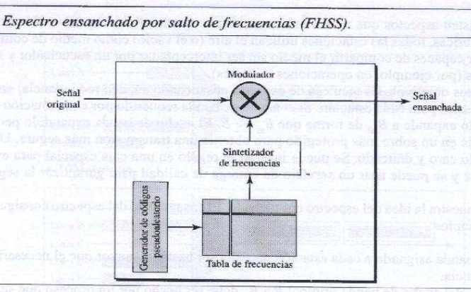

</div>

Un generador de código pseudo-aleatorio llamado ruido pseudoaleatorio (pseudorandom noise, PN) crea un patrón k-bit por cada período de salto Tk. La tabla de frecuencia usa el patrón para encontrar la frecuencia que se usa para este período de salto y se lo pasa al sintetizador de frecuencias. El sintetizador de frecuencias crea una señal portadora de esa frecuencia, y la señal fuente modula la señal portadora.

<div align='center'>

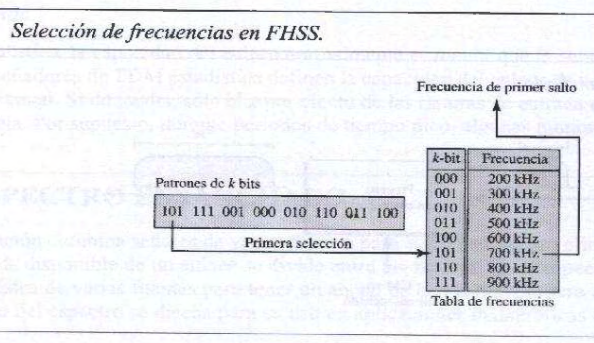

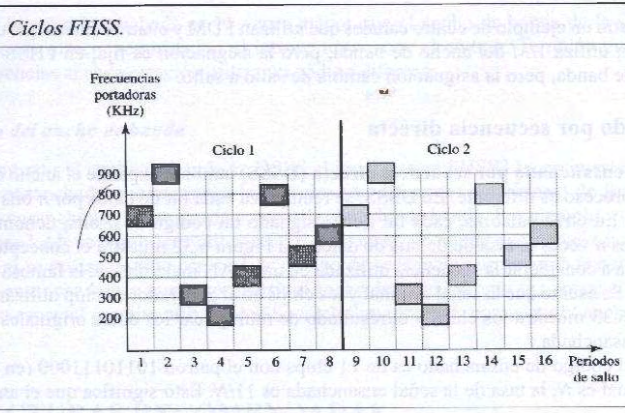

</div>

Este esquema puede cumplir con los objetivos mencionados anteriormente. Si hay muchos patrones k-bit y el período de salto es corto, un emisor y un receptor pueden tener privacidad. Si un intruso intenta interceptar la señal transmitida, sólo puede acceder a un pequeño pedazo de datos porque no conoce la secuencia de ensanchado para poder adaptarse al siguiente salto. El esquema también tiene un efecto anti-intercepción, si un agente malicioso intenta enviar un ruido para interceptar la señal, sólo podrá por un período de salto, pero no por el período completo.

Si el número de frecuencias de salto es M, se pueden multiplexar M canales en uno, compartiendo el mismo ancho de banda Bss. Esto es posible porque una estación usa solo una frecuencia en cada período de salto. 

La técnica de **espectro ensanchado de sequencia directa (DSSS)** también expande el ancho de banda de la señal original, pero reemplaza cada bit de datos con n bits usando un código de ensanchado, llamado chips, donde la tasa de chips es n veces la tasa de bit de datos.

<div align='center'>

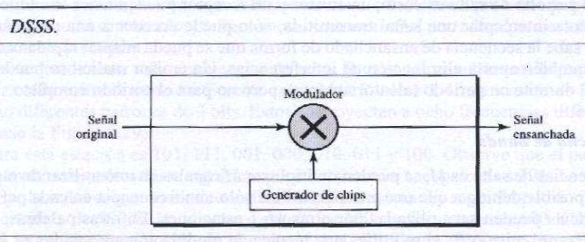

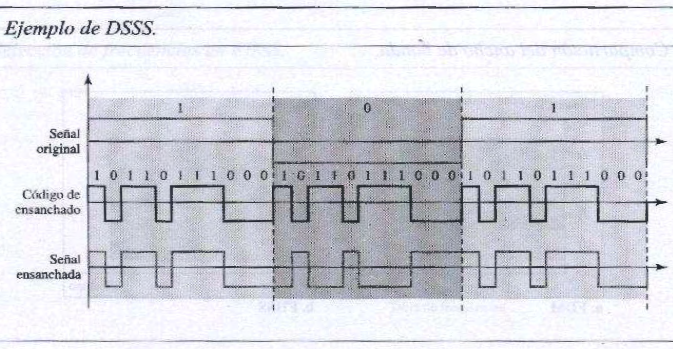

</div>

En la imagen de arriba, el código de ensanchado es 11 chips con el patrón 10110111000. Si la tasa de la señal original es N, la tasa de la señal ensanchada es 11/N. Esto significa que el ancho de banda requerido para la señal ensanchada es 11 veces más larga que la del ancho de banda de la señal original. La señal ensanchada provee privacidad si el intruso no sabe el código, y también provee inmunidad con respecto a interferencias si cada estación usa un código diferente.

En DSSS, si se usa un código de ensanchado que ensancha señales que no pueden ser combinadas y separadas, entonces no se puede compartir en ancho de banda. Pero si se usa un tipo especial de código de secuencia que permite la combinación y separación de señales ensanchadas, se puede compartir el ancho de banda.

---

### Bibliografia

➤ [**FOR07**] - [Data Communications and Networking](https://github.com/mnomico/tyr/raw/main/libros/FOR07.pdf)

&nbsp;&nbsp;&nbsp;&nbsp;&nbsp;&nbsp;⤷ Capítulo 3: “Data and Signals”<br>
&nbsp;&nbsp;&nbsp;&nbsp;&nbsp;&nbsp;⤷ Capítulo 6: “Bandwidth Utilization:
Multiplexing and Spreading”

</div>