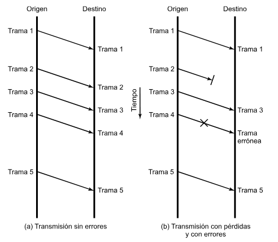
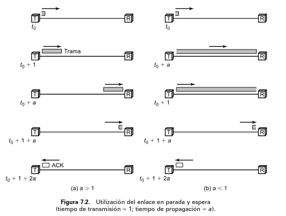
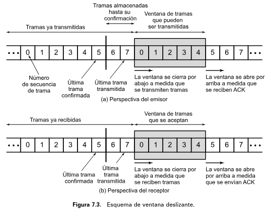

## [Volver atrás](../readme.md)

<div align="center">
<h1>Capa de Enlace</h1>
</div>

### Indice

💡 [Conceptos a tener en cuenta](#conceptos-a-tener-en-cuenta)

❓ [Guía de preguntas](#guia-de-preguntas)

✍️ [Ejercicios](#ejercicios)

📝 [Resumen](#resumen)

📖 [Bibliografía](#bibliografia)

---

### Conceptos a tener en cuenta

➤ Funciones de la capa de enlace

➤ Trama (Frame)

➤ Control de Flujo (S&W, Sliding Windows)

➤ Control de Errores (ARQ)

➤ Tasa de Error

➤ Tiempo de Trama

➤ Tiempo de Transmisión

➤ Eficiencia en enlace (U)

➤ Producto Retardo x Ancho de Banda

➤ Throughput

---

### Guia de preguntas

1. Describa las funciones del Nivel de Enlace ¿Qué similitudes y diferencias existen con las funciones propuestas por el Modelo OSI para la capa de transporte?

2. ¿Por qué es necesario contar con las funciones que provee la capa 2?

3. ¿Cuáles son las técnicas típicas para realizar dichas funciones? Compare cada una indicando ventajas y desventajas.

4. ¿Cuáles son los requisitos para una comunicación efectiva a nivel de enlace?

5. Describa la técnica de ventanas deslizantes para control de flujo. ¿En qué situaciones es altamente recomendable su uso? Justifique.

6. ¿Por qué los datos a enviar se dividen en tramas? ¿Qué estructura tienen?

7. ¿Por qué es necesaria la utilización del número de secuencia dentro de la estructura de la trama?

8. Explique el concepto de piggyback. ¿En qué casos se utilizaría y en cuáles no?

9. ¿Qué mecanismos se utilizan para la detección de errores? ¿Cuál es el fundamento del CRC? ¿Qué polinomio usa HDLC y qué prestaciones le brinda?

10. Realice un diagrama de tiempo para el intercambio de tramas entre dos equipos (A y B) utilizando un protocolo con ventana deslizante (con W = 5) para el control de flujo y un ARQ-adelante-atrás para control de errores. En el ejemplo, el equipo A debe enviar 6 tramas y el B solamente 3.

11. Indique y ejemplifique por qué hay que modificar el tamaño máximo de ventana cuando se utilizan ARQ-Adelante-Atrás-N y ARQ con Retransmisión Selectiva.

12. Se cuenta con un enlace digital para transmitir música por radio. ¿Qué técnica para tratar los errores es la más adecuada y por qué? 

    a) Ninguna técnica 

    b) Sólo detección de errores 

    c) Detección y recuperación (ARQ).

13. Describa brevemente las características del protocolo HDLC y cómo implementa las funciones de enlace.

14. ¿Qué significa que HDLC puede utilizar una configuración no-balanceada? Mencione un ejemplo propio donde se muestre dicha situación y justifique.

15. HDLC, ¿Es un protocolo orientado a la conexión ó no? ¿Con qué primitivas cuenta (según respuesta a la primera pregunta)?

16. ¿Cuáles son los 3 tipos de trama que define HDLC? ¿Para qué es cada una y durante qué etapa de la comunicación se utilizan?

17. ¿Qué configuración de HDLC utilizaría para un enlace satelital? Justifique.

18. Explique la técnica de bit stuffing y su uso ¿Cuál sería una alternativa?

19. ¿Qué es el throughput de un enlace? ¿De qué variables depende?

20. ¿Qué parámetros se consideran al evaluar la eficiencia de un protocolo de enlace?

---

### Ejercicios

1. ¿Cuál es el producto retardo x ancho de banda de un enlace de 256 Kbps y RTT = 30 ms? ¿Cómo se modifica si el RTT sube a 500 ms? ¿Cómo afecta al rendimiento de los protocolos?

2. Suponga que se requiere transmitir información desde un satélite de comunicaciones hasta una base en la luna (distancia 4 x 105 km). Para ello se tiene un canal de 1024 Kbps. Calcule el RTT del enlace y el producto retardo x ancho de banda. Y si quisiera transmitir desde una estación terrestre: ¿Qué valores toman tales parámetros? ¿Qué utilización (U) se obtendrían con un protocolo S&W y uno con SW (con W = 128)? Suponga tramas de 2000 bytes.

3. Un enlace de 50km de longitud y un ancho de banda de 1 Mbps se gestiona utilizando un protocolo con control de flujo por S&W. Calcule el tamaño de trama necesario para obtener la mayor utilización (U) si el retardo es de 50 ms.

4. Calcular el throughput para un enlace que utiliza un protocolo de ventana deslizante cuyo tamaño de trama es de 100 bytes y la ventana es 8. La tasa del enlace es de 1.45 Mbps y el RTT = 50 ms. ¿Cuál es el rendimiento (U) del enlace?

5. Un canal tiene una velocidad de transmisión de 4 Kbps y un retardo de 20 ms. ¿Para qué tamaño de trama se conseguirá un esquema de parada y espera con una eficiencia (U) del 50%?

6. Dos estaciones se comunican a través de un enlace de 1 Mbps con un retardo de propagación de 270 ms. Si se usan tramas HDLC de 1024 bits con números de secuencia de 3 bits ¿Cuál será el rendimiento máximo posible considerando sólo los datos transportados?

7. Analizar para qué tamaño de ventana resulta el throughput óptimo si se cuenta con un enlace de 512 Kbps y RTT = 500 ms y el tamaño de trama es de 800 bytes.

8. Calcule la utilización de un enlace de fibra óptica de 500 metros cuya tasa de transferencia es de 500 Mbps si se utiliza un protocolo con control de flujo mediante parada y espera cuyas tramas son de 1000 bytes. ¿Cómo se modifica la situación si se utilizan ventanas? ¿Qué tamaño de W brinda la mayor utilización?

9. ¿Qué ocurre en el caso anterior si se tiene una probabilidad P=0.2 de error y se utiliza ARQ con: 
    
    a) S&W

    b) retransmisión selectiva?

10. ¿Con qué parámetros se puede obtener una utilización superior al 50% para un enlace con tramas de 53 bytes, de 100 Kms y 30 Mbps si la probabilidad de error es P=0.35?

---

### Resumen

Para llevar a cabo el control necesario en el envío de datos se necesita un **protocolo de control del enlace de datos**. Cuando se utiliza un protocolo de este tipo, el medio de transmisión es el **enlace de datos**.

Para lograr una comunicación de datos efectiva se necesita cumplir los siguientes requisitos y objetivos:

- **Sincronización de trama**: los datos se envían en tramas, y el principio y fin de estas tramas deben ser identificables.
- **Control de flujo**: el emisor no debe enviar tramas a una velocidad superior a la velocidad en la que el receptor puede recibirlas y procesarlas.
- **Control de errores**: se debe corregir los bits erróneos provocados por el medio de transmisión.
- **Direccionamiento**: se debe identificar a las estaciones involucradas en la transmisión.
- **Datos y control sobre el mismo enlace**: el receptor debe poder diferenciar la información de control y la de datos.
- **Gestión del enlace**: se necesita una serie de procedimientos para realizar la gestión del intercambio de datos.

#### 7.1 Control de flujo

El control de flujo es una técnica que asegura que el emisor no sobrecargue con datos al receptor. El receptor reserva una porción de memoria para la transferencia de datos (un buffer). Cuando se reciben datos, el receptor debe procesarlos primero y luego pasar los datos a las capas superiores. Si no se tiene un procedimiento para el control de flujo, el buffer del receptor se puede llenar y desbordar mientras procesa datos.

<div align='center'>



</div>

Las flechas representan el envío de una trama entre dos estaciones. Los datos se envían en secuencias de tramas. Cada una contiene un campo de datos (payload) y un campo de información de control (header).

El **tiempo de transmisión** es el tiempo que tarda una estación en enviar todos los bits de una trama sobre el medio. El **tiempo de propagación** es el tiempo que tarda un bit en atravesar el medio desde el origen hasta el destino.

**Control de flujo mediante parada y espera**

El procedimiento de control de flujo mediante parada y espera (stop & wait) funciona de la siguiente manera. El origen transmite una trama. El destino, cuando la recibe, envia una trama que confirma la recepción de la trama e indica al origen que puede enviar otra. El origen espera hasta recibir la confirmación antes de enviar la trama siguiente. De esta manera el destino puede detener el flujo de datos. 

El origen segmenta la información en bloques pequeños, transmitiendo los datos en varias tramas. Esto se hace así por varias razones:

- El tamaño del buffer del receptor puede ser limitado.
- Mientras más larga sea la transmisión, más probable es la ocurrencia de errores. Si el tamaño de trama es grande, se debe retransmitir la trama completa, pero si se divide en tamaños más pequeños, la retransmisión es menos costosa.
- En un medio compartido, es común que no se le permita a una estación ocupar el medio por períodos largos, para evitar que el resto de estaciones sufran retardos.

Si se usan varias tramas para un solo mensaje, el método de stop & wait es ineficiente, porque sólo se puede transmitir una trama en un momento dado. La longitud de un enlace de bits es:

```
B = R * d / V

B = longitud del enlace en bits, es decir la cantidad de bits que entran en el enlace
R = velocidad del enlace en bps
d = distancia del enlace en metros
V = velocidad de propagación en m/s
```

En los casos en el que la longitud del enlace en bits es mayor que la longitud de la trama, aparecen ineficiencias importantes.

<div align='center'>



</div>

El tiempo de transmisión se normaliza a la unidad (1) y el tiempo de propagación se expresa con la variable ```a```, que se puede expresar de la siguiente manera:

```
a = B / L

B = longitud del enlace en bits
L = longitud de la trama en bits
```

Cuando a < 1, el tiempo de propagación es menor que el de transmisión, es decir que la trama es tan larga que sus primeros bits llegan a destino antes de que el origen haya terminado su transmisión. En este caso, la línea se utiliza ineficientemente.

Cuando a > 1, el tiempo de propagación es mayor que el de transmisión, es decir que el origen completa la transmisión de la trama antes de que lleguen sus primeros bits al destino. En este caso, parte de la línea se desperdicia. Para velocidades de transmisión y distancias grandes, se recomienda usar valores grandes de a.

**Control de flujo mediante ventana deslizante**

Si se permite que transiten varias tramas al mismo tiempo, la eficiencia va a mejorar significativamente.

Para dos estaciones A y B, conectadas por un enlace full-duplex, la estación B reserva un buffer para almacenar W tramas, es decir que B puede aceptar W tramas, y A puede enviar W tramas sin esperar una confirmación. Para saber cuáles son las tramas confirmadas, cada trama tiene un número de secuencia. B envía una trama de confirmación con el número de secuencia de la trama siguiente que quiere recibir, lo cual indica que confirma la recepción de las tramas recibidas hasta el número de secuencia enviado y está preparado para recibir las W tramas siguientes, a partir del número de secuencia.

Por ejemplo, B recibe las tramas 2, 3 y 4 y envía la confirmación cuando llega la trama 4, con número de secuencia 5: B está confirmando las tramas 2, 3 y 4. A mantiene una lista con los números de secuencia que puede transmitir y B mantiene una lista con los números de secuencia que puede recibir. Estas listas se consideran como una ventana de tramas, por eso este método se lo conoce como **control de flujo mediante ventana deslizante**.

La numeración de las tramas ocupa un campo, por lo tanto va a tener un número limitado. Para un campo de k bits, el rango de números de secuencia es desde 0 hasta 2^k - 1. El máximo de la ventana es 2^(k-1) por una cuestión que se ve más adelante.

<div asign='center'>



</div>

En la imagen se usa números de secuencia de 3 bits, por lo que las tramas se van a numerar del 0 al 7 (porque 2^3 - 1 => 8 - 1 => 7), usando los mismos números para las tramas luego de la número 7. El rectángulo sombreado indica las tramas que se pueden transmitir. Cada vez que se envía una trama, la ventana se cierra, y cada vez que recibe una confirmación, la ventana se abre. Las tramas que están entre la barra vertical y la ventana ya fueron enviadas, pero no fueron confirmadas. Estas tramas son almacenadas por si hay que retransmitirlas.

<div asign='center'>


</div>

En esta imagen se usa un campo de 3 bits para los números de secuencia y un tamaño máximo para la ventana igual a 7 tramas, comenzando con la 0. Luego de transmitir 3 tramas sin confirmación, A cierra su ventana, pasando a tener un tamaño de 4 tramas, y manteniendo una copia de las tramas transmitidas sin confirmar. La ventana indica que A puede transmitir cuatro tramas, comenzando por la trama con número 3. B transmite una trama RR (Receive Ready) 3, que indica que recibió todas las tramas hasta la número 2 y que puede recibir 7 tramas a partir de la trama 3. Ahora A puede descartar las tramas almacenadas, y transmite las tramas 3, 4, 5 y 6. B devuelve una RR 4, confirmando la trama 3 y permitiendo la transmisión de tramas a partir de la trama 4 hasta la trama 2. Cuando la trama RR llega a A, como ya se transmitieron las tramas 4, 5 y 6, A solamente abre su ventana para permitir la transmisión de una trama más (porque sólo recibió confirmación de 1 trama).

La mayoría de los protocolos permiten que una estación pueda interrumpir la transmisión con un mensaje RNR (Receive Not Ready), confirmando las tramas anteriores pero prohibe la recepción de tramas. Por ejemplo, RNR 5 significa que se confirma la recepción de tramas hasta la número 4 pero no acepta más. En algún momento la estación debe transmitir una confirmación para reabrir la ventana.

Si se transmiten tramas en ambas direcciones, se puede utilizar un procedimiento conocido como **piggybacking**, en el que cada trama de datos incluye un campo para indicar el número de secuencia de la trama y otro campo para indicar el número de secuencia que confirma. Entonces si una estación tiene que enviar una confirmación y también datos, lo hace utilizando una sola trama ahorrando la capacidad del canal. Si la estación tiene datos para enviar pero nada para confirmar, envía el último número de secuencia de confirmación enviado.

#### 7.2 Control de errores

El control de errores hace referencia a los mecanismos necesarios para la detección y corrección de errores que aparecen en una transmisión de tramas. Pueden ocurrir dos tipos de errores:
- **Tramas perdidas**: ocurre cuando una trama no llega a destino.
- **Tramas dañadas**: ocurre cuando una trama se recibe con bits erróneos.

Las técnicas que se utilizan para el control de errores se basan en:

- **Detección de errores**.
- **Confirmaciones positivas**: el destino devuelve una confirmación por cada trama recibida sin errores.
- **Retransmisión por expiración de timer**: el origen retransmite cuando no se confirma una trama después de un tiempo.
- **Confirmación negativa y retransmisión**: el destino devuelve una confirmación negativa para las tramas con errores. El origen retransmite esas tramas.

Estos mecanismos se denominan **Automatic Repeat reQuest (ARQ)**. El objetivo de un esquema ARQ es convertir un enlace de datos no fiable en fiable

**ARQ con Parada y Espera**

Se basa en la técnica para el control de flujo mediante stop and wait. La estación origen transmite una sola trama y debe esperar la recepción de un ACK antes de enviar otra trama.

La estación origen usa un timer. Si no se recibe una confirmación cuando expira el timer, retransmite la trama.

Puede ocurrir que la estación destino reciba la trama y envíe la confirmación, pero esta se dañe o pierda. La estación origen retransmite porque su timer expiró, la estación destino recibe un duplicado de la trama, la descarta y envía un ACK nuevamente.

La ventaja del esquema ARQ con stop and wait es su simplicidad, y su desventaja principal es que es ineficiente.

**ARQ con vuelta atrás N**


---

### Bibliografia

➤ [**STA04**] - [Comunicaciones y redes de computadores](https://github.com/mnomico/tyr/raw/main/libros/STA04.pdf)

&nbsp;&nbsp;&nbsp;&nbsp;&nbsp;&nbsp;⤷ Capítulo 7: “Protocolos de control del enlace de datos”