## [Volver atrás](../readme.md)

<div align="center">
<h1>Redes Locales y WLANs</h1>
</div>

### Indice

💡 [Conceptos a tener en cuenta](#conceptos-a-tener-en-cuenta)

❓ [LANs - Guía de preguntas](#lans---guia-de-preguntas)

❔ [WLANs - Guía de preguntas](#wlans---guia-de-preguntas)

📝 [Resumen](#resumen)

📖 [Bibliografía](#bibliografia)

---

### Conceptos a tener en cuenta

- Características generales de las Redes de Área Local
- Identificar propiedades de los diferentes tipo de acceso al medio:
    - Dinámico/Aleatorio (con contienda)
    - Dinámico/Controlado (sin contienda)
    - Estático
- Acceso al medio CSMA/CD
- Protocolo Ethernet y su sucesor, el IEEE 802.3
- Algoritmo de un bridge/switch
- Hub, Bridge y Switch Ethernet.
- Alcances y limitaciones de las WLANs
- Acceso al medio CSMA/CA
- Problema del nodo oculto

---

### LANs - Guia de Preguntas

1. Describa las principales características de una red LAN.

2. ¿Qué es un método de acceso al medio? ¿Cómo se clasifican?

3. Describa cómo opera el método de acceso al medio CSMA/CD.

4. ¿Qué es una colisión? ¿En qué casos pueden ocurrir?

5. ¿De qué forma se enteran los nodos que transmiten que ha sucedido una colisión? ¿Y los restantes?

6. ¿Qué es una colisión tardía? ¿Qué problema podría ocurrir si sucede? ¿Por qué ocurren?

7. ¿Cómo opera y cúal es el objetivo de la técnica de Backoff?

8. ¿Qué es un hub y un conmutador (switch)? ¿Cuáles son sus diferencias funcionales principales?

9. Enuncie las características básicas de una red Token Ring y una basada en bus.

10. ¿Qué es Ethernet? Describa sus características principales.

11. Describa sintéticamente las normas 802.x.

12. Explique el modo full duplex en Ethernet.

13. Describa las similitudes y diferencias entre Ethernet, Fast Ethernet y Gigabit Ethernet.

14. ¿Sobre qué topologías se puede desplegar una red Ethernet?

15. ¿A qué se denomina modo promiscuo de operación en Ethernet? ¿Cúal es su utilidad y cuál su peligrosidad?

16. ¿Qué son las direcciones MACs? ¿Cómo se asignan?

17. ¿Cúal es el objetivo de los puentes en LANs? ¿Qué es un puente transparentes?

18. ¿Cúal es la diferencia entre un dominio de colisión y un dominio de broadcast?

19. ¿Qué objetivos se persiguen con la implementación de puentes (switches) (conmutadores) en las redes locales?

20. ¿Qué diferencias existen entre Ethernet e IEEE 802.3? (detalle los formatos de trama en cada caso).

---

### WLANs - Guia de Preguntas

1. Elabore una comparativa entre los diferentes tipos de servicios Wireless: Celular, Microondas, WiMax, Bluetooth, WiFi, Satelital, etc. en los siguientes aspectos:

    a. Frecuencia de Trabajo

    b. Ancho de Banda

    c. Velocidad Nominal

    d. Ventajas/Desventajas de cada una respecto al resto.

2. Explique cuáles son las similitudes y diferencias entre los métodos de acceso CSMA/CA y CSMA/CD, y justifique los motivos.

3. La capa de acceso MAC permite utilizar el medio en dos modos de coordinación. Explique brevemente en qué consiste cada uno de estos modos de trabajo.

4. ¿Cuál es la solución al problema del Nodo Oculto?

5. ¿En qué casos es mejor usar el esquema CSMA/CA y en cuáles usar RTS/CTS? Justifique y desarrolle posibles entornos.

6. Si se configura la red como "oculta" en un AP, ¿qué sucede con los beacon frames? ¿Realmente produce un ocultamiento de la red? 
¿Cómo se produce la asociación a la red? Justifique.

7. ¿En qué caso se utilizan los 4 campos de dirección de una trama?

---

### Resumen

### 12 Multiple Access

Podemos considerar que la capa de enlace de datos tiene dos subcapas. La capa superior que es responsable del control de flujo y de error se llama **capa de control de enlace lógico (LLC, Logical Link Control)**, la capa inferior que es responsable de la resolución de múltiple acceso se llama **capa de control de acceso al medio (MAC, Media Access Control)**

Cuando los nodos o estaciones están conectados mediante un mismo enlace, llamado **enlace multipoint** o **broadcast**, se necesita un protocolo de múltiple acceso para coordinar el acceso al enlace.

#### 12.1 Random Access

En los métodos de acceso o contención aleatoria, ninguna estación es superior al resto y a ninguna se le asigna el control sobre otra. Ninguna estación permite o bloquea a otra estación a transmitir. Cuando una estación necesita transmitir, usa un procedimiento definido por el protocolo para decidir si transmitir o no transmitir. Esta decisión depende el estado del medio, es decir si está desocupado u ocupado. Las estaciones compiten entre sí para acceder al medio.

Si más de una estación trata de transmitir, puede haber una colisión y las tramas van a ser destruidas o modificadas. Para evitar esto, se utilizan métodos que evolucionaron de un protocolo conocido como **ALOHA**.

El protocolo ALOHA original se llama **ALOHA puro**. Cada estación transmite una trama cuando tiene datos para transmitir. Como hay un solo canal compartido, existe la posibilidad de colisión. El ALOHA puro depende de los ACKs del destino, si no se recibe el ACK luego de un período de tiempo (conocido como **time-out**), la estación asume que la trama o el ACK fueron destruídas y retransmite la trama.

<div align='center'>

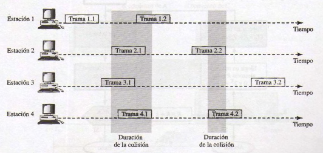

</div>

Para evitar que varias estaciones, al retransmitir sus tramas colisionen, cada estación espera un período de tiempo aleatorio antes de retransmitir su trama. A este tiempo se lo llama **tiempo back-off (Tb)**.

Luego de un número máximo de retransmisiones Kmax, la estación debe darse por vencida e intentar más tarde.

El período de time-out es igual al máximo valor posible de **delay de propagación de ida y vuelta** (RTPD, round-trip propagation delay), el cual es el doble del tiempo requerido para enviar una trama: 2Tprop. El tiempo back-off es un valor aleatorio que depende de K (el número de intento de transmisiones). Se toma un valor entre 0 y 2^k - 1 y se multiplica por Tprop o Ttrama para encontrar Tb. El valor de Kmax en general es 15.

<div align='center'>

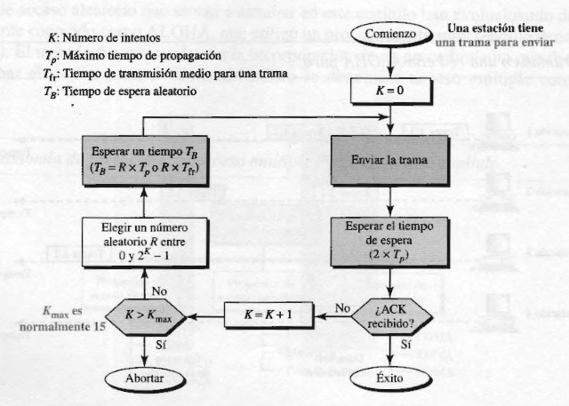

</div>

El **período vulnerable** es el tiempo en el que existe una posibilidad de colisión. El período vulnerable de ALOHA puro es 2 veces el tiempo de trama.

Este tiempo de vulnerabilidad en ALOHA puro se da porque no hay reglas definidas sobre cuando una estación puede transmitir. **ALOHA con ranuras** fue inventado para mejorar la eficiencia del ALOHA puro.

En ALOHA con ranuras se divide el tiempo en ranuras de Ttrama y obliga a las estaciones a transmitir sólo al comienzo de una ranura.

<div align='center'>

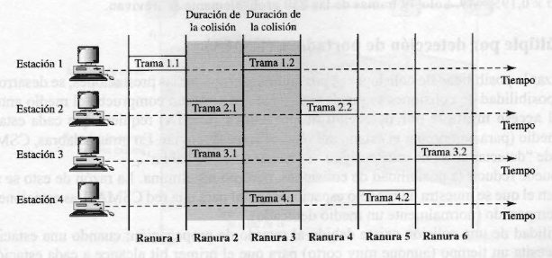

</div>

El período vulnerable de ALOHA con ranuras se reduce a la mitad, es decir que es igual a Ttrama.

Para minimizar las probabilidades de colisión e incrementar el rendimiento, se desarrolló el método **CSMA (Carrier Sense Multiple Access)**. La probabilidad de colisión se puede reducir si la estación sensa el medio antes de transmitir.

La probabilidad de colisión todavía existe debido al delay de propagación, cuando una estación envía una trama, le toma un tiempo al primer bit para llegar a cada estación. Una estación puede sensar el medio y verlo desocupado porque el primer bit de otra estación todavía no llegó.

<div align='center'>

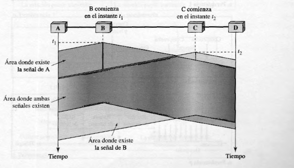

</div>

El período vulnerable de CSMA es el tiempo de propagación Tp, el tiempo que necesita la señal para propagarse desde un extremo del medio al otro.

**Métodos de persistencia**

Para saber que hacer cuando un canal está ocupado o desocupado, se desarrollaron tres métodos.

<div align='center'>

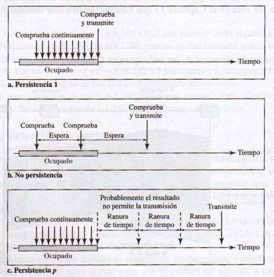

</div>

El método de **persistencia 1** consiste en que cuando la estación encuentra el medio desocupado, transmite una trama inmediatamente. Tiene la mayor probabilidad de colisión.

En el método de **no persistencia**, una estación que tiene datos para transmitir sensa el medio. Si el medio está desocupado, transmite. Sino, espera un período de tiempo aleatorio y sensa el medio de nuevo. Reduce la probabilidad de colisión debido a que es poco probable que dos o más estaciones esperen la misma cantidad de tiempo para transmitir, sin embargo reduce la eficiencia ya que puede dejar al medio desocupado.

El método de **persistencia p** se usa si el medio tiene ranuras de tiempo con una duración igual o mayor que el tiempo de propagación. Combina las ventajas de los otros dos métodos, reduciendo la probabilidad de colisión y mejorando la eficiencia. En este método, luego de que la estación vea al medio desocupado, sigue estos pasos:
1. Con probabilidad p, la estación transmite su trama.
2. Con probabilidad q = 1 - p, la estación espera a la próxima ranura y sensa el medio de nuevo.
    
    a. Si el medio está desocupado, vuelve al paso 1.

    b. Si el medio está ocupado, asume que ocurrió una colisión y usa el procedimiento back-off. 

<div align='center'>

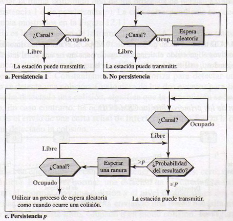

</div>

El método **CSMA/CD (Carrier Sense Multiple Access with Collision Detection)** implementa que hacer dada una colisión, cosa que CSMA por si sola no especifica.

En este método, una estación sensa el medio al transmitir una trama para ver si la transmisión fue exitosa. Si no lo fue, ocurrió una colisión, y se retransmite la trama.

<div align='center'>

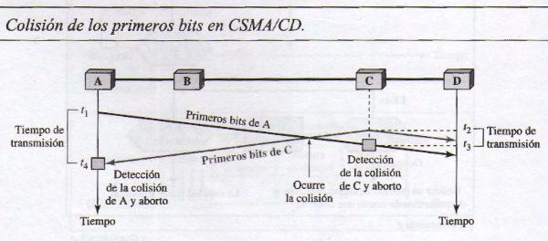

</div>

Para que CSMA/CD funcione, se necesita restringir el tamaño de trama. Antes de transmitir el último bit de la trama, la estación emisora debe detectar una colisión, si es que hay alguna, y abortar la transmisión. Esto se debe a que la estación, una vez que transmite su trama, no guarda una copia de la trama y no sensa el medio para detectar colisiones. Entonces el tiempo de transmisión de trama Ttrama debe ser al menos dos veces el tiempo de propagación Tprop.

Para decidir cuando transmitir, se utiliza uno de los métodos de persistencia. La estación transmite la trama y al mismo tiempo sensa su propia señal (si es igual, es porque no hubo colisión) en puertos diferentes para detectar si hubo una colisión o si la transferencia fue exitosa. Si se detecta una colisión, se envía una **señal jamming** para que las otras estaciones se enteren de la colisión.

<div align='center'>

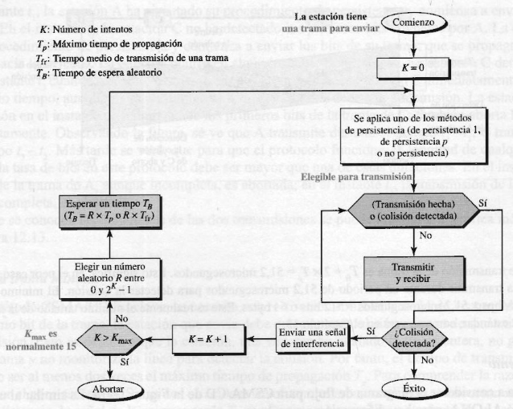

</div>

El nivel de energía de un canal puede tener tres valores: cero, normal, y anormal. En el nivel cero, el medio está desocupado. En el nivel normal, una estación está transmitiendo una trama por el medio. En un nivel anormal, hay una colisión y el nivel de energía es el doble que el del nivel normal. Una estación que quiere transmitir una trama debe sensar el nivel de energía del medio para determinar si el canal está ocupado, desocupado, o en modo colisión.

<div align='center'>

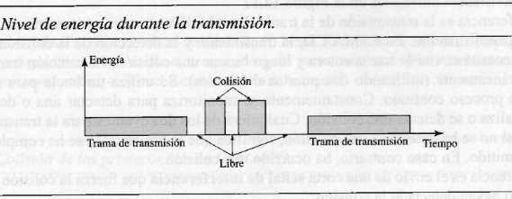

</div>

En una red inalámbrica, la mayoría de la energía enviada es perdida durante la transmisión. Una colisión solo agrega entre un 5 y 10 porciento de energía a la señal, lo cual complica la detección de colisiones.

Como no se pueden detectar las colisiones, se deben evitar. **CSMA/CA (Carrier Sense Multiple Access with Collision Avoidance)** fue creado para las redes inalámbricas. Las colisiones se evitan mediante tres estrategias: el espacio entre tramas, la ventana de contención, y acknowledgements.

<div align='center'>

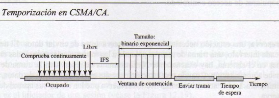

</div>

Las colisiones se evitan retrasando la transmisión incluso si el medio está desocupado. Cuando el medio se ve desocupado, la estación espera un período de tiempo llamado **espacio entre tramas (IFS, InterFrame Space)**. Si bien parece que el medio está desocupado, una estación puede haber comenzado su transmisión, y su señal todavía no alcanzó la estación que quiere transmitir. Una vez pasado el IFS, la estación sensa el medio nuevamente, y si está libre, puede transmitir, pero debe esperar un tiempo igual al tiempo de contención. El IFS se puede usar para dar prioridad a estaciones o tipos de tramas.

La **ventana de contención** es una cantidad de tiempo dividida en ranuras. La estación que quiere transmitir elige una cantidad aleatoria de ranuras como tiempo de espera. Por cada intento de transmisión, se incrementa la cantidad de ranuras a esperar, similar a la persistencia p. Luego de cada ranura, la estación debe sensar el medio. Si lo encuentra ocupado, detiene el timer y lo reanuda cuando el canal se encuentre desocupado. Esto da prioridad a la estación que estuvo esperando por más tiempo.

Incluso con estas precauciones, puede haber una colisión y se pueden corromper los datos. Para verificar esto, se utilizan las **confirmaciones** o acknowledgements y el timer de time-out para saber si el receptor recibió la trama.

<div align='center'>

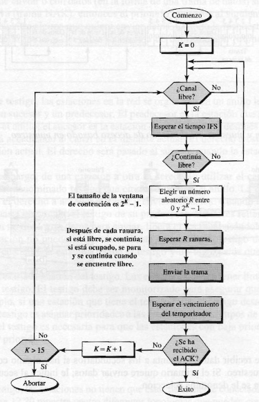

</div>

#### 12.2 Controlled Access

En el acceso controlado, las estaciones se consultan para saber que estación tiene el derecho de transmitir. Una estación no puede transmitir a no ser que haya sido autorizada por otras estaciones.

En el método de **reserva**, una estación debe realizar una reserva antes de transmitir. El tiempo se divide en intervalos, y en cada intervalo, una trama de reserva precede las tramas de datos enviadas en ese intervalo.

Por cada estación en el sistema hay una ranura de reserva en la trama de reserva. Cada ranura pertenece a una estación, y cuando una estación necesita transmitir datos, hace una reserva en su ranura. 

<div align='center'>

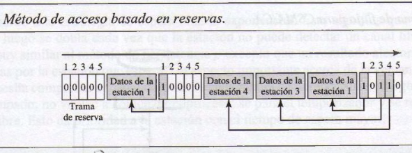

</div>

El **muestreo** funciona con topologías en las que un dispositivo se designa como estación primaria y el resto de los dispositivos como estaciones secundarias. Todas las transferencias se deben realizar por la estación primaria. La estación primaria controla el enlace, y las estaciones secundarias siguen sus instrucciones. La estación primaria es siempre la que inicia una sesión.

Si la estación primaria quiere recibir datos, le pregunta a las estaciones secundarias si tienen algo para transmitir; esto se conoce como **muestreo**. Si la estación primaria quiere enviar datos, le avisa a las estaciones secundarias que los reciba; esto se conoce como **selección**.

<div align='center'>

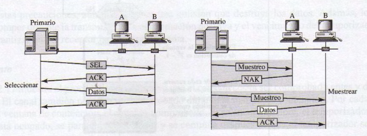

</div>

Si la estación primaria tiene que enviar datos, los envía, porque sabe que el medio esta desocupado, ya que él es el que decide sobre la transferencia de datos. Lo que no sabe es si el destino está preparado para recibir, entonces avisa al destino sobre la transmisión mediante una trama **SEL (select)** y espera una confirmación. 

Cuando la estación primaria está lista para recibir datos, le pregunta (o muestrea) cada estación si tiene algo que transmitir. La estación secundaria responde con una trama **NAK** si no tiene nada que transmitir o con datos. Cuando pasa esto último, la estación primaria responde con una trama ACK.

En el método **token-passing** o **paso de testigo**, las estaciones se organizan en un anillo lógico. Para cada estación, hay un predecesor y un sucesor. El derecho de acceso se pasa del predecesor a su sucesor. El derecho va a ser pasado al sucesor de este último cuando la estación no tenga datos para transmitir.

Para que el derecho de acceso al medio se transmita de una estación a otra, un paquete especial llamado **token** circula por el anillo. Este token da derecho de acceso al medio a quien lo posea.

El tiempo que las estaciones poseen el token debe ser limitado, y el token debe ser sensado para asegurar que no se haya perdido o destruido. También se puede alignar prioridades a las estaciones y a los tipos de datos a transmitir.

Las estaciones no tienen que estar físicamente conectadas a un anillo, este puede ser lógico.

<div align='center'>

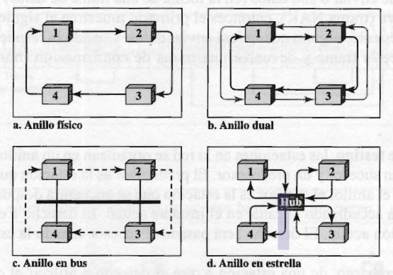

</div>

```
Acá podría explicar las diferentes topologías, pero con la imagen creo que es suficiente
```

#### 12.3 Channelization

La canalización es un método de acceso múltiple en el cual el ancho de banda disponible de un enlace es compartido en tiempo, frecuencia, o mediante código, entre diferentes estaciones.

En el **acceso múltiple por division de frecuencia (FDMA)** el ancho de banda se divide en bandas de frecuencia. A cada estación se le aligna una banda para transmitir datos. Cada estación también usa un filtro de pasabanda para confinar las frequencias que transmite. Para prevenir interferencias entre las estaciones, las bandas se separan por pequeñas bandas de guarda.

<div align='center'>

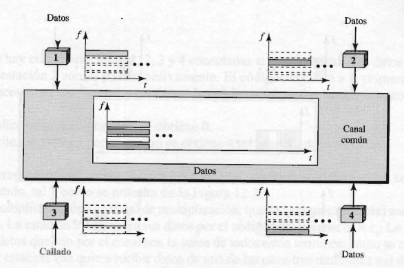

</div>

FDMA define una banda de frecuencia default para la comunicación, lo cual significa que se puede utilizar un flujo de datos continuo con FDMA.

En el **acceso múltiple por división de tiempo (TDMA)**, las estaciones comparten el ancho de banda del canal en el tiempo. A cada estación se le aligna una ranura de tiempo en la cual puede transmitir datos.

<div align='center'>

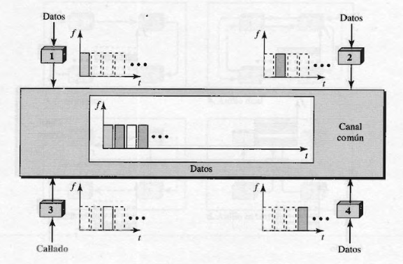

</div>

El problema principal de TDMA es la sincronización de las diferentes estaciones. Cada estación debe saber el comienzo y la ubicación de su ranura, lo cual puede ser difícil por los delays de propagación que se introducen si las estaciones estan muy separadas. Para compensar los delays, se pueden insertar tiempos de guarda.

En el **acceso múltiple por división de código (CDMA)**, sólo un canal ocupa el ancho de banda entero, y todas las estaciones pueden transmitir al mismo tiempo.

CDMA se basa en la teoría de la codificación, a cada estación se le aligna un código, el cual es una secuencia de números llamada **chips**.

<div align='center'>

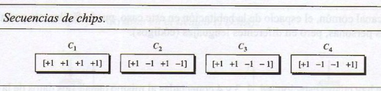

</div>

Los chips tienen las siguientes propiedades:
1. Cada secuencia está hecha de N elementos, dónde N es el número de estaciones.
2. Si se multiplica una secuencia por un número, cada elemento de la secuencia se multiplica por ese número (multiplicación escalar).
3. Si se multiplican dos secuencias iguales, elemento por elemento, y se suman los resultados, se consigue N, dónde N es el número de elementos de cada secuencia (producto interno de dos secuencias iguales).
4. Si se multiplican dos secuencias diferentes, elemento por elemento, y se suman los resultados, se obtiene 0.
5. Sumar dos secuencias da como resultado otra secuencia.

Si una estación necesita enviar un bit 0, lo codifica como -1, y si necesita enviar un bit 1, lo codifica como +1. Cuando una estación está desocupada, no envía ninguna señal, lo cual se interpreta como 0.

---

### 13 Wired LANs: Ethernet

#### 13.1 IEEE Standards

La capa de enlace de datos en el estándar IEEE se divide en dos subcapas: LLC y MAC.

En el proyecto 802 de IEEE, el control de flujo, el control de errores, y parte de las tareas de tramado se juntan en una subcapa llamada **control de enlace lógico (LLC, Logical Link Control)**. El tramado se maneja tanto en LLC como en MAC.

El LLC provee un solo protocolo de control de enlace de datos para todas las LANs IEEE.

LLC define una unidad de datos de protocolo (PDU) que es similar al de HDLC. La cabecera contiene un campo de control que se usa para el control de flujo y de errores. Dos campos definen el protocolo de capa superior en el origen y en el destino, estos campos se llaman **destination service access point (DSAP)** y **source service access point (SSAP)**. Los otros campos que están definidos en HDLC se movieron a MAC. Es decir que una trama definida en HDLC se divide en una PDU para LLC y en una trama para MAC.

<div align='center'>

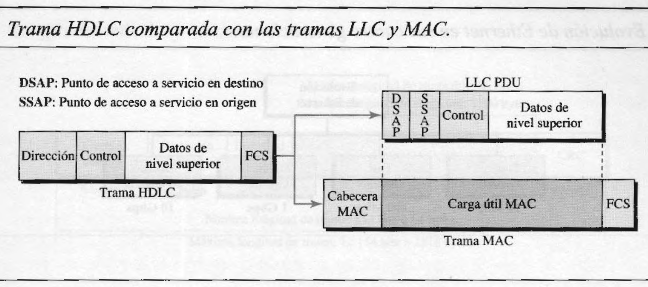

</div>

El propósito de LLC es proveer control de flujo y de errores para los protocolos de capa superior. Sin embargo, la gran mayoría de protocolos de capa superior como IP no usan los servicios de LLC.

La subcapa **MAC (Media Access Control)** define el método de acceso y el formato específico de tramado para el protocolo LAN correspondiente.

#### 13.2 Standard Ethernet

El Ethernet original pasó por cuatro generaciones: Standard Ethernet, Fast Ethernet, Gigabit Ethernet, y Ten-Gigabit Ethernet.

En el Ethernet Estándar, la subcapa MAC gobierna el método de acceso y realiza el tramado de los datos recibidos de la capa superior y se los pasa a la capa física.

La trama de Ethernet contiene siete campos: preámbulo, SFD, DA, SA, longitud o tipo de PDU, datos de capa superior, y el RCR. Ethernet no provee ningun mecanismo para confirmar las tramas recibidas, lo cual lo hace un medio poco fiable. Las confirmaciones se deben implementar en las capas superiores.

<div align='center'>

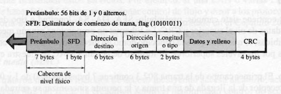

</div>

- **Preámbulo**: contiene 7 bytes de 0s y 1s alternados que alerta al receptor de la llegada de la trama y permite sincronizar su entrada.
- **SFD (Start Frame Delimiter)**: indica el comienzo de la trama.
- **DA (Destination Address)**: contiene la dirección física de la estación destino.
- **SA (Source Address)**: contiene la dirección física de la estación emisora.
- **Longitud o tipo**: el Ethernet original usaba este campo como un campo de tipo para definir el protocolo de capa superior usando la trama MAC. El estándar IEEE lo usaba como campo de longitud para definir el número de bytes en el campo de datos.
- **Datos**: datos encapsulados de los protocolos de capas superiores. Tiene un máximo de 1500 bytes.
- **CRC**: contiene información de detección de errores.

La restricción de longitud mínima se necesita para el funcionamiento correcto de CSMA/CD. La longitud mínima de datos de la capa superior debe ser 46 bytes.

La restricción de longitud máxima tiene dos razones históricas. La primera era que la memoria era demasiada cara cuando se diseñó Ethernet, y la segunda era que la restricción prevenia que una estación monopolice el medio compartido.

Cada estación en una red Ethernet tiene su propia **tarjeta de interfaz de red (NIC, Network Interface Card)**. El NIC provee a la estación una dirección física de 6 bytes, que se expresa en notación hexadecimal, con : entre los bytes.

Una dirección destino siempre es una dirección unicast, es decir que la trama viene de una sola estación. La dirección destino, sin embargo, puede ser unicast, multicast, o broadcast. Si el bit menos significativo del primer byte en una dirección destino es 0, la dirección es unicast, sino, es multicast.

La dirección broadcast es un caso especial de la dirección multicast, los destinatarios son todas las estaciones en la LAN. Una dirección destino broadcast se representa con 48 1s.

Ethernet estándar utiliza CSMA/CD con persistencia 1 como método de acceso al medio.

En una red Ethernet, el tiempo de ida y vuelta (o round-trip time) requerido más el tiempo necesario para enviar la secuencia de jam, se llama tiempo de ranura:

```
Tiempo de ranura = round-trip time + tiempo necesario para enviar la secuencia de jam
```

El tiempo de ranura se define en bits, y es el tiempo que requiere una estación para enviar 512 bits.

La razón por la cual se eligió 512 bits fue para el funcionamiento correcto de CSMA/CD. Si todas las estaciones utilizan el protocolo CSMA/CD, cuando una trama cuyo tamaño está entre 512 y 1518 bits y una estación envía los primeros 512 bits y no sensa ninguna colisión, entonces se garantiza que no va a haber colisión.

El Ethernet Estándar define varias implementaciones de capa física.

Todas las implementaciones estándar usan señalización digital (banda base) a 10 Mbps. En el emisor, los datos se convierten en una señal digital usando el esquema Manchester, y en el receptor la señal se interpreta como Manchester y se decodifica en datos.

La primera implementación se llama **10Base5** o **thick Ethernet**. Fue la primer especificación Ethernet que usa una topología de bus con un transceiver (transmisor/receptor) externo conectado a un cable coaxial.

<div align='center'>

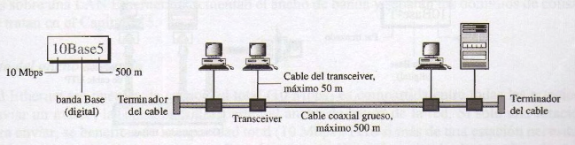

</div>

El transceiver transmite, recibe y detecta colisiones. Está conectado a una estación por un cable que provee caminos diferentes para transmitir y recibir. La colisión solo sucede en el cable coaxial.

El largo máximo del cable coaxial es 500m, si se excede puede haber degradación de señal. Si se necesita una mayor longitud, se pueden utilizar repetidores.

La segunda implementación de llama **10Base2** o **thin Ethernet**. También usa una topología de bus, pero el cable es mucho más fino y más flexible. El transceiver es parte de la tarjeta de interfaz de red (NIC).

<div align='center'>

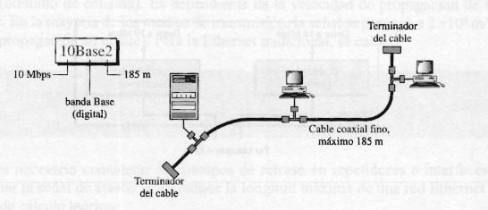

</div>

La colisión también ocurre en el cable coaxial fino. Esta implementación es más barata y más simple que 10Base5. Sin embargo, el largo de cada segmento no puede exceder 200m debido al alto nivel de atenuación en los cables coaxiales finos.

La tercera implementación se llama **10Base-T** o **twisted-pair Ethernet (Ethernet de par trenzado)**. Usa una topología de estrella física, y las estaciones se conectan al hub por dos pares de cables trenzados.

<div align='center'>

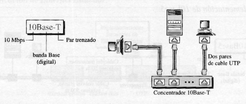

</div>

Los dos pares trenzados crean dos caminos, uno para transmitir y otro para recibir, entre la estación y el hub. Las colisiones ocurren en el hub, que reemplaza el cable coaxial. El largo máximo del par trenzado es 100m para minimizar la atenuación.

**10Base-F*** usa la topología de estrella para conectar estaciones a un hub. Las estaciones se conectan al hub usando dos cables de fibra óptica.

<div align='center'>

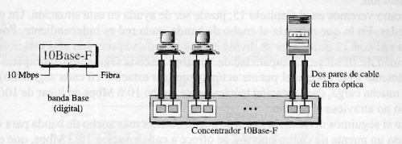

</div>

#### 13.3 Changes in the Standard

El Ethernet Estándar de 10 Mbps sufrió varios cambios antes de pasar a las tasas de datos más altas.

El primer cambio fue la división de una LAN en **bridges**, los cuales aumentan el ancho de banda y separan los dominios de colisión.

En una red Ethernet sin bridges, la capacidad total (10 Mbps) se comparte entre todas las estaciones que tienen que transmitir. Si sólo una estación transmite, utiliza la capacidad total. Si dos estaciones tienen que transmitir, se alternan el uso del medio, transmitiendo cada una en promedio a una velocidad de 5 Mbps.

El bridge divide la red en dos o más redes, y cada red es independiente en cuanto a ancho de banda. Mientras más se divide la red, más ancho de banda de puede ganar para cada segmento dividido.

<div align='center'>

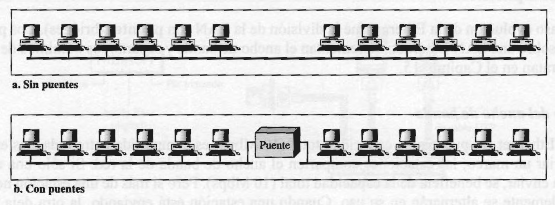

</div>

Otra ventaja de los bridges es la separación del dominio de colisiones. Al dividir las subredes, el dominio de colisión se reduce, y por lo tanto también reduce la probabilidad de colisión.

<div align='center'>

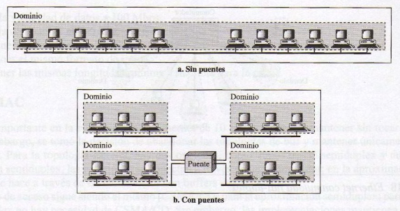

</div>

A partir de las LANs con bridges surgió la idea del **switched Ethernet**, utilizando **switches** o **conmutadores** con N puertos, donde N es igual al número de estaciones en LAN. De esta manera, el ancho de banda sólo se comparte entre la estación y el switch (5 Mbps cada uno). Además, el dominio de colisiones se divide en N dominios.

<div align='center'>

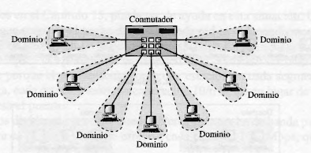

</div>

Una de las limitaciones de 10Base5 y 10Base2 es que la comunicación es half-duplex. El **full-duplex switched Ethernet** incrementa la capacidad de cada dominio de 10 a 20 Mbps.

<div align='center'>

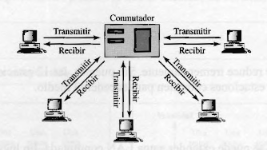

</div>

En full-duplex switched Ethernet no se necesita CSMA/CD, ya que cada estación está conectada al switch mediante dos enlaces separados, entonces las estaciones o el switch pueden transmitir y recibir sin preocuparse por las colisiones.

El Ethernet Estándar fue diseñado como un protocolo no orientado a la conexión de la subcapa MAC, por lo que no tenía control de flujo ni de errores.

Para brindar estos servicios al full-duplex switched Ethernet, se crea una nueva subcapa, llamada **control MAC**, que se situa entre el LLC y el MAC.

#### 13.4 Fast Ethernet

**Fast Ethernet** es compatible con Ethernet Estándar, pero puede transmitir datos 10 veces más rápido, a una tasa de 100 Mbps.

Para Fast Ethernet, se abandonó la topología de bus y se optó por la topología de estrella. Para half-duplex, las estaciones se conectan mediante un hub, y para full-duplex, las estaciones se conectan mediante un switch con buffers en cada puerto.

El método de acceso para half-duplex es el mismo, CSMA/CD. Full-duplex Fast Ethernet no lo necesita, pero lo implementa para ser compatible con Ethernet Estándar.

Una nueva función del Fast Ethernet es la **autonegociación**. Permite a una estación o a un hub negociar el modo o la tasa de datos de la operación.

Si sólo se usan dos estaciones, se conectan punto a punto. Si son más de dos estaciones, se necesita utilizar una topología de estrella con un hub o switch en el centro.

La implementación de Fast Ethernet en la capa física se puede categorizar en **dos cables** o **cuatro cables**. La implementación de dos cables puede ser 100Base-TX (2 pares de twisted pair) o 100Base-FX (2 pares de cables de fibra óptica). La implementación de cuatro cables sólo puede ser 100Base-T4 (cuatro pares de twisted pair).

Se eligieron tres esquemas de codificación para Fast Ethernet: 
- 100Base-TX utiliza el esquema MLT-3.
- 100Base-FX utiliza el esquema RRZ-1.
- 100Base-T4 utiliza el esquema 8B/6T.

#### 13.5 Gigabit Ethernet

La necesidad de mayor tasa de datos resultó en el desarrollo del protocolo **Gigabit Ethernet**. Es compatible con Ethernet Estándar y Fast Ethernet.

En general, Gigabit Ethernet utiliza la comunicación full-duplex, pero se puede utilizar half-duplex para ser compatible con sus predecesores.

En el modo full-duplex de Gigabit Ethernet, no hay colisiones, y el largo máximo del cable se determina por la atenuación de la señal en el cable.

En el modo half-duplex de Gigabit Ethernet, pueden ocurrir colisiones, y el largo máximo del cable se determina a partir del tamaño mínimo de trama. Para definir el tamaño mínimo de la trama, se utilizan tres métodos: tradicional, carrier extension, y frame bursting.

En el método **tradicional**, se mantiene el largo mínimo de trama del Ethernet tradicional (512 bits), lo que significa que el largo máximo de la red es de 25m.

En el método **carrier extension**, se incrementa el largo mínimo de la trama a 512 bytes (4096 bits), lo que significa que el largo máximo de la red es de 200m.
Para poder alcanzar este tamaño, generalmente se deben agregar bits de extensión (padding) a la trama.

Carrier extension es ineficiente si las tramas son cortas. Se propuso el método **frame bursting** o **ráfagas de tramas** en el cual se envían múltiples tramas. Para hacer que estas tramas parezcan como si fueran una sola, se agregan bits entre las tramas para que el medio no se encuentre desocupado.

<div align='center'>

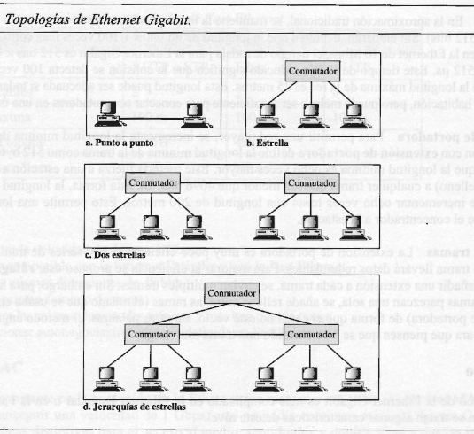

</div>

La implementación de Gigabit Ethernet se puede categorizar como **dos cables** o **cuatro cables**. La implementación de dos cables utiliza cables de fibra óptica (1000Base-SX, short-wave, o 1000Base-LX, long-wave), o STP (1000Base-CX). La implementación de cuatro cables utiliza cables de par trenzado (1000Base-T).

### 14 Wireless LANs

---

### 5.4.3 Link-Layer Switches

El rol de un switch es recibir tramas de la capa de enlace y enviarlas a enlaces salientes. El switch es **transparente** para los hosts y los routers de la subred. La tasa a las que llegan las tramas al switch pueden exceder la capacidad del enlace de la interfaz. Para acomodar esto, las interfaces de output del switch tienen buffers.

El **filtrado** es la función del switch que determina si una trama debe ser forwardeada a una interfaz o si debería ser descartada. El **forwarding** es la función del switch que determina las interfaces por las cuales una trama debe ser enviada. El filtrado y forwarding se realizan con una **switch table**, que contiene las entradas de algunos de los hosts y routers en una LAN. Una entrada en la switch table contiene:
- Una dirección MAC.
- La interfaz del switch que apunta a esa dirección MAC.
- El momento en el que dicha entrada fue ingresada en la tabla.

El filtrado y forwarding de un switch funcionan de la siguiente manera:
- Si la dirección destino no se encuentra en la tabla, el switch forwardea copias de la trama a los buffers de salida de todas las interfaces, excepto de la interfaz que envió la trama.
- Si la dirección destino se encuentra en la tabla y está asociada con la interfaz que emitió la trama, se descarta la trama.
- Si la dirección destino se encuentra en la tabla y está asociada con una interfaz que no es la que emitió la trama, el switch pone la trama en el buffer de salida de la interfaz correspondiente.

La switch table se arma automática, dinámica y autónomamente, es decir que los switches son autodidactas. 
- Inicialmente, la switch table se encuentra vacía.
- Por cada trama recibida de una interfaz, el switch almacena en su tabla:
    - La dirección MAC origen de la trama.
    - La interfaz por la que vino la trama.
    - El momento actual.
- La switch table elimina una dirección en la tabla si no se reciben tramas con esa dirección luego de un período de tiempo (**aging time**).

**Propiedades del Link-Layer Switching**

- **Eliminación de colisiones**: no se desperdicia ancho de banda debido a las colisiones. El switch almacena las tramas y nunca trasmite más de una en un segmento al mismo tiempo.
- **Enlaces heterogéneos**: el switch aisla un enlace de otro, los enlaces en la LAN pueden operar a diferentes velocidades y pueden operar sobre diferentes medios.
- **Administración**: el switch puede detectar problemas y brindar información sobre uso de ancho de banda, tasas de colisión, y tipos de tráfico.

**Ventajas y desventajas de los switches**

- **Plug-and-play**, no requieren configuración previa.
- Poseen **altas tasas de filtrado y forwarding**.
- Para prevenir que las tramas broadcast circulen sin fin, la topología de una red con switches se restringe a **STP (Spanning Tree Protocol)**
- Las redes grandes de switches requieren **tablas ARP grandes** y generan demasiado **tráfico y procesamiento ARP**.
- Son **susceptibles a tormentas de broadcast**, que pueden saturar y colapsar la red.

Para redes pequeñas, utilizar switches es suficiente, pero para redes grandes se necesita tanto routers como switches para obtener un aislamiento del tráfico más robusto, controlar las tormentas de broadcast, y utilizar mejores rutas entre los hosts de la red.

<div align='center'>

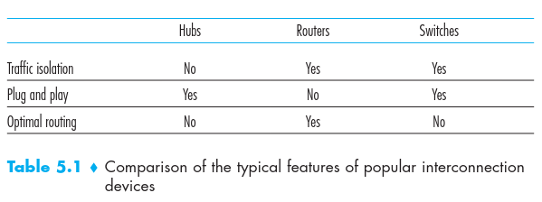

</div>

---

### 15.4 Bridges

Para lograr la interconexión con otras LANs y WANs, se utilizan puentes (bridges) y dispositivos de encaminamiento. Los puentes son los más sencillos y permiten la interconexión de LANs similares, mientras que los dispositivos de encaminamiento son para usos generales y permiten la interconexión de variedades de redes LAN y WAN.

Los puentes se diseñaron para LANs que usan los mismos protocolos en las capas físicas y de acceso al medio, lo cual reduce drásicamente el procesamiento en el puente.

Las razones para las que se usan varias LANs interconectadas mediante puentes son:
- **Fiabilidad**: usando puentes, la red se puede dividir en segmentos aislados, decrementando la probabilidad de errores.
- **Prestaciones**: las prestaciones de una LAN decrecen cuando aumenta la cantidad de estaciones o la longitud del medio, esto se puede solucionar mediante el uso de puentes.
- **Seguridad**: la división de la red LAN puede mejorar la seguridad, ya que se puede contar con diferentes tipos de tráficos, con necesidades de seguridad diferentes en medios separados.
- **Geografía**: los puentes permiten la separación de LANs en áreas geográficas diferentes.

Las funciones de un puente son las siguientes:
- Lectura de las tramas transmitidas en una LAN y aceptación o descarte de dichas tramas dirigidas a otra LAN.
- Retransmisión de tramas a una LAN mediante el protocolo de control de acceso al medio de esa LAN.

<div align='center'>

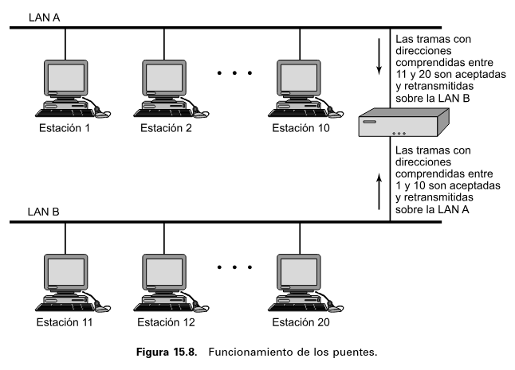

</div>

Las características de un puente son las siguientes:
- El puente no modifica el contenido o el formato de las tramas, ya que las LANs usan los mismos protocolos.
- El puente debe tener la memoria temporal suficiente para aceptar demandas de pico.
- El puente debe poder direccionar y encaminar las tramas.
- Un puente puede conectar más de dos LANs.

El puente permite ampliar las LANs sin tener que modificar el software de comunicación de las estaciones.

**Arquitectura de Protocolos de los Puentes**

El puente funciona de la siguiente manera: captura las tramas MAC cuyo destino no se encuentra en la LAN de origen, las almacena temporalmente y las transmite sobre la otra LAN.

<div align='center'>

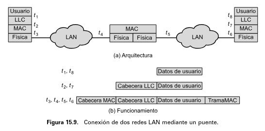

</div>

El puente debe disponer de la capacidad de encaminar los datos, de manera que cuando recibe una trama debe decidir si se retransmite o no, y sobre qué LAN hacerlo.

La técnica de encaminamiento más sencilla es el **encaminamiento estático**, adecuada para números pequeños de redes LAN. El comité IEEE 802 desarrollaron dos estrategias de encaminamiento, una basada en el **spanning tree**, y otra basada en el **token ring**. 

En el encaminamiento estático, se selecciona una ruta para la LAN origen y para la LAN destino. Si hay rutas alternativas, se selecciona la que tenga menor cantidad de saltos. Las rutas son fijas y sólo cambian cuando se cambia la topología.

Cada puente necesita una **tabla de encaminamiento** para cada una de las LANs a las que está conectado. 

La carga de la tabla de encaminamiento se realiza manualmente, y la realiza un administrador de red.

**Técnica del Árbol de Expansión**

El método de spanning tree es un mecanismo en el que los puentes arman automáticamente una tabla de encaminamiento y la actualizan a partir de los cambios en la topología.

Un puente en spanning tree mantiene una **forwarding database** para cada puerto de conexión a una LAN. La base de datos asocia direcciones MAC con puertos específicos, permitiendo al puente saber por cuál puerto debe reenviar una trama.

Un puente encamina y aprende direcciones de la misma manera que un switch. [(ver Link Layer Switches)](#543-link-layer-switches)

---

### 15.5 Layer 2 and Layer 3 Switches

Otros dispositivos para la interconexión de redes LAN son los conmutadores de capa 2 y de capa 3.

El **concentrador (hub)** es un elemento activo que actúa como elemento central de la topología en estrella. Cada estación se conecta al hub mediante dos enlaces (full-duplex). El hub reenvía la señal de la trama a las líneas de salida de cada estación.

Se puede formar una estructura jerárquica utilizando hubs en cascada. Se utiliza un **hub raíz (HHUB, Header Hub)** y uno o más **hubs intermedios (IHUB, Intermediate Hub)**. Cada hub puede ser una mezcla de estaciones y otros hubs conectados a él. Esta estructura es adecuada para edificios cableados, en el cual hay un armario de interconexiones en cada planta del edificio, pudiendo colocarse un hub en cada una.

Las prestaciones del hub se pueden mejorar mediante el uso de un **switch de capa 2**. Una trama transmitida por una estación se conmuta hacia la línea de salida correspondiente para ser enviada a la estación destino. Al mismo tiempo, otras líneas desocupadas se pueden usar para conmutar otro tráfico.

<div align='center'>

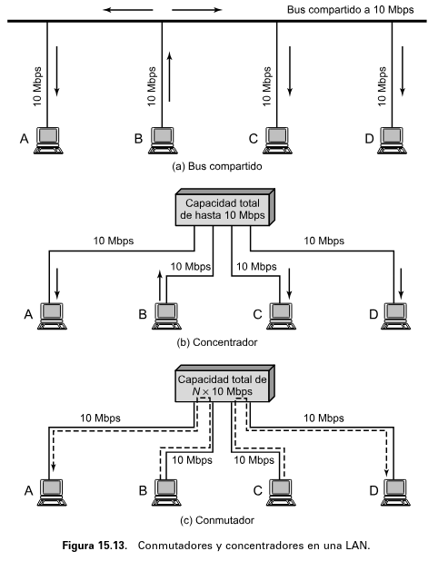

</div>

Existen dos tipos de switches:
- **Store-and-forward switch**: el switch acepta una trama en una línea de entrada, la almacena temporalmente, y la encamina hacia la línea de salida.
- **Cut-through switch**: el switch retransmite la trama tan pronto como sepa la dirección de destino.

Un switch de capa 2 se puede ver como una versión full-duplex de un hub. La diferencias entre puentes y switches de capa 2 son:
- La gestión de tramas en un puente se realiza mediante software mientras que un switch de capa 2 reconoce las direcciones y retransmite por hardware.
- Un puente sólo analiza las tramas una en una mientras que un switch de capa 2 tiene varias rutas de datos que actúan en paralelo.
- Un puente usa siempre un mecanismo de almacenamiento y envío mientras que un switch de capa 2 puede funcionar en modo cut-through.

A medida que crece el número de dispositivos, los switches de capa 2 muestran deficiencias. Una de esas deficiencias es la tormenta de broadcast, y la otra es que sólo puede existir un único camino entre dos dispositivos.

Una estrategia lógica para solucionar estas limitaciones consiste en dividir una red local en **subredes** conectadas entre sí por dispositivos de encaminamiento, o **routers**. De esta manera, una trama MAC broadcast está restringida a aquellas estaciones y switches que pertenecen a la misma subred. Además, los routers basados en IP usan algoritmos de encaminamiento que toleran caminos alternativos entre subredes mediante diferentes routers.

Sin embargo, el uso de routers presenta problemas de rendimiento, ya que realizan todo el procesamiento IP que tiene que ver con la retransmisión por software. Para solucionar esto, se fabricaron routers que implementan la lógica de retransmisión por hardware.

Los **switches de capa 3** se pueden clasificar en dos categorías: de tipo **paquete a paquete** o **basados en flujo**. Un switch de tipo paquete a paquete funciona igual que un router tradicional. Como la lógica de retransmisión está en el hardware, se incrementa el rendimiento. El switch basado en flujos trata de mejorar el rendimiento identificando flujos de paquetes IP que tengan las mismas direcciones de origen y de destino. Una vez que se identifica un flujo, se puede establecer una ruta predefinida para acelerar la retransmisión.

<div align='center'>

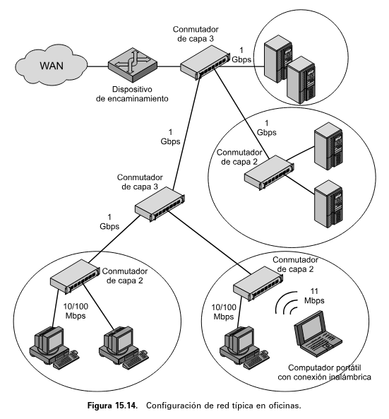

</div>

---

### Bibliografia

➤ [**FOR07**] - [Comunicaciones y redes de computadores](https://github.com/mnomico/tyr/raw/main/libros/FOR07.pdf)

&nbsp;&nbsp;&nbsp;&nbsp;&nbsp;&nbsp;⤷ Capítulo 12: “Multiple Access”

&nbsp;&nbsp;&nbsp;&nbsp;&nbsp;&nbsp;⤷ Capítulo 13: “Wired LANs: Ethernet”

&nbsp;&nbsp;&nbsp;&nbsp;&nbsp;&nbsp;⤷ Capítulo 14: “Wireless LANs”

[**KUR12**] - [Computer Networking: A Top-Down Approach](https://github.com/mnomico/tyr/raw/main/libros/KUR12.pdf)

&nbsp;&nbsp;&nbsp;&nbsp;&nbsp;&nbsp;⤷ Sección 5.4.3: "Link-Layer Switches"

➤ [**STA04**] - [Comunicaciones y redes de computadores](https://github.com/mnomico/tyr/raw/main/libros/STA04.pdf)

&nbsp;&nbsp;&nbsp;&nbsp;&nbsp;&nbsp;⤷ Sección 15.4: "Bridges"

&nbsp;&nbsp;&nbsp;&nbsp;&nbsp;&nbsp;⤷ Sección 15.5: "Layer 2 and Layer 3 Switches"
