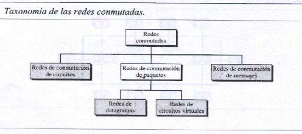
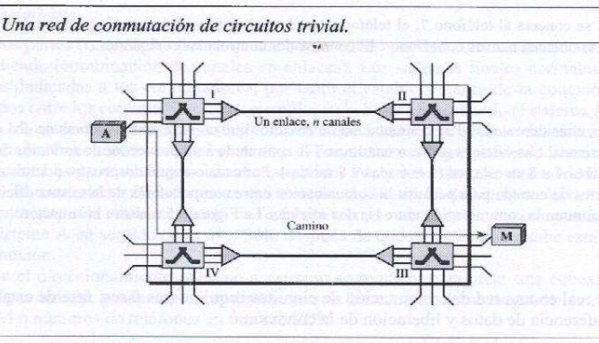
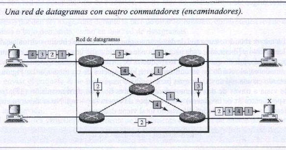
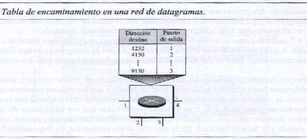
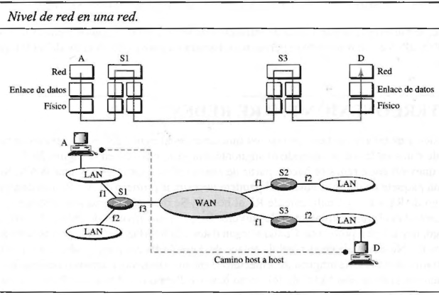
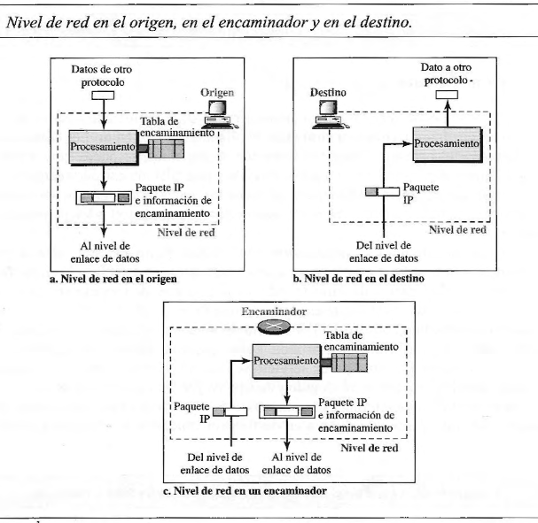
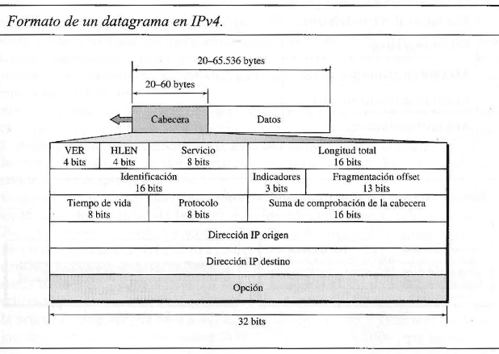
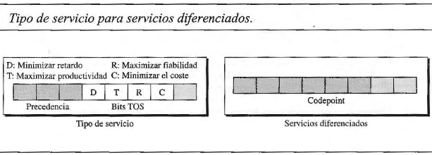
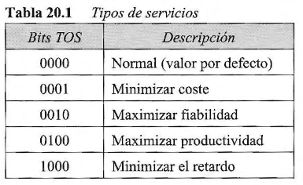
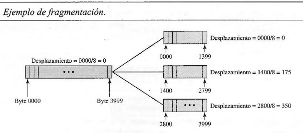

## [Volver atrás](../readme.md)

<h1>Conmutación, Capa de Red y Protocolo IPv4</h1>

### Indice

💡 [Conceptos a tener en cuenta](#conceptos-a-tener-en-cuenta)

❓ [Guía de preguntas](#lans---guia-de-preguntas)

📝 [Resumen](#resumen)

📖 [Bibliografía](#bibliografia)

---

### Conceptos a tener en cuenta

- Concepto sobre conmutación 
    - Circuitos	
    - Datagramas
    - Circuitos Virtuales
- Necesidad de una capa de red
- Funciones de la capa de red según el Modelo OSI
    - Cuestiones particulares de IP
- Protocolo IP
    - Características/Tipo de Servicio
    - Header
    - Esquema de direcciones
    - Fragmentación y ensamblado
    - Time-to-Live (TTL)
- Protocolo auxiliar ICMP
    - Ejemplos básicos

---

### Guia de Preguntas

1. Defina “conmutación” en el ámbito de una red de datos.
2. Compare los métodos de conmutación vistos.
3. ¿Cuál es la función de la capa de red?
4. ¿Cuál es la diferencia en el envío de mensajes (PDU) en capa 3 respecto de tramas en capa 2?
5. ¿Qué tipo de servicio ofrece el protocolo IP? ¿Es confiable? Justifique.
6. ¿La capa de red en Internet implementa control de congestión? Justifique.
7. En IPv4, ¿Qué es la fragmentación, por qué ocurre y cómo se realiza?
8. ¿Qué campos del header de IPv4 cambian su valor a medida que “pasan” de ruteador a ruteador?
9. A partir de las siguientes direcciones IP con máscara 255.255.255.224 indique dirección de red y host y dirección de broadcast de la subred.

    a. 10.1.1.216 

    b. 10.1.1.184 

    c. 201.202.203.204 

    d. 156.14.45.129

10. ¿Qué son los bloque de direcciones privadas? ¿Cuáles son?
11. Indicar cuáles direcciones pertenecen a las mismas redes usando las máscaras: 255.255.255.192 - 255.255.192.0 - 255.255.248.0

    140.128.200.1 , 150.128.30.3 , 140.128.200.255 , 140.129.250.1 , 140.128.190.221 , 140.128.30.30 , 140.128.120.120 , 140.128.60.1

12. Si se cuenta con la dirección 170.210.96.0/24, y 200 hosts separados en 3 redes, cual seria una máscara apropiada. Determine la asignación de IP para cada subred, indicando IP inicial y final, máscara y dirección de broadcast. Repita la operación de 4 y 7 redes.
13. Si se cuenta con la dirección 170.210.0.0/24 y 200 hosts separados en 3 redes, cual seria una máscara apropiada. Determine la asignación de IP para cada subred, indicando IP inicial y final, máscara y dirección de broadcast. Repita la operación de 4 y 7 redes.
14. ¿Para qué se utiliza el protocolo ARP? Capture datos de una red y muestre los mensajes correspondientes.
15. ¿Qué partes de un datagrama IP son controladas por el campo checksum?
16. ¿Cúal es la utilidad de la dirección de loopback?
17. ¿Cuál es la finalidad del protocolo ICMP y cómo se implementa?
18. ¿Qué información se obtiene con el comando ping? ¿Qué mensajes ICMP utiliza?

---

### Resumen

### 8 Switching

Una red es un conjunto de dispositivos conectados. Una red conmutada consiste de una serie de nodos entrelazados llamados **switches**. Los switches (o conmutadores) crean conexiones temporales entre dos o más dispositivos conectados al switch. 

Los tres métodos de conmutación más importantes son **conmutación de circuitos**, **conmutación de paquetes**, y **conmutación de mensajes**. Los primeros dos son usados actualmente, mientras que el último ya no se utiliza demasiado. Las redes actuales se pueden dividir en tres categorías: redes de conmutación de circuitos, redes de conmutación de paquetes, y redes de conmutación de mensajes. Las redes de conmutación de paquetes se pueden dividir en redes de circuitos virtuales y redes de datagramas.

#### 8.1 Circuit-Switched Networks

Una red de conmutación de circuitos es una serie de switches conectados por enlaces físicos. La conexión entre dos estaciones es un camino dedicado formado por uno o más enlaces. Sin embargo cada conexión usa sólo un canal dedicado en cada enlace.

Los sistemas finales se conectan directamente a un switch. Cuando un sistema final A necesita comunicarse con un sistema final B, el A necesita enviar una solicitud de conexión a B que debe ser aceptada tanto por todos los switches como por B. Para esto se debe realizar primero la fase de establecimiento: se reserva un circuito (un canal) en cada enlace. Esta combinación de circuitos define el camino que va a usarse para la transferencia de datos. Una vez finalizada la transferencia, los circuitos se desarman.

La conmutación de circuitos tiene las siguientes características:
- La conmutación de circuitos se realiza en la capa física.
- Antes de comenzar la comunicación, se deben reservar los recursos que se van a utilizar. Estos recursos pueden ser canales (ancho de banda en FDM y ranuras de tiempo en TDM), buffers en switches, tiempo de procesamiento de los switches, y los puertos de entrada/salida de los switches, que deben mantenerse exclusivamente dedicados a la transferencia de datos hasta la fase de desarmado.
- Los datos que se transfieren entre las estaciones no se empaquetan, es decir que los datos son un flujo continuo enviados desde la estación origen y recibidos por la estación destino.
- No hay direccionamiento durante la transferencia de datos, solamente para la fase de establecimiento de la conexión.

La comunicación en una red de conmutación de circuitos requiere tres fases: **fase de establecimiento de conexión**, **fase de transferencia de datos**, y **fase de desarmado de conexión**.

**Fase de establecimiento de conexión**

Para que dos o más entidades se puedan comunicar, se debe establecer un circuito dedicado. Los sistemas finales normalmente están conectados por líneas dedicadas a los switches, entonces la fase de establecimiento significa crear canales dedicados entre los switches.

Cuando el sistema A necesita conectarse al sistema M, envía al switch I una solicitud de establecimiento que incluye la dirección del sistema M. El switch I encuentra un canal entre si mismo y el switch IV, entonces el switch I envía la solicitud al switch IV, y este encuentraun canal dedicado entre si mismo y el switch III. El switch III le entrega la solicitud al sistema M.

El sistema M envía una confirmación al sistema A mediante el mismo camino de manera inversa.

**Fase de transferencia de datos**

Luego de establecer el circuito dedicado, las dos entidades pueden transferir datos.

**Fase de desarmado de conexión**

Cuando una de las entidades solicite el fin de la conexión, se envía una señal a cada switch para que libere sus recursos.

En cuanto a **eficiencia**, las redes de conmutación de circuitos no son tan eficientes como los otros dos tipos de redes porque los recursos se asignan durante toda la conexión, y estos recursos no se pueden utilizar para otras conexiones.

Si bien las redes de conmutación de circuitos tienen baja eficiencia, el **delay** en este tipo de redes es mínimo. Gracias a que los recursos para la conexión son dedicados, el flujo de datos es continuo, por lo tanto no hay tiempos de espera en los switches. El único delay que ocurre es durante el establecimiento de la conexión, la transferencia de datos, y el desarmado del circuito.

#### 8.2 Datagram Networks

En las comunicaciones de datos, se necesita enviar mensajes de un sistema final a otro. Si un mensaje pasa por una red de conmutación de paquetes, necesita ser dividido en paquetes.

En la conmutación de paquetes, no se reservan recursos. Los recursos se asignan bajo demanda. La asignación se hace de manera FCFS (First Come, First Served). Cuando un switch recibe un paquete, el paquete debe esperar si hay otros paquetes siendo procesados. 

En una red de datagramas, cada paquete se trata independientemente del resto. En estos casos, los paquetes son llamados **datagramas**.

A comparación de la conmutación de circuitos, que se realiza en la capa física, la conmutación de datagramas se realiza en la capa de red.

En este ejemplo, los cuatro datagramas pertenecen al mismo mensaje, pero pueden viajar por diferentes caminos para llegar al destino. Debido a esto, los datagramas pueden llegar al destino desordenados. También se pueden perder los paquetes o pueden ser descartados debido a la falta de recursos. La responsabilidad de solicitar la retransmisión de paquetes o de reordenarlos recae en un protocolo de capa superior.

Las redes de datagramas a veces se las conoce como redes sin conexión, es decir que el switch no almacena información sobre el estado de la conexión, no hay fases de establecimiento o desarmado. Cada paquete se trata igual sin importar su origen o destino.

Para que los paquetes puedan llegar a destino en una red de datagramas, se utilizan las **tablas de ruteo**. Cada switch contiene una tabla de ruteo, basadas en direcciones de destino. Las tablas de ruteo son dinámicas y se actualizan periódicamente. Las direcciones de destino y los puertos de salida correspondientes se almacenan en las tablas.

Cada paquete en una red de datagramas tiene un encabezado con la dirección de destino del paquete. Cuando el switch recibe el paquete, examina la dirección de destino y consulta la tabla de ruteo para encontrar el puerto por el cual debe reenviar el paquete.

En cuanto a **eficiencia**, la red de datagramas es más eficiente que una red de conmutación de circuitos, ya que los recursos son asignados solamente cuando se necesita transferir paquetes.

Pueden existir **delays** más grandes en una red de datagramas. Si bien no hay fases de establecimiento o desarmado, cada paquete puede tener que esperar en un switch antes de ser reenviado. Además, como cada paquete puede viajar por medio de diferentes switches, el delay entre los paquetes puede ser muy diferente.

---

### 20 Network Layer: Internet Protocol

En Internet, el protocolo de red principal es el **Internet Protocol (IP)**. 

#### 20.1 Internetworking

Para poder solucionar el problema de enviar por varios enlaces, se diseñó la capa de red. La capa de red es responsable de la entrega host a host y para rutear (o encaminar) los paquetes por los routers o switches.

La capa de red en el origen es responsable de crear un paquete a partir de los datos que provienen de otro protocolo (como el protocolo de capa de transporte). El encabezado del paquete contiene las direcciones lógicas de origen y de destino. La capa de red es responsable de verificar su tabla de ruteo para encontrar información sobre el ruteo, como la interfaz por la que debe salir el paquete o la dirección física del siguiente nodo. Si el paquete es muy grande, se fragmenta.

La capa de red en el switch o router es responsable de rutear el paquete. Cuando llega un paquete, el router o switch consulta su tabla de ruteo y encuentra la interfaz por la cual debe enviar el paquete. El paquete, luego de sufrir algunos cambios en su encabezado, se pasa nuevamente a la capa de enlace.

La capa de red en el destino es responsable de verificar direcciones, es decir que se asegura que la dirección destino en el paquete es la misma que la dirección del host. Si el paquete es un fragmento, la capa de red espera hasta que lleguen todos los fragmentos, y luego los reensambla y pasa a la capa de transporte.

El Internet, en la capa de red, es una red de conmutación de paquetes. Se eligió la conmutación de datagramas para la capa de red. Utiliza direcciones universales que se definen en la capa de red para rutear paquetes desde un origen hacia un destino.

La entrega de un paquete se puede lograr utilizando un servicio de red **orientado a la conexión** o **no orientado a la conexión**. En un servicio orientado a la conexión, el origen primero establece una conexión con el destino antes de enviar un paquete. Cuando se establece la conexión, una secuencia de paquetes del mismo origen hacia el mismo destino pueden ser enviados uno tras otro. Cuando todos los paquetes de un mensaje se entregaron, se termina la conexión.

En un protocolo orientado a la conexión, la decisión sobre la ruta de una secuencia de paquetes con el mismo origen y destino sólo se puede hacer una vez, cuando se establece la conexión. Los switches no recalculan la ruta de cada paquete. 

En un servicio no orientado a la conexión, el protocolo de capa de red trata cada paquete independientemente. Los paquetes en un mensaje pueden o no viajar por el mismo camino hacia su destino. Este tipo de servicio se utiliza en las redes de datagramas, y es el que utiliza el Internet.

La razón de esto es que el Internet está formado de varias redes heterogéneas, haciendo imposible la conexión desde un destino hacia un origen sin saber la naturaleza de las redes de antemano.

#### 20.2 IPv4

IPv4 es un protocolo de datagrama no orientado a la conexión y no fiable. No provee control de errores o de flujo (excepto para la detección de errores en el header). Hace el mejor esfuerzo posible para que una transimisión llegue al destino, pero no lo garantiza.

Cada datagrama es tratado independientemente, y cada datagrama puede seguir una ruta diferente hacia el destino, y por lo tanto los datagramas pueden llegar fuera de orden o pueden perderse o corromperse. Para resguardarse de esto, se necesita un protocolo de capa superior que se encargue de esto, como TCP.

**Datagrama**

Los paquetes en la capa de IPv4 se llaman datagramas. Un datagrama es un paquete de longitud variable que consiste de dos partes: header y datos. El header tiene una longitud de entre 20 a 60 bytes y contiene información necesaria para el ruteo y entrega. En TCP/IP es común mostrar el header en secciones de 4 bytes.

- **Version (VER)**: campo de 4 bits que define la versión del protocolo IP, que puede ser IPv4 o IPv6, y en base a este valor se interpretan los campos del datagrama.
- **Header length (HLEN)**: campo de 4 bits que define la longitud total del datagrama en palabras de 4 bytes. Se necesita ya que la longitud del header es variable. Cuando no contiene opciones, el largo del header es de 20 bytes, y el valor de este campo es 5 (porque 20 bytes / 4 bytes = 5).
- **Services**: campo de 8 bits, conocido como service type.

Se lo puede interpretar como service type o como differentiated services. Cuando se lo interpreta como **service type**, los primeros 3 bits se llaman bits de precedencia. Los siguientes 4 bits se llaman bits de tipo de servicio, y el último bit no se usa.

1. La **precedencia** es un subcampo de 3 bits cuyo valor es del rango 0 al 7. Define la prioridad del datagrama en cuestiones como la congestión. Los datagramas con menor precedencia son descartados por el router en estos casos. 
2. El **tipo de servicio** es un subcampo de 4 bits, en el que cada bit tiene un significado especial. Sólo uno de estos bits puede tener el valor 1.

- **Total length**: campo de 16 bits que define la longitud total del datagrama IPv4 en bytes. Para saber la longitud de los datos que vienen de la capa superior, se resta el Header length del Total length. El Header length se puede encontrar multiplicando el valor del campo HLEN por 4.

    Longitud de data = Total length - HLEN x 4

Como la longitud del campo es de 16 bits, la longitud total del datagrama IPv4 está limitado a 65535 (2^16 - 1). En la mayoría de los casos, este campo no es necesario. Sin embargo, hay ocasiones en la que el datagrama contiene bits de relleno. Por ejemplo, el protocolo Ethernet tiene una restricción mínima y máxima para el tamaño de datos que pueden ser encapsulados en una trama (de 46 a 1500 bytes). Si el tamaño del datagrama IPv4 es menor a 46 bytes, se deben agregar bits de relleno. Entonces cuando se desencapsula el datagrama, se necesita verificar el campo de Total length para separar los datos de los bits de relleno. 

- **Identification**: campo de 16 bits que identifica un datagrama a partir de su host origen. La combinación de la identificación y de la dirección IPv4 origen debe identificar unívocamente a un datagrama. Este campo se utiliza para la fragmentación.
- **Flags**: campo de 3 bits. Se utiliza para la fragmentación.
- **Fragmentation offset**: campo de 13 bits que se utiliza para la fragmentación.
- **Time to live (TTL)**: un datagrama tiene un tiempo limitado para ser transmitido. El valor del campo se decrementa por cada router por el que pasa el datagrama, y si llega a cero, es descartado. El valor de este campo es aproximadamente 2 veces el número máximo de rutas entre dos hosts. Este campo es necesario porque las tablas de ruteo pueden corromperse. Un datagrama puede viajar por dos o más routers por mucho tiempo sin ser entregado al destino; esto no sucede con esta restricción.
- **Protocol**: campo de 8 bits que define el protocolo de capa superior que usa los servicios de IPv4. Un datagrama IPv4 puede encapsular datos de protocolos de capa superior como TCP o UDP.
- **Checksum**: se utiliza para la verificación de errores.
- **Source address**: campo de 32 bits que define la dirección IPv4 de origen.
- **Destination address**: campo de 32 bits que define la dirección IPv4 de destino. 

**Fragmentación**

Cada protocolo de capa de enlace tiene su propio formato de trama. Uno de los campos definidos es el campo de tamaño máximo de datos. Esto implica que cuando un datagrama es encapsulado en una trama, el tamaño total del datagrama debe ser menor que el tamaño máximo, que es definido por las restricciones impuestas por el hardware y el software usadas en la red.

El valor del **MTU (Maximum Transfer Unit)** depende del procotolo de la red física.

Para hacer que el protocolo IPv4 sea independiente de la red física, se fijó el largo máximo del datagrama a 65535 bytes. Esto hace la transmisión más eficiente si se usa un protocolo con un MTU de este tamaño. Sin embargo, para otras redes físicas, se debe dividir el datagrama para que pueda pasar por estas redes. Esto se llama **fragmentación**.

El origen no fragmenta el paquete IPv4, sino que la capa de transporte va a segmentar los datos en un tamaño que pueda ser acomodado por IPv4 y por la capa de enlace.

Cuando se fragmenta un datagrama, cada fragmento contiene su propio header sin cambiar la mayoría de los campos. El datagrama fragmentado puede ser fragmentado si encuentra una red con una MTU menor.

Un datagrama puede ser fragmentado por el host origen o por un router aunque generalmente se limita la fragmentación en el origen. El reensamblado del datagrama sólo lo hace el host destino, ya que este es el único que va a recibir todos los fragmentos.

Los campos que deben ser cambiados cuando un datagrama es fragmentado son: Flags, Fragmentation offset, y Total length. El resto de los campos debe ser copiado, y el valor de Checksum debe ser recalculado (aunque esto no es por la fragmentación en si sino debido a que, por ejemplo, cuando un datagrama llega a un router, su TTL decrementa, y por lo tanto también debe hacerlo el checksum).

Los campos relacionados con la fragmentación y reensamblado de un datagrama IPv4 son los siguientes:

- **Identification**: cuando se fragmenta un datagrama, el valor en este campo se copia a todos los fragmentos. Esto ayuda al destino a reensamblar el datagrama.
- **Flags**: el primer bit está reservado. El segundo bit se llama **do not fragment**. Si su valor es 1, no debe fragmentarse el datagrama. Si el datagrama no puede pasar por una red física, se descarta el datagrama y se envía un mensaje de error ICMP al host origen. Si su valor es 0, el datagrama puede ser fragmentado. El tercer bit se llama **more fragment**. Si su valor es 1, el datagrama no es el último fragmento, y hay más fragmentos después de este. Si su valor es 0, significa que es el último fragmento.
- **Fragmentation offset**: muestra la posición relativa del fragmento con respecto al datagrama completo. Es el offset de los datos en el datagrama original medido en unidades de 8 bytes. Dicho de otra manera, el valor de offset del fragmento es el bit a partir del cual comienza el fragmento del datagrama, dividido por 8.

Para reensamblar el datagrama, el host destino sigue la siguiente estrategia:
1. El primer fragmento tiene un offset con valor = 0.
2. Divide el largo del primer fragmento por 8. El segundo fragmento tiene un offset igual a ese resultado.
3. Divide el largo total del primer y segundo fragmento por 8. El tercer fragmento tiene un offset igual a ese resultado.
4. Continúa con el mismo proceso. El último fragmento tiene un bit **more** con valor = 0.

**Checksum**

Al principio, el valor de checksum se setea a 0. Luego el header entero se divide en secciones de 16 bits y se suman. El resultado se complementa e inserta en el campo Checksum.

El checksum en el paquete IPv4 cubre solo el header, no los datos, ya que todos los protocolos de capa superior que encapsulan datos en el datagrama IPv4 tienen un checksum que cubre todo el paquete. Además, el header de IPv4 cambia cada vez que pasa por un router.

**Options**

El header del datagrama IPv4 está conformado por dos partes: una parte fija y una parte variable. La parte fija tiene un largo de 20 bytes, y la parte variable comprende las opciones, que pueden tener un máximo de 40 bytes.

Las opciones se utilizan para el testeo y debuggeo de la red.

---

### 2 The Internet Address Architecture

#### 2.1 Introduction

Cada dispositivo conectado a Internet tiene al menos una dirección IP. Los procedimientos de reenvio implementados por los routers IP usan direcciones IP para identificar de dónde viene y a dónde va el tráfico.

Cuando los dispositivos navegan el Internet, se les asignan direcciones que deben ser coordinadas para que no se repitan. Para las redes privadas, las direcciones IP usadas deben ser coordinadas para evitar que se repitan, pero sólo dentro de la misma red privada. Conjuntos de direcciones IP son asignadas a usuarios y organizaciones, los que reciben estas direcciones asignan direcciones a los dispositivos. Para direcciones globales de Internet, un sistema jerárquico de entidades administrativas colaboran en la asignación de direcciones a usuarios y a proveedores de servicios. Los usuarios individuales por lo general reciben direcciones a partir de proveedores de servicio de Internet **(ISPs - Internet service providers)** que proveen tanto las direcciones como el ruteo de tráfico a cambio de una tarifa.

#### 2.2 Expressing IP Addresses

Las direcciones IPv4 se representan en notación de cuádruple punto, por ejemplo 165.195.130.107. Esta notación consiste de cuatro números decimales separados por puntos. Cada número es un entero positivo de rango [0, 255] y representa un cuarto de la dirección IP. Esto facilita la escritura de la dirección IPv4 entera, ya que esta se compone de un número positivo de 32 bits.

En IPv6, las direcciones tienen un largo de 128 bits. La notación que se utiliza para estas direcciones es una serie de cuatro números hexadecimales llamados bloques o campos separados por dos puntos. Un ejemplo de una dirección IPv6 que contiene ocho bloques es 5f05:2000:80ad:5800:0058:0800:2023:1d71. Para que su escritura sea más fácil, se acordaron algunas reglas para estandarizar su expresión:
- Los bloques que comienzan con 0s no necesitan ser escritos. Usando el ejemplo anterior, la dirección se pudo haber escrito como 5f05:2000:80ad:5800:58:800:2023:1d71.
- Bloques que contienen únicamente 0s pueden ser omitidos y reemplazados por la notación ::. Por ejemplo, la dirección IPv6 0:0:0:0:0:0:0:1 se puede escribir como ::1. La dirección 2001:0db8:0:0:0:0:0:2 se puede escribir como 2001:db8::2. Para evitar ambigüedades, la notación :: sólo se puede utilizar una vez en una dirección IPv6.
- Las direcciones IPv4 embebidas que se representan en formato IPv6 pueden usar una notación híbrida en la que el bloque que precede inmediatamente la porción IPv4 tiene el valor ffff y la parte restante de la dirección se formatea usando cuádruple punto. Por ejemplo, la dirección IPv6 ::ffff:10.0.0.1 representa la dirección IPv4 10.0.0.1. Esto se conoce como una **dirección IPv4-mapped IPv6**.
- Existe una notación que se adopta cuando los últimos 32 bits de la dirección IPv6 pueden ser escritos usando cuádruple punto. La dirección IPv6 ::0102:f001 es equivalente a la dirección ::1.2.240.1. Esto se conoce como **dirección IPv6 compatible con IPv4**. Este tipo de dirección era requerido para transicionar entre IPv4 e IPv6 pero ya no se requiere hacerlo.

---

### 5 The Internet Protocol (IP)

---

### Bibliografia

➤ [**FOR07**] - [Data Communications and Networking](../libros/FOR07.pdf)

&nbsp;&nbsp;&nbsp;&nbsp;&nbsp;&nbsp;⤷ Capítulo 8: “Switching” (hasta 8.3)

&nbsp;&nbsp;&nbsp;&nbsp;&nbsp;&nbsp;⤷ Capítulo 20: “Network Layer:
Internet Protocol” (hasta 20.2 inclusive)

➤ [**STE11**] - [TCP/IP Illustrated Vol I](../libros/STE11.pdf)

&nbsp;&nbsp;&nbsp;&nbsp;&nbsp;&nbsp;⤷ Capítulo 2: “The Internet Address Architecture” (hasta 2.3)

&nbsp;&nbsp;&nbsp;&nbsp;&nbsp;&nbsp;⤷ Capítulo 5: “The Internet Protocol (IP)” (hasta 5.3)