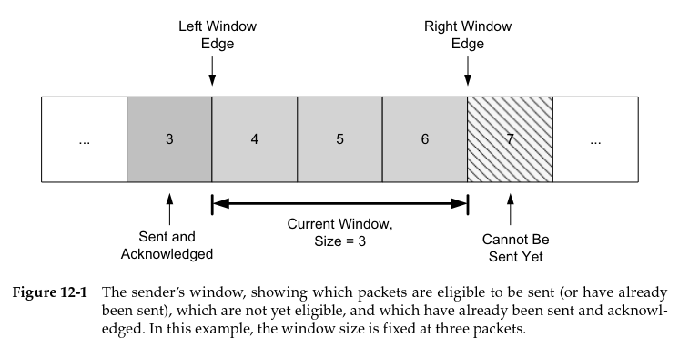
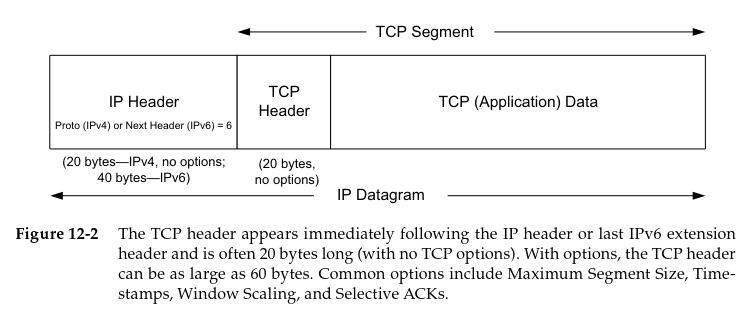
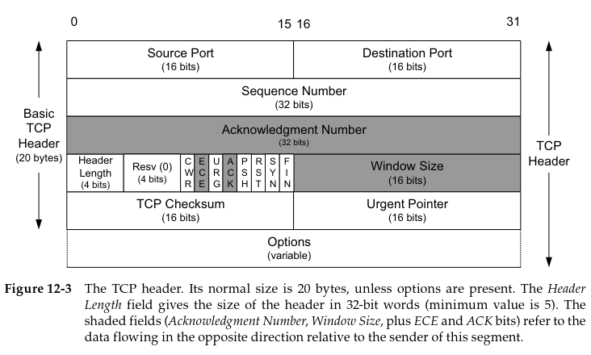
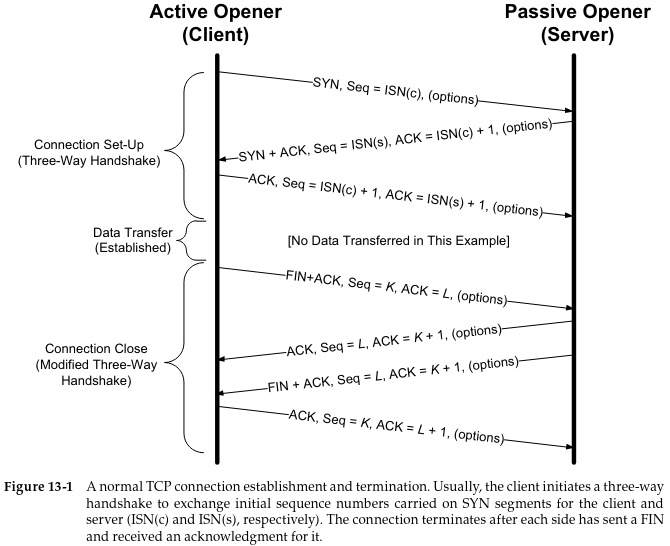
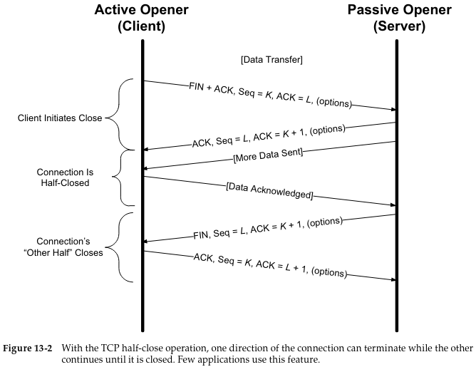
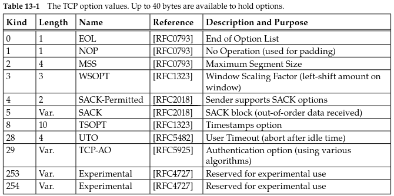
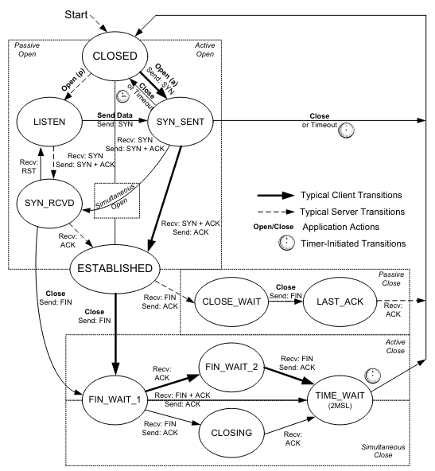
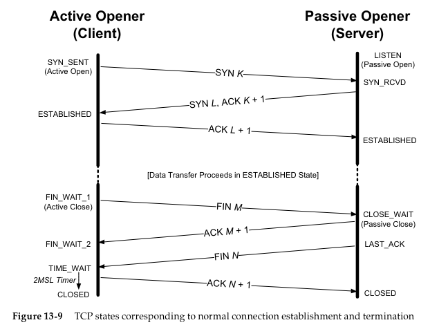
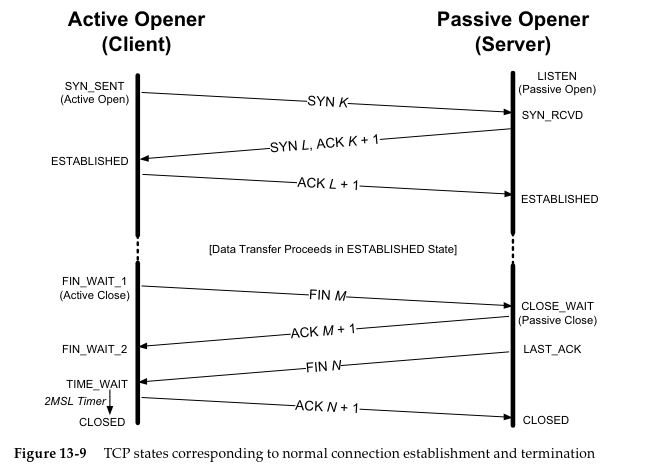

## [Volver atrás](../readme.md)

<h1>Capa de Transporte y TCP</h1>

### Indice

💡 [Conceptos a tener en cuenta](#conceptos-a-tener-en-cuenta)

❓ [Guía de preguntas](#lans---guia-de-preguntas)

📝 [Resumen](#resumen)

📖 [Bibliografía](#bibliografia)

---

### Conceptos a tener en cuenta

- Conceptos a tener en cuenta
- Función de la capa de transporte
- TCP - Tipo de Servicio
- Concepto de Segmento
- Números de Puerto/Sockets
- Control de Flujo
    - Ventana
    - Número de secuencia
    - Número de ACK
- Funciones de los segmentos TCP
    - Banderas
- Apertura de conexión
    - Three-way Handshake
- Cierre de conexión

---

### Guia de Preguntas

1. ¿Cuáles son las funciones básicas de la capa de transporte? ¿Qué diferencia fundamental existe respecto de la capa de enlace?
2. Describa las características principales del protocolo TCP.
3. ¿Cómo es el protocolo de establecimiento de una comunicación TCP?
4. Explique los conceptos “Active Open” y “Passive Open”.
5. ¿Cómo es el protocolo de cierre de una comunicación TCP? Explique el concepto de “Half Close”.
6. ¿Qué son y para qué se utilizan los números de puerto? ¿Cómo se asignan en servidores y clientes?
7. ¿Cómo se identifica unívocamente una conexión abierta en TCP?
8. ¿Qué representa el número de secuencia en un segmento TCP? ¿Cómo se obtiene?
9. ¿Qué función cumplen las flags en el header TCP? ¿En qué etapa de la comunicación se utiliza cada una?
10. Caracterice los tipos de tráfico interactivo y masivo.
11. ¿Cómo se realiza el control de flujo en TCP? ¿Qué diferencias encuentra respecto de los protocolos vistos de capa de enlace?
12. ¿Qué entiende por congestión en una red? 
13. ¿Cómo detecta TCP una congestión y qué mecanismos implementa para evitarla?
14. ¿Cuáles son los parámetros que regulan el envío de segmentos TCP en un momento dado?
15. ¿Qué métrica sobre la regula la tasa de envío de segmentos?
16. En la siguiente captura, para cada segmento, identifique flags, números de secuencia, ventanas, direcciones y puertos. Determine la finalidad del mismo y luego realice el diagrama de tiempos del intercambio.

17. Revise los principales protocolos de aplicación en la pila TCP/IP e indique qué protocolo de transporte utilizan. A los protocolos de aplicación vistos en la asignatura agregue FTP, TFTP, DHCP, NTP, NNTP, BGP (averigüe qué uso tiene cada uno, sin detalles de funcionamiento).

---

### Resumen

### 12 TCP: The Transmission Control Protocol

#### 12.1 Introduction

El problema de comunicarse en entornos en los cuales el medio de comunicación puede perder o alterar los mensajes a entregar es un tema que fue estudiado por años. Hay varias métodos y teorías que intentan resolver este problema, pero el más simple y el más utilizado es el que simplemente "vuelve a enviar" hasta que la información sea entregada con éxito. Esta estrategia, llamada **Automatic Repeat Request (ARQ)** establece la base de varios protocolos de comunicación, entre ellos TCP.

##### 12.1.1 ARQ and Retransmission

Un protocolo de corrección de errores diseñado para funcionar sobre un canal de comunicaciones con múltiples saltos, como en el caso de IP, debe lidiar con problemas como el reordenamiento, duplicación, y pérdida de paquetes.

Una manera de manejar la pérdida de paquetes y errores de bit es reenviar el paquete hasta que se reciba adecuadamente. Esto requiere una mandera de determinar:
1. Si el receptor recibió el paquete
2. Si el paquete recibido es el mismo que el paquete enviado

El método por el cual el receptor informa al wmisor que recibió el paquete se llama **acknowledgement**, o **ACK**. Entonces cuando el emisor envía un paquete, espera un ACK. Cuando el receptor recibe un paquete, envía el ACK. Cuando el emisor recibe el ACK, envía otro paquete, y así sucesivamente. A partir de esto surgen algunas cuestiones, como cuánto tiempo debe esperar un emisor para recibir un ACK, qué pasa si un ACK se pierde, y qué sucede si el paquete fue recibido pero tiene errores.

Si un paquete fue recibido pero contiene errores, se pueden utilizar códigos para detectar errores en un paquete grande usando sólo unos pocos bits. Los códigos simples normalmente no son capaces de corregir errores pero son capaces de detectarlos, es por eso que los **checksums** y **CRC**s son populares. Cuando un receptor recibe un paquete que contiene un error, no envía un ACK, por lo que luego de un tiempo, el emisor vuelve a enviar el paquete, el cual debería llegarle al receptor sin errores.

Si un ACK se pierde, el emisor no puede saber si el receptor recibió el paquete y su ACK se perdió, o si el paquete que envió nunca llegó. Entonces el emisor envía nuevamente el paquete. En el primer caso, el receptor puede que reciba el paquete de nuevo, es decir que recibe un paquete duplicado. Para resolver este problema, se utiliza un **número de secuencia**. Cada paquete recibe un nuevo número de secuencia cuando se envía desde el emisor. El emisor puede usar este número para determinar si ya recibió este paquete, y si se da el caso, lo puede descartar.

El protocolo descrito hasta ahora es fiable pero no muy eficiente. Para una red que no daña o pierde muchos paquetes, la causa del bajo throughtput por lo general es que la red no está constantemente ocupada. Para corregir esto, se debe permitir que más de un paquete pueda transitar la red al mismo tiempo.

##### 12.1.2 Windows of Packets and Sliding Windows

Cada paquete tiene un **número de secuencia**. Se define una **ventana** de paquetes como la colección de paquetes que deben ser inyectados por el emisor pero que todavía no fueron confirmados. El **window size** es el número de paquetes en la ventana. El término **window** o **ventana** surge de la idea de que si alineas todos los paquetes enviados durante una sesión de comunicación, pero sólo hay una pequeña apertura para verlos, sólamente vas a poder ver un conjunto de ellos, como si te asomaras para ver a través de una ventana. 

La imagen muestra la ventana de tres paquetes, para un tamaño de ventana de 3. El paquete número 3 ya fue enviado y confirmado, entonces la copia que el emisor estaba almacenando puede ser descartada. El paquete 7 está listo en el emisor pero no puede ser enviada porque todavía no está en la ventana. Cuando el emisor recibe una confirmación (ACK), la ventana se "desliza" una posición hacia la derecha, por lo cual la copia del paquete 4 puede ser descartada y ahora puede enviarse el paquete 7. Este movimiento de la ventana indica el nombre de este tipo de protocolo: el protocolo de **ventana deslizante** o **sliding window**.

La ventana deslizante puede usarse para combatir varios de los problemas descritos hasta ahora. Por lo general esta estructura se implementa tanto en el emisor como en el receptor. En el emisor, mantiene un registro de qué paquetes pueden ser enviados, cuáles son los paquetes que todavía tienen que ser confirmados, y cuáles son los paquetes que todavía no se pueden enviar. En el receptor, mantiene un registro de cuáles paquetes fueron recibidos y confirmados, cuáles son los paquetes que se esperan (y cuánta memoria se asignó para recibirlos) y qué paquetes no se van a almacenar debido a limitaciones de memoria.

##### 12.1.3 Variable Windows: Flow Control and Congestion Control

Para manejar el problema que surge cuando un receptor es muy lento en comparación con un emisor, se introduce el **control de flujo**, que se puede implementar de dos maneras. Una de ellas es la **rate-based flow control**: al emisor se asigna una tasa de datos determinada y se asegura que los datos nunca van a ser enviados a una tasa que exceda esa asignación. Este tipo de control de flujo es la más apropiada para aplicaciones de streaming y puede ser usada con entrega broadcast y multicast.

La otra forma predominante de flujo de control se llama **window-based flow control** y es la aplicación más popular cuando se usan ventanas deslizantes. En este caso, el tamaño de las ventanas no es fijo, puede variar con el tiempo. El emisor utiliza un valor llamado **window advertisement** para anunciarle al receptor el nuevo valor de su tamaño de ventana. Normalmente este anuncio viene acompañado de un ACK, es decir que el emisor ajusta su tamaño de ventana al mismo tiempo que confirma un paquete recibido. 

El emisor puede inyectar W paquetes en la red antes de escuchar un ACK para cualquiera de ellos. Si el emisor y el receptor son lo suficientemente rápidos, y la red no pierde paquetes y tiene capacidad infinita, la tasa de transferencia es proporcional a SW/R bits por segundo, siendo S el tamaño del paquete en bits, y R el round trip time. Cuando el window advertisement del receptor disminuye el valor de W en el emisor, la tasa del emisor se limita para no saturar al receptor. Este flujo de control funciona bien para proteger al receptor, pero para los routers de la red se utiliza una forma especial del flujo de control llamada **control de congestión**.

El control de congestión implica reducir la velocidad del emisor para no saturar la red entre él mismo y el receptor de manera implícita, en vez de utilizar un protocolo como en el flujo de control.

##### 12.1.4 Setting the Retransmission Timeout

La cantidad de tiempo que un emisor debe esperar antes de enviar un paquete es aproximadamente la suma de:
- El tiempo que tarda el emisor en enviar un paquete
- El tiempo que tarda el receptor en procesarlo y enviar un ACK
- El tiempo que tarda el ACK en propagarse hacia el emisor
- El tiempo que tarda el emisor en procesar el ACK

Ninguno de estos tiempos se puede saber con certeza. Una estrategia es tener implementar en un protocolo una manera de poder estimarlos. Esto se llama **round trip time estimation** y es un proceso estadístico. El verdadero RTT tiene un valor cercano a la media muestral de un conjunto de muestras de RTTs.

#### 12.2 Introduction to TCP

##### 12.2.1 The TCP Service Model

TCP provee un servicio fiable de flujo de bytes orientado a la conexión. El término **orientado a la conexión** significa que dos aplicaciones que usan TCP deben establecer una conexión TCP antes de transmitir datos. 

TCP no interpreta el contenido de los bytes en el flujo de bytes. La interpretación del flujo de bytes lo realiza el protocolo de capa de aplicación.

##### 12.2.2 Reliability in TCP

Como TCP provee una interfaz de flujo de bytes, debe convetir el flujo de bytes de una aplicación del emisor en un conjunto de paquetes que IP pueda transmitir. Esto se llama **paquetización**. Estos paquetes contienen números de secuencia, los cuales en TCP representan los offsets en bytes del primer byte en cada paquete del flujo de datos en general, en vez de utilizar números de paquetes. Esto permite que los paquetes puedan ser de tamaño variable durante una transferencia y también permite que puedan ser combinados (**repaquetización**). Los datos de aplicación se dividen en lo que TCP considera los chunks de mejor tamaño a enviar, generalmente metiendo cada segmento en un solo datagrama IP que no va a ser fragmentado. Este chunk pasado por TCP a IP se llama **segmento**.

TCP mantiene un checksum en su cabecera, aplicación de datos, y campos de la cabecera IP, todo esto forma un pseudo-header. Su propósito es detectar cualquier error de bit. Si un segmento llega con un checksum inválido, TCP lo descarta sin enviar una confirmación.

Cuando TCP envía un grupo de segmentos, inicia un timer de retransmisión mientras espera la llegada de la confirmación. TCP no usa timers diferentes para cada segmentos, sino que inicia un timer cuando envía una ventana de datos y actualiza el timeout a medida que llegan los ACKs. Si no se recibe una confirmación a tiempo, se retransmite un segmento. 

Cuando TCP recibe datos, envía una confirmación que puede no ser enviada inmediatamente. Los ACKs usados por TCP son cumulativos, en el sentido que un ACK indicando el byte número N implica que todos los bytes hasta el byte N fueron recibidos. Esto provee robustez en cuanto a pérdidas de ACKs.

TCP provee un servicio **full-duplex** a la capa de aplicación, por lo tanto los datos pueden fluir en ambas direcciones. Por lo tanto, cada punto de la conexión debe mantener un número de sequencia de los datos que son transmitidos en cada dirección. Una vez que se establece una conexión, cada segmento TCP que es enviado en una dirección también contiene un ACK para los segmentos que son recibidos. También contienen un window advertisement para implementar flujo de control.

Mediante los números de secuencia, un receptor TCP descarta segmentos duplicados y reordena los segmentos fuera de orden, lo cual sucede debido a que IP no provee eliminación de duplicados o que los paquetes lleguen en el orden correcto. Sin embargo, TCP nunca entrega los datos desordenados a la aplicación.

#### 12.3 TCP Header and Encapsulation

TCP se encapsula en datagramas IP.

TCP es un protocolo mucho mas complicado que UDP, ya que sincroniza cada extremo de la conexión sobre su estado actual.

Cada header TCP contiene número de puerto destino y origen. Estos dos valores, junto con las direcciones IP destino y origen en el header IP, identifican únicamente a cada conexión. La combinación de una dirección IP y un número de puerto se llama **socket**. 

El campo **Sequence Number** identifica el byte, dentro del flujo de datos enviado por el TCP emisor al TCP receptor, que representa el primer byte de datos del segmento que lo contiene. Por ejemplo,  si el emisor ya envió 1000 bytes, y el siguiente segmento empieza con el byte 1001, el Sequence Number será 1001. Si ese segmento lleva, por ejemplo, 500 bytes, entonces el siguiente segmento tendrá Sequence Number = 1501.

El campo **Acknowledgement Number** contiene el siguiente número de secuencia que el emisor de ese ACK espera recibir. Esto es el número de secuencia del último byte de datos recibido + 1. Este campo es válido sólo si el bit de ACK está seteado en 1, lo cuál es así excepto en los segmentos de inicio y cierre.

Cuando se está estableciendo una nueva conexión, el bit SYN se setea en 1 en el primer segmento enviado por el cliente al servidor. El Sequence Number contiene la primer secuencia de números a usar en ese sentido de la conexión. Este número no es 0 o 1, es otro número, que a menudo se elije de manera aleatoria, llamado **initial sequence number (ISN)**. La razón por la cual el ISN no es 0 o 1 es por una medida de seguridad: si hay alguien ajeno a la conexión que la está escuchando, puede deducir que el flujo de datos va a comenzar a partir del segmento con ISN 0 o 1.

El número de secuencia incrementa en uno cuando se envía el primer byte de datos porque el bit SYN consume un número de secuencia. Los SYNs y los datos de aplicación se entregan de manera fiable gracias a esto, cosa que no sucede con los ACKs ya que no consumen números de secuencia.

TCP puede ser descrito como "un protocolo de ventana deslizante con confirmaciones positivas cumulativas". Los TCP modernos tienen un **selective acknowledgement (SACK)** que permite al receptor confirmar datos recibidos de manera desordenada. Cuando se lo empareja con un emisor TCP capaz de reenviar selectivamente, se puede obtener un beneficio en el rendimiento.

El campo **Header Length** indica el largo del header en palabras de 32 bits. Esto se requiere porque el largo del campo **Options** es variable. Sin ese campo, el tamaño del header es de 20 bytes.

Actualmente existen 8 campos de bits que son definidos por el header TCP. Uno o varios pueden ser seteados en 1 al mismo tiempo. Los más importantes son:
- ACK (Acknowledgement): siempre está en 1 una vez que se establece la conexión.
- PSH (Push): el receptor debe pasar estos datos a la aplicación lo más pronto posible.
- RST (Reset): reiniciar la conexión, generalmente por algún error.
- SYN (Synchronize): sincronizar los números de secuencia para iniciar una conexión.
- FIN (Finalize): el emisor del segmento terminó de enviar datos.

El control de flujo en TCP se realiza por cada extremo, que anuncian su tamaño de ventana usando el campo **Window Size**. Este es el número de bytes, comenzando con el que está especificado por el número de ACK, que el receptor puede aceptar. Es un campo de 16 bits, limitando la ventana a 65535 bytes, y por lo tanto limitando el throughtput. La opción **Window Scale** permite que este valor pueda ser escalado para usar tamaños de ventana mayores.

El campo **Checksum** cubre todo el header TCP, los datos, y algunos campos del header IP. Este campo es calculado y almacenado por el emisor, y verificado por el receptor.

El campo **Urgent Pointer** es váñido si el bit URG esta seteado en 1. Este puntero es un offset que debe ser agregado al número de secuencia del segmento para obtener el número de secuencia del último byte de datos urgentes. El mecanismo urgente de TCP es una manera para que el emisor pueda marcar datos especiales.

El campo más común de **Option** es **Maximum Segment Size (MSS)**. Cada extremo de una conexión especifica esta opción en el primer segmento que envía. MSS especifica el tamaño máximo de segmento que el emisor de esa opción está dispuesto a recibir.

### 13 TCP Connection Management

#### 13.1 Introduction

TCP es un protocolo unicast orientado a la conexión. Debido a su gestión del estado de la conexión, TCP es mucho más complicado que UDP, que es un protocolo no orientado a la conexión, es decir que no realiza establecimiento o terminaciones de conexión.

Durante el establecimiento de la conexión, los dos extremos pueden intercambiar una variedad de opciones con respecto a los parámetros que se utilizan en la conexión. Algunas de ellas se pueden enviar sólo cuando la conexión se establece, y otras se pueden enviar más adelante.

#### 13.2 TCP Connection Establishment and Termination

Una conexión TCP está definida por un par de sockets, los cuales identifican mediante dirección IP y puerto a los extremos involucrados en la conexión.

Una conexión pasa por tres fases: establecimiento de la conexión (setup), transferencia de datos (data transfer o established), y terminación de la conexión (teardown o closing).

Para establecer una conexión TCP, deben ocurrir los siguientes pasos:
- El cliente envía un segmento SYN especificando el número de puerto del servidor al cual se quiere conectar y el ISN del cliente. Puede enviar una o más opciones. Este es el segmento 1.
- El servidor responde con su propio SYN, que también contiene su ISN. Este es el segmento 2. El servidor también confirma el SYN del cliente, usando un número de ACK igual al ISN del cliente + 1. El SYN consume un número de secuencia, y si se pierde, es retransmitido.
- El cliente debe confirmar el SYN del servidor enviando un ACK igual al ISN del servidor + 1. Este es el segmento 3.

Estos tres segmentos completan el establecimiento de la conexión. Esta fase se la conoce como **three-way handshake**. Su propósito principal es darle a conocer a cada extremo de la conexión que una conexión está siendo iniciada, las opciones que va a tener dicha conexión y cómo intercambiar los ISNs.

El extremo que envía el primer SYN (el cliente) es el que realiza lo que se conoce como **active open** o apertura activa. El otro extremo (el servidor), que recibe el SYN y envía el siguiente SYN, realiza un **passive open** o apertura pasiva. La **simultaneous open** o apertura simultánea ocurre cuando ambos extremos realizan un active open al mismo tiempo y ambos son tanto cliente como servidor.

Cualquiera de los extremos puede iniciar el cierre de la conexión. Por lo general, el cliente es el que solicita el cierre, aunque los servidores, inician el cierre luego de completar una solicitud. El extremo TCP que desea hacer el cierre envía un FIN. El proceso del cierre de la conexión se completa cuando ambos extremos lo hacen:
- El **active closer** envía un FIN especificando el número de secuencia actual que el receptor espera. El FIN también incluye un ACK para los últimos datos que recibió el active closer.
- El **passive closer** confirma la recepción del FIN enviando un ACK con el número de secuencia recibido + 1. La aplicación es notificada de que el otro extremo cerró la conexión, y realiza su propio cierre. El passive closer se convierte en otro active closer y envía su propio FIN.
- Para completar el cierre de la conexión, el último segmento contiene un ACK para el último FIN. Si se pierde un FIN, se retransmite hasta que se reciba el ACK correspondiente.

Es posible que una conexión quede en un estado conocido como **half-open**. Como la comunicación de datos en TCP es bidireccional, puede que sólo uno de los extremos realice el cierre, por lo tanto sólo se cierra una dirección del flujo de datos (half-close).

Cuando se necesita intercambiar una pequeña cantidad de datos, normalmente se utiliza el protocolo UDP, ya que como es un protocolo no orientado a la conexión, no establece ni cierra conexiones. Sin embargo, las aplicaciones deben implementar su propia gestión de errores, congestión, y control de flujo.

##### 13.2.1 TCP Half-Close

TCP soporta la operación **half-close**, que lo que hace es que el emisor indica el cierre de la conexión de su lado, e indicarle al receptor que está dispuesto a seguir recibiendo datos hasta que reciba un FIN.

Los primeros dos segmentos son los mismos que en un cierre normal: un FIN enviado por el extremo que inicia el cierre, seguido de un ACK en el FIN del receptor. El extremo que recibe el half-close puede seguir enviando datos, y cuando ya no tiene más datos para enviar, cierra su lado de la conexión enviando un FIN. Cuando se confirma este fin, la conexión se cierra completamente.

##### 13.2.3 Initial Sequence Number (ISN)

Cuando se abre una conexión, cualquier segmento con un par de sockets es válido mientras el número de secuencia sea válido y el checksum de OK. 

Antes de que cada extremo envíe su SYN para establecer la conexión, elige un ISN. El ISN debe cambiar con el tiempo, para que sea diferente en cada conexión. Los números de secuencia nuevos no deben repetirse entre diferentes instanciaciones de la misma conexión, es decir que debe evitarse utilizar el mismo ISN cuando se levanta una nueva conexión entre dos extremos que ya establecieron una comunicación anteriormente.

Si en una conexión, uno de los segmentos se atrasa en llegar por un largo período de tiempo y se cierra la conexión, pero luego se reabre con los mismos sockets, ese segmento atrasado puede ser tomado como parte del flujo de datos en la nueva conexión. Esto se puede evitar utilizando control de errores como CRCs o checksums en la capa de aplicación.

Para armar un segmento TCP, lo único que se necesita es el par de sockets y la ventana de la conexión. Esto representa una vulnerabilidad para TCP, cualquiera puede armar un segmento con estos datos e interrumpir una conexión. Una manera de evitar esto es hacer que el ISN sea difícil de adivinar, o mediante el uso de encriptación.

En los sistemas modernos, el ISN se selecciona de manera semialeatoria. Linux realiza un proceso complejo para seleccionar los ISNs, mediante el uso de un esquema basado en el reloj, pero inicia el reloj con un valor aleatorio para cada conexión.

#### 13.3 TCP Options

El header TCP puede contener opciones. Cada opción inicia con un byte denominado **kind** que especifica el tipo de opción, Las opciones que no se entienden son ignoradas. La razón de la opción NOP es permitir al emisor rellenar campos en múltiplos de 4 bytes. Esto se debe a que el largo del header de TCP siempre debe ser un múltiplo de 32 bits porque el campo Header Length usa esa unidad. La opción EOL indica el fin de una lista y que no se necesita procesar más.

##### 13.3.1 Maximum Segment Size (MSS) Option

El Maximum Segment Size (MSS) es el segmento más largo que un TCP está dispuesto a recibir. El valor de MSS sóo cuenta data bytes de TCP y no incluye los tamaños de los headers TCP o IP. Cuando se establece una conexión, cada extremo anuncia su MSS en una opción de MSS en el SYN. La opción permite que se puedan usar 16 bits para especificar el valor de MSS. Si no se usa la opción, se utiliza el valor por defecto: 536 bytes. Este valor permite cumplir con el tamaño mínimo que los hosts IPv4 deben poder procesar:

    20 bytes (encabezado IPv4) + 20 bytes (encabezado TCP) + 536 bytes (MSS) = 576 bytes.

Este valor por defecto se utiliza para evitar la fragmentación de los datagramas en la capa de red, asegurando que cada segmento TCP pueda transmitirse dentro de un único datagrama IP. Generalmente el valor del MSS es 1460 bytes, ya que el valor típico del MTU para Ethernet es 1500 bytes.

##### 13.3.2 Selective Acknowledgment (SACK) Options

TCP no es capaz de confirmar datos que recibió correctamente pero fuera de orden. Esto hace que el receptor tenga huecos en su cola de datos recibidos, previniendo que las aplicaciones puedan consumir los datos que están adelante del hueco.

El **selective acknowledgement (SACK)** provee la capacidad al receptor de comunicarle al emisor que se recibieron paquetes fuera de orden y que los confirma, para que el emisor pueda retransmitir aquellos paquetes que se dañaron o perdieron.

##### 13.3.3 Window Scale (WSCALE or WSOPT) Option

La opción **Window Scale** incrementa la capacidad del campo Window Advertisement de 16 a aproximadamente 30 bits. En vez de cambiar el tamaño del campo, el header sigue teniendo un valor de 16 bits, y la opción aplica un factor de escalado al valor de 16 bits. Lo que hace este factor es agregar 0s a la derecha del valor, multiplicándolo por 2 por cada 0 que se agrega. 

Esta opción sólo puede aparecer en el SYN, para que el factor de escalado sea fijo una vez establecida la conexión. Para habilitar el escalado de ventana, ambos extremos deben enviar la opción en sus SYNs. El extremo que realiza el active open envía la opción en su SYN, pero el extremo que realiza el passive open puede enviar la opción sólo si el SYN recibido lo especifica. El factor de escalado puede ser diferente en cada extremo.

#### 13.5 TCP State Transitions

Las reglas que determinan lo que debe hacer TCP estan determinadas por el estado en el que se encuentra TCP. El estado actual cambia dependiendo de varios factores, como segmentos que son transmitidos o recibidos, timers que expiran, escrituras o lecturas de la aplicación, o información de otras capas. Estas reglas se pueden resumir en el diagrama de transiciones de estado de TCP.

##### 13.5.1 TCP State Transition Diagram

Los estados se indican con óvalos y las transiciones entre estados se indican con flechas. Cada punto de una conexión transiciona por los estados. Algunos son activados por la recepción de un segmento con determinados flags. Algunas transiciones también causan que se envíe un segmento con ciertos flags. Otras transiciones se disparan por las acciones de una aplicación o por la expiración de timers. Cuando se inicia, TCP comienza en el estado **CLOSED**. Normalmente transiciona inmediatamente al estado **SYN_SENT** o **LISTEN** dependiendo si el TCP está realizando una apertura activa (como cliente) o una apertura pasiva (como servidor).

Las dos transiciones que llevan al estado **ESTABLISHED** corresponden a la apertura de una conexión, y las transiciones que salen de ESTABLISHED corresponden a la terminación de una conexión. El estado ESTABLISHED es donde la transferencia de datos puede ocurrir entre dos extremos en ambas direcciones.

Los estados **FIN_WAIT_1**, **FIN_WAIT_2**, y **TIME_WAIT** se encuentran en un cuadro llamado "Active Close". Se entra en estos estados cuando la aplicación local inicia una solicitud de cierre. Los estados **CLOSE_WAIT** y **LAST_ACK** se encuentran en un cuadro llamado "Passive Close". Estos estados corresponden a la espera de la confirmación de un FIN y a realizar el cierre. El "Simultaneous Close", una forma de doble active close, usa el estado **CLOSING**.

##### 13.5.2 TIME_WAIT (2MSL Wait) State

El estado TIME_WAIT también se lo conoce como el estado **2MSL wait**. Es un estado en el que TCP espera por un tiempo igual a doble del **Maximum Segment Lifetime (MSL)**, a veces llamado **timed wait**. El MSL es la máxima cantidad de tiempo que cualquier segmento puede existir en la red antes de ser descartado.

Cuando TCP realiza un active close y envia el último ACK, esa conexión debe quedarse en el estado TIME_WAIT por una cantidad de tiempo igual al doble que el MSL. Esto permite a TCP reenviar el último ACK en caso de que se pierda. El último ACK se reenvía porque el otro extremo va a retransmitir su FIN.

Otro efecto del estado 2MSL wait es que mientras TCP espera, los sockets que se utilizaron para esa conexión no pueden ser reutilizados, sólo cuando el 2MSL wait se terminó, o cuando una nueva conexión usa un ISN que excede el número de secuencia más alto en la instancia previa de esa conexión, o si el uso de la opción Timestamps permite distinguir los segmentos de una instancia previa de una instancia nueva.

Incluso si esta restricción se pasa por alto, cualquier segmento atrasado que llega para una conexión que está en el estado 2MSL wait se descarta.

Para las aplicaciones interactivas, normalmente el cliente es el que realiza el active close y entra en el estado TIME_WAIT. El servidor normalmente realiza el passive close y no pasa por el estado TIME_WAIT. Esto implica que si se termina un cliente, y se reinicia inmediatamente, ese nuevo cliente no puede utilizar el mismo número de puerto. Esto en sí no es un problema porque los clientes usan puertos efímeros asignados por el sistema operativo.

En el caso de los servidores, la situación es diferente. Siempre utilizan puertos bien conocidos, y si se termina un proceso servidor que tiene una conexión establecida y se reinicia inmediatamente, el servidor no puede asignar su número de puerto a su socket, porque el puerto es parte de una conexión que está en estado 2MSL wait. El servidor puede tomarse entre 1 o 4 minutos para poder reiniciarse, dependiendo del valor del MSL.

##### 13.5.3 Quiet Time Concept

El 2MSL wait provee protección contra segmentos atrasados de una instancia previa de una conexión a ser interpretados como parte de una nueva conexión que usa los mismos sockets. Pero esto sólo funciona si un host con conexiones en el estado 2MSL wait no crashea.

TCP debe esperar una cantidad de tiempo igual al MSL antes de crear nuevas conexiones luego de un reinicio o un crasheo. Esto se llama **quiet time**.

##### 13.5.4 FIN_WAIT_2 State

En el estado FIN_WAIT_2, TCP envia un FIN y el otro extremo lo confirma. A no ser que se esté realizando un half-close, el TCP debe esperar a la aplicación del otro extremo a reconocer que recibió el último dato y cerrar la conexión enviando un FIN. Sólo cuando la aplicación realiza este cierre y el FIN es recibido el TCP active close se mueve del estado FIN_WAIT_2 al estado TIME_WAIT. Esto significa que uno de los extremos puede quedarse en este estado para siempre. El otro extremo sigue en CLOSE_WAIT y puede quedarse en ese estado para siempre, hasta que la aplicación decida cerrar la conexión.

Muchas implementaciones previenen esta espera infinita en el estado FIN_WAIT_2 de la siguiente manera: si la aplicación que hace el active close realiza un cierre completo, se inicia un timer. Si la conexión está quieta cuando el timer expira, TCP mueve la conexión al estado CLOSED.

#### 13.6 Reset Segments

Un segmento que contiene el bit RST en 1 se lo conoce como **reset segment** o simplemente **reset**. Un reset es enviado por TCP cuando un segmento que llega no aparece ser parte de la conexión. Los resets resultan en un cierre rápido de una conexión TCP.

##### 13.6.3 Half-Open Connections

Se dice que una conexión TCP es **half-open** si uno de sus extremos cerró o abortó la conexión sin saber sobre el otro extremo. Esto puede suceder cuando uno de los extremos se cae. Mientras no haya intentos de transmitir datos en una conexión half-open, el extremo que sigue activo no detecta que el otro extremo se cayó.

##### 13.6.4 TIME-WAIT Assasination (TWA)

El estado TIME_WAIT permite el descarte de cualquier datagrama de una conexión cerrada. Durante este período, el TCP que espera no tiene nada para hacer, sólo se mantiene en este estado hasta que el timer 2MSL expira. Si recibe un reset durante este período, puede desincronizarse. Esto se llama **TIME-WAIT Assasination (TWA)**.

En este ejemplo, el servidor completa su rol en la conexión y limpia cualquier estado. El cliente se queda en el estado TIME_WAIT. Cuando el intercambio de FINs se completa, el número de secuencia del cliente es K y el del servidor es L. El segmento que llega tarde es enviado desde el servidor al cliente usando el número de secuencia L - 100 y contiene un número de ACK K - 100. Cuando el cliente recibe este segmento, determina que el número de secuencia y el valor de ACK son viejos. Cuando recibe estos segmentos viejos, TCP responde enviando un ACK con el número de secuencia actual y los valores de ACK. Sin embargo, cuando el servidor recibe este segmento, no tiene información sobre la conexión y responde con un reset, lo cual causa que el cliente transicione prematuramente del estado TIME_WAIT a CLOSED. La mayoría de los sistemas evitan este problema simplemente ignorando los resets cuando se está en estado TIME_WAIT.

### 14 TCP Timeout and Retransmission

---

### Bibliografia

➤ [**STE11**] - [TCP/IP Illustrated Vol I](../libros/STE11.pdf)

&nbsp;&nbsp;&nbsp;&nbsp;&nbsp;&nbsp;⤷ Capítulo 12: “TCP: The Transmission Control Protocol”

&nbsp;&nbsp;&nbsp;&nbsp;&nbsp;&nbsp;⤷ Capítulo 13: “TCP Connection Management”

&nbsp;&nbsp;&nbsp;&nbsp;&nbsp;&nbsp;⤷ Capítulo 14: “TCP Timeout and Retransmission”

&nbsp;&nbsp;&nbsp;&nbsp;&nbsp;&nbsp;⤷ Capítulo 15: “TCP Data Flow and Window Management”