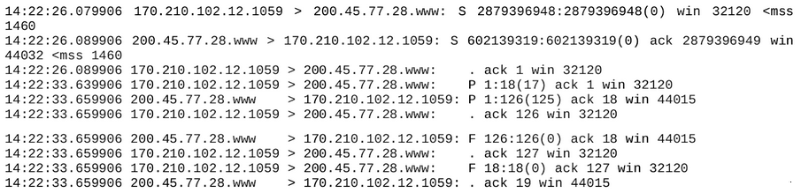

## [Volver atrás](../readme.md)

<h1>Capa de Transporte y TCP</h1>

### Indice

💡 [Conceptos a tener en cuenta](#conceptos-a-tener-en-cuenta)

❓ [Guía de preguntas](#lans---guia-de-preguntas)

📝 [Resumen](#resumen)

📖 [Bibliografía](#bibliografia)

---

### Conceptos a tener en cuenta

- Conceptos a tener en cuenta
- Función de la capa de transporte
- TCP - Tipo de Servicio
- Concepto de Segmento
- Números de Puerto/Sockets
- Control de Flujo
    - Ventana
    - Número de secuencia
    - Número de ACK
- Funciones de los segmentos TCP
    - Banderas
- Apertura de conexión
    - Three-way Handshake
- Cierre de conexión

---

### Guia de Preguntas

1. ¿Cuáles son las funciones básicas de la capa de transporte? ¿Qué diferencia fundamental existe respecto de la capa de enlace?
2. Describa las características principales del protocolo TCP.
3. ¿Cómo es el protocolo de establecimiento de una comunicación TCP?
4. Explique los conceptos “Active Open” y “Passive Open”.
5. ¿Cómo es el protocolo de cierre de una comunicación TCP? Explique el concepto de “Half Close”.
6. ¿Qué son y para qué se utilizan los números de puerto? ¿Cómo se asignan en servidores y clientes?
7. ¿Cómo se identifica unívocamente una conexión abierta en TCP?
8. ¿Qué representa el número de secuencia en un segmento TCP? ¿Cómo se obtiene?
9. ¿Qué función cumplen las flags en el header TCP? ¿En qué etapa de la comunicación se utiliza cada una?
10. Caracterice los tipos de tráfico interactivo y masivo.
11. ¿Cómo se realiza el control de flujo en TCP? ¿Qué diferencias encuentra respecto de los protocolos vistos de capa de enlace?
12. ¿Qué entiende por congestión en una red? 
13. ¿Cómo detecta TCP una congestión y qué mecanismos implementa para evitarla?
14. ¿Cuáles son los parámetros que regulan el envío de segmentos TCP en un momento dado?
15. ¿Qué métrica sobre la regula la tasa de envío de segmentos?
16. En la siguiente captura, para cada segmento, identifique flags, números de secuencia, ventanas, direcciones y puertos. Determine la finalidad del mismo y luego realice el diagrama de tiempos del intercambio.

17. Revise los principales protocolos de aplicación en la pila TCP/IP e indique qué protocolo de transporte utilizan. A los protocolos de aplicación vistos en la asignatura agregue FTP, TFTP, DHCP, NTP, NNTP, BGP (averigüe qué uso tiene cada uno, sin detalles de funcionamiento).

---

### Resumen

---

### Bibliografia

➤ [**STE11**] - [TCP/IP Illustrated Vol I](../libros/STE11.pdf)

&nbsp;&nbsp;&nbsp;&nbsp;&nbsp;&nbsp;⤷ Capítulo 12: “TCP: The Transmission Control Protocol”

&nbsp;&nbsp;&nbsp;&nbsp;&nbsp;&nbsp;⤷ Capítulo 13: “TCP Connection Management”

&nbsp;&nbsp;&nbsp;&nbsp;&nbsp;&nbsp;⤷ Capítulo 14: “TCP Timeout and Retransmission”

&nbsp;&nbsp;&nbsp;&nbsp;&nbsp;&nbsp;⤷ Capítulo 15: “TCP Data Flow and Window Management”