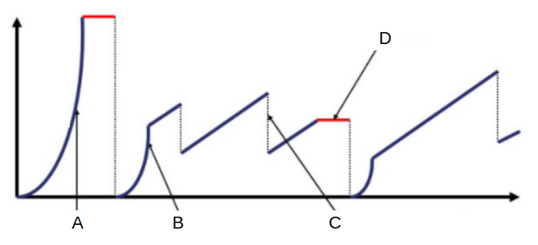
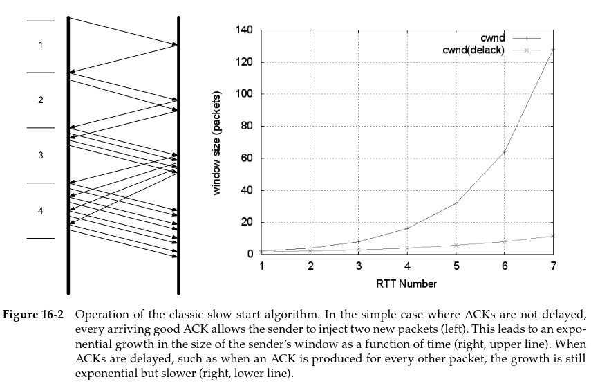
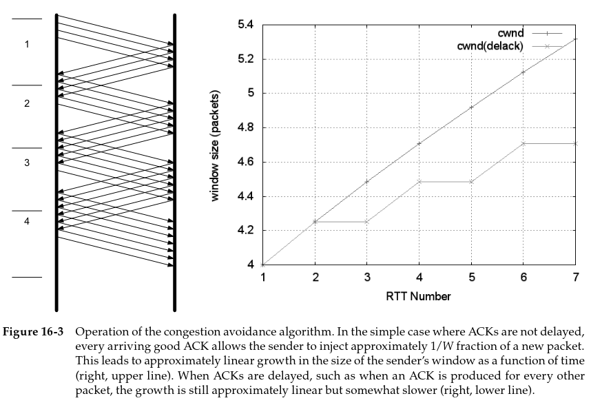

## [Volver atrás](../readme.md)

<h1>Capa de Transporte y TCP</h1>

### Indice

💡 [Conceptos a tener en cuenta](#conceptos-a-tener-en-cuenta)

✍️ [Ejercicio](#ejercicio)

📝 [Resumen](#resumen)

📖 [Bibliografía](#bibliografia)

---

### Conceptos a tener en cuenta

- Tráfico interactivo
- Tráfico masivo (bulk)
- Slow start
- Congestion Avoidance
- Fast Retransmit
- Fast Recovery
- Temporizadores (timers)

---

### Ejercicio

Dado el siguiente gráfico de intercambio en una conexión TCP, identificar qué sucedió en los instantes A, B, C y D? ¿Qué mecanismos se activaron en cada caso?

---

### Resumen

#### 16 TCP Congestion Control

#### 16.1 Introduction

El **control de congestión** es un conjunto de comportamientos determinados por algoritmos que cada TCP implementa en un intento de prevenir que la red sea saturada por una gran carga de tráfico. El método básico es que TCP desacelere cuando se sospecha que la red está por congestionarse o cuando ya está congestionada debido a que hay routers descartando paquetes.

TCP puede desacelerar si el TCP receptor no puede, por así decirlo, seguirle el ritmo al TCP emisor. Esto se logra mediante el control de flujo: el emisor adapta su tasa de transferencia dependiendo del **Window Size** anunciado por el receptor en sus ACKs. 

Si un router recibe más datos de los que puede enviar, debe almacenar dichos datos. Si esta situación persiste, eventualmente se va a agotar el almacenamiento y el router va a estar forzado a descartar datos.

Esta situación se llama **congestión**. Si no se soluciona esto, se puede reducir el rendimiento de una red considerablemente. En los peores casos, se dice que está en un estado de **colapso de congestión**. Para evitar esto, TCP implementa procedimientos de control de congestión.

##### 16.1.1 Detection of Congestion in TCP

No hay una señalización explícita sobre congestión. Si un TCP reacciona a una congestión, es porque concluye que una congestión está ocurriendo. Esto se logra detectando que uno o más paquetes se perdieron. 

##### 16.1.2 Slowing Down a TCP Sender

El campo Window Size en el header TCP se usa para indicarle a un emisor que ajuste su ventana dependiendo del buffer disponible en el receptor. Para indicarle al emisor que desacelere si el receptor o la red es muy lenta, se introduce una variable de control de ventanas en el emisor que se basa en una estimación de la capacidad de la red y asegurando que el tamaño de la ventana nunca exceda el mínimo de los dos. Esto provoca que un TCP envíe a una tasa igual a la que el receptor o la red puede manejar.

El nuevo valor que se utiliza para estimar la capacidad de la red se llama **congestion window (cwnd)**. La ventana W del emisor se escribe como el mínimo entre la ventana anunciada del receptor (**awnd**) y la ventana de congestión:

    W = min(cwnd, awnd)

Si se quiere saber la cantidad máxima de bytes que se pueden transferir, se puede utilizar la siguiente fórmula:

    W (bytes) = min(cwnd * MSS, awnd)
    MSS = Maximum Segment Size

Y si se quiere saber la cantidad de segmentos que se pueden transferir, se puede usar la siguiente fórmula:

    W (segmentos) = min(cwnd, awnd / MSS) 

Dado que tanto el estado de la red y el estado del receptor cambian con el tiempo, los valores de awnd y cwnd también van a cambiar. También se desea que W no tenga un valor muy chico o grande, se quiere que esté alrededor del **bandwidth-delay product (BDP)** de la red, también conocido como el tamaño de ventana óptimo. Esta es la cantidad de datos que pueden ser almacenados en el tránsito de la red para un receptor, es igual al producto del RTT y la capacidad mínima del camino hacia el receptor.

#### 16.2 The Classic Algorithms

Cuando comienza una conexión TCP, no tiene idea cual debería ser el valor de cwnd. TCP aprende el valor de awnd con el intercambio de un paquete con el receptor. La única manera que tiene de aprender un valor para cwnd es tratar de enviar datos a tasas rápidas hasta que se pierdan paquetes. Esto se puede lograr enviando inmediatamente a la tasa máxima (awnd) o puede empezar lentamente. TCP generalmente usa un algoritmo para evitar empezar tan rápido cuando inicia para alcanzar un estado estacionario.

El control de congestión en el emisor se realiza con la recepción de ACKs. Si un TCP ya opera en un estado estacionario, puede que la recepción de un ACK indique la pérdida de uno o más paquetes, y por lo tanto surge la oportunidad de enviar más paquetes. El comportamiento de la congestión en estado estacionario intenta lograr la **conservación de paquetes** en la red.

##### 16.2.1 Slow Start

El inicio de la transmisión en una red con condiciones desconocidas requiere que TCP sondee la red lentamente para determinar la capacidad disponible, con el fin de evitar congestionar la red con una ráfaga de datos inapropiadamente grande. El algoritmo **slow start** se utiliza para este propósito al comienzo de una transferencia o después de reparar una pérdida detectada por el temporizador de retransmisión **(RTO, retransmission timeout)**.

TCP comienza en slow start enviando un determinado número de segmentos luego del intercambio de SYNs, llamado **initial window (IW)**. El valor inicial de IW es 1. Por lo tanto, un TCP que recién comienza su conexión, tendra un cwnd = IW, es decir cwnd = 1.

Asumiendo que no se pierden paquetes y que cada paquete causa que se envíe un ACK en respuesta, se devuelve un ACK para el primer segmento, permitiendo que el TCP emisor pueda enviar otro segmento. Sin embargo, slow start incrementa el valor de cwnd en 1 por cada ACK que se recibe. Por ejemplo, si el valor de cwnd es 1, y se recibe un ACK, el valor de cwnd para a ser 2. Ahora envían 2 segmentos, se reciben 2 ACKs, y el valor de cwnd pasa a ser 4. Y así sucesivamente.

Eventualmente cwnd puede volverse tan grande que la ventana de paquetes enviados satura la red. Cuando esto sucede, cwnd se reduce a la mitad. Además, este es el punto en el cual TCP pasa de operar en slow start a operar en congestion avoidance. El punto de cambio es determinado por la relación entre cwnd y un valor llamado **slow start threshold (ssthresh)**. 

##### 16.2.2 Congestion Avoidance

Slow start se usa cuando se inicia el flujo de datos a través de una conexión o luego de una pérdida invocada por un timeout. Incrementa el cwnd rápido y ayuda a establecer un valor para ssthresh, y una vez logrado esto, existe la posibilidad de que la red tenga capacidad disponible. Si esta capacidad se fuera a utilizar con ráfagas de tráfico altas, se podrían sobrecargar los routers, provocando pérdidas de paquetes y en consecuencia, retransmisiones.

Para evitar esto y encontrar capacidad adicional en la red, de una manera no tan agresiva, TCP implementa el algoritmo **congestion avoidance**. Una vez establecido el sstresh y el cwnd está al menos al mismo nivel, TCP ejecuta congestion avoidance, el cual busca capacidad adicional incrementando cwnd por 1 segmento por cada ventana completa de datos enviada.

##### 16.2.3 Selecting between Slow Start and Congestion Avoidance

ssthresh es un límite sobre el valor de cwnd que determina que algoritmo está operando: slow start o congestion avoidance. Cuando cwnd < ssthresh, se usa slow start, y cuando cwnd > ssthresh, se usa congestion avoidance. Cuando son iguales, se puede utilizar cualquiera.

El valor inicial de ssthresh puede ser inicializado arbitrariamente con un valor alto (awnd o mayor) lo cual causa que TCP siempre inicie con slow start. Cuando ocurre una retransmisión causada por un timeout o la recepción de tres ACKs duplicados (que confirman el mismo segmento), el valor de ssthresh se actualiza a la mitad de su valor.

##### 16.2.4 Fast Recovery

Cuando se reciben tres ACKs duplicados, se inicia lo que se denomina un **fast retransmit**, y se reduce el cwnd a la mitad de su valor. Cuando esto ocurre, se inicia una etapa de recuperación en la cual el valor de cwnd incrementa utilizando **fast recovery**.

Fast recovery permite que cwnd crezca temporalmente en 1 por cada ACK recibido durante la etapa de recuperación. La ventana de congestión se infla por un período de tiempo, permitiendo enviar un paquete adicional por cada ACK recibido, hasta que se observe un ACK no duplicado. Cuando sucede esto, TCP termina la etapa de recuperación y reduce la congestión a su valor pre-inflado.

---

### Bibliografia

➤ [**STE11**] - [TCP/IP Illustrated Vol I](../libros/STE11.pdf)

&nbsp;&nbsp;&nbsp;&nbsp;&nbsp;&nbsp;⤷ Capítulo 16: “TCP Congestion Control”
